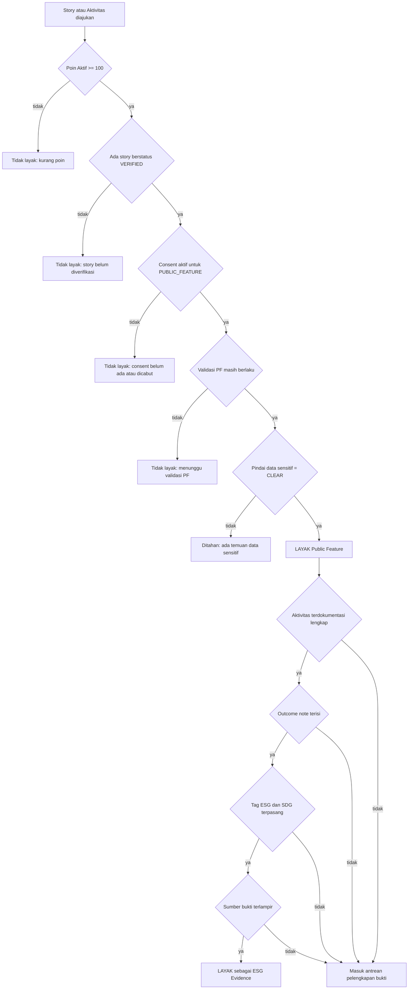
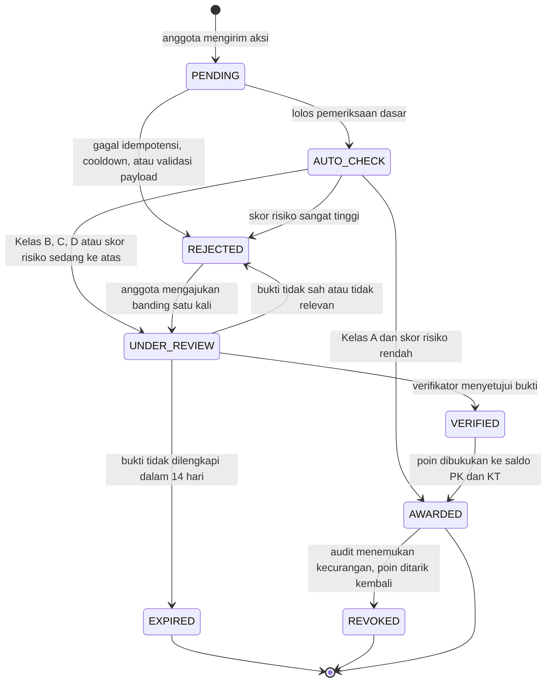
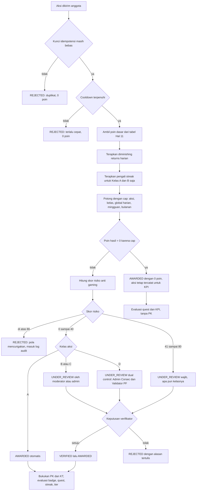
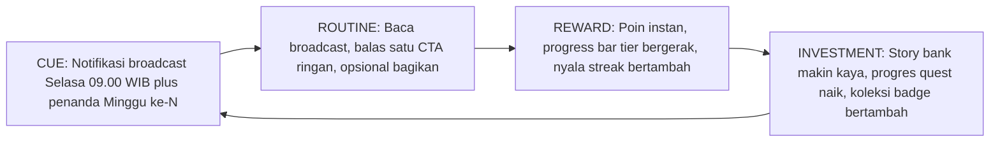
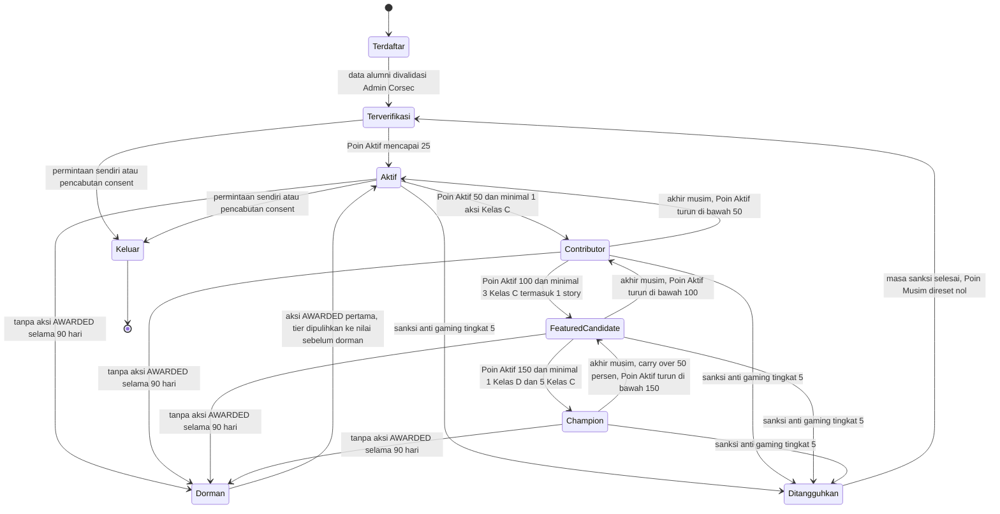

# 03: Spesifikasi Gamifikasi Pfriends

> **Turunan langsung dari** `00-SOURCE-BRIEF.md` (Hal 5 pilar 05, Hal 9, Hal 10, **Hal 11**, **Hal 12**).
> **Aturan emas:** seluruh angka poin (1/2/5/8/10/15/15/30/50) dan seluruh ambang tier (25/50/100/150)
> beserta benefit-nya **tidak boleh diubah, ditambah, atau dikurangi**. Bagian yang merupakan rancangan
> tambahan (anti-gaming, badge, streak, quest, leaderboard, katalog tukar, state machine, engine)
> ditandai eksplisit dengan label **[RANCANGAN]** dan dibangun agar tidak pernah mengganggu angka sumber.

---

## Daftar Isi

| § | Bagian | Sumber |
|---|---|---|
| 1 | Filosofi Desain: Octalysis & Self-Determination Theory | [RANCANGAN] |
| 2 | Model Skoring Inti | **Hal 11: kanonik** |
| 3 | Tier, Ambang, dan Benefit | **Hal 12: kanonik** |
| 4 | Gate Kelayakan (Public Feature & ESG Evidence) | **Hal 12: kanonik** |
| 5 | Anti-Gaming & Anti-Spam | [RANCANGAN] |
| 6 | Sistem Badge / Lencana | [RANCANGAN] |
| 7 | Streak & Habit Loop Mingguan | [RANCANGAN]: selaras Hal 9 "broadcast-first" |
| 8 | Quest / Challenge Musiman | [RANCANGAN]: selaras Hal 5 pilar 03 & 06 |
| 9 | Leaderboard | [RANCANGAN] |
| 10 | Katalog Penukaran Poin | [RANCANGAN]: mandat Hal 5 pilar 05 |
| 11 | Recognition: TOP Contribution & TOP Awardee | **Hal 5 pilar 05** + [RANCANGAN] mekanisme |
| 12 | State Machine Progresi Member | [RANCANGAN] |
| 13 | Arsitektur Domain & Pseudocode `GamificationEngine` | [RANCANGAN] |
| 14 | Skema Persistensi Dexie | [RANCANGAN] |
| 15 | Acceptance Criteria & Kasus Uji Deterministik | [RANCANGAN] |
| 16 | Matriks Ketertelusuran ke Dokumen Sumber |: |

---

## 1. Filosofi Desain

Konteks Pfriends bukan aplikasi konsumen komersial. Ini komunitas **penerima manfaat program TJSL** :
alumni beasiswa Sobat Bumi (SOBI) dan UMKM binaan (PFpreneur/Womenpreneur). Implikasinya:

1. **White-hat mendominasi.** Mekanik yang menekan (rasa takut kehilangan, kelangkaan agresif, judi) harus
   dipakai sangat tipis dan selalu diberi katup pengaman. Komunitas beneficiary yang merasa "diperah"
   untuk KPI amplifikasi akan menghasilkan kepatuhan semu, bukan *sense of belonging*: padahal
   *Sense of Community Theory* (McMillan & Chavis, 1986) adalah landasan yang dikutip Hal 5.
2. **Poin mengukur kontribusi, bukan kehadiran.** Kalimat kunci Hal 11: *"Points should reward meaningful
   contribution, not spammy activity"*: dijadikan **kendala desain formal**, bukan slogan. Diterjemahkan
   menjadi §5 (cap/cooldown/verifikasi) dan §3.3 (syarat komposisi tier).
3. **Ekstrinsik tidak boleh mematikan intrinsik.** Efek *over-justification*: memberi hadiah pada perilaku
   yang sudah bermakna secara intrinsik (berbagi kisah hidup, mentoring adik tingkat) dapat menurunkan
   motivasi asli. Mitigasi: katalog penukaran (§10) condong ke **peningkatan kapasitas** (upskilling,
   mentoring, sertifikat, akses) bukan hadiah konsumtif murni, dan **tidak ada konversi ke uang tunai**.

### 1.1 Pemetaan Octalysis (8 Core Drives)

| # | Core Drive | Warna | Implementasi di Pfriends | Katup pengaman |
|---|---|---|---|---|
| 1 | Epic Meaning & Calling | White | Narasi "duta energi & Sobat Bumi", Movement-Based Quest, konversi Koin Tukar → penanaman pohon atas nama anggota |: |
| 2 | Development & Accomplishment | White | Tier 25/50/100/150, badge, progress bar, checklist syarat komposisi | Checklist selalu menampilkan *apa* yang kurang, bukan sekadar "belum memenuhi syarat" |
| 3 | Empowerment of Creativity & Feedback | White | Story bank, Community Journalism, kebebasan memilih quest, verifikasi selalu disertai alasan tertulis | Banding 1× untuk setiap penolakan |
| 4 | Ownership & Possession | Netral | Saldo Koin Tukar, koleksi badge, bingkai profil, identitas chapter (PF10/PF11/PF12) | Saldo tidak pernah hangus tanpa 3× notifikasi |
| 5 | Social Influence & Relatedness | Netral | Leaderboard chapter, Duet Quest SOBI × Womenpreneur, mentoring, nominasi antar-anggota | Opt-out tampil anonim (governance, Hal 10) |
| 6 | Scarcity & Impatience | Black | Badge musiman terbatas, kuota reward bulanan, kursi event | Tidak ada mekanik "bayar untuk lewati antrean" |
| 7 | Unpredictability & Curiosity | Black | "Kartu Kejutan" pada broadcast mingguan (bonus Koin Tukar acak kecil), quest misteri | Bonus acak **hanya** dalam Koin Tukar, **tidak pernah** Poin Kontribusi: agar tier tetap murni hasil kontribusi |
| 8 | Loss & Avoidance | Black | Streak, kedaluwarsa Koin Tukar, decay carry-over musiman | Token *Jeda Aman* (§7.3), decay maksimal 50%, tier kehormatan tidak pernah turun |

### 1.2 Pemetaan Self-Determination Theory

| Kebutuhan psikologis | Bagaimana dipenuhi | Anti-pattern yang dihindari |
|---|---|---|
| **Autonomy** (otonomi) | Anggota memilih quest sendiri (maks 2 aktif), memilih kanal amplifikasi, boleh opt-out leaderboard, tidak ada aksi wajib berkonsekuensi | Kuota share harian yang dipaksakan; notifikasi "kamu tertinggal dari temanmu" |
| **Competence** (kompetensi) | Progres bertahap 25→50→100→150 dengan langkah yang selalu terlihat; umpan balik verifikasi yang menjelaskan; liga peer-group agar selalu ada lawan setara | Leaderboard tunggal nasional di mana anggota baru selamanya di bawah |
| **Relatedness** (keterhubungan) | Chapter batch, Duet Quest lintas komunitas, nominasi oleh sesama anggota, recognition publik dengan consent | Kompetisi zero-sum antar-individu tanpa jalur kolaboratif |

---

## 2. Model Skoring Inti: **KANONIK (Hal 11)**

Tabel di bawah adalah **salinan persis** Hal 11. Kolom `Kode`, `Kelas`, dan `Kunci Idempotensi`
adalah metadata implementasi dan **tidak mengubah nilai poin**.

| Kode | Aksi (Hal 11) | **Poin** | Kelas | Kunci Idempotensi |
|---|---|---|---|---|
| `BROADCAST_VIEW` | View / read weekly broadcast | **1 pt** | A | `memberId + broadcastId` |
| `CTA_REACT` | React or reply to light CTA | **2 pts** | A | `memberId + ctaId` |
| `SHARE_PRIVATE` | Share PF content to WA / private network | **5 pts** | B | `memberId + contentId + channelId` |
| `SHARE_PUBLIC` | Share PF content to public social media | **8 pts** | B | `memberId + contentId + platform + postUrl` |
| `STORY_SUBMIT` | Submit story / nomination / survey | **10 pts** | C | `memberId + contentHash` |
| `SESSION_ATTEND` | Attend online session | **15 pts** | C | `memberId + eventId` |
| `KNOWLEDGE_QA` | Ask useful question / share useful answer | **15 pts** | C | `memberId + threadId + postId` |
| `SPEAKER_MENTOR` | Become speaker / mentor / facilitator | **30 pts** | D | `memberId + sessionId` |
| `LEAD_ACTION` | Lead local action / campaign | **50 pts** | D | `memberId + campaignId` |

> *"Points should reward meaningful contribution, not spammy activity."*: Hal 11

### 2.1 Kelas Aksi [RANCANGAN]

Klasifikasi ini murni operasional: menentukan jalur verifikasi dan cap. Nilai poin tetap dari Hal 11.

| Kelas | Nama | Karakter | Jalur verifikasi | Tunduk cap harian/mingguan global? |
|---|---|---|---|---|
| **A** | Ringan / *self-serve* | Mudah dilakukan, mudah di-spam, nilai rendah | Otomatis oleh sistem | Ya |
| **B** | Amplifikasi | Butuh bukti tautan/tangkapan layar | Otomatis (link-check) + moderator chapter | Ya |
| **C** | Kontribusi | Butuh penilaian manusia atas substansi | Admin Komunitas Corsec | Ya |
| **D** | Kepemimpinan | Langka, bernilai tinggi, butuh validasi PF | Admin Corsec + Validator PF (dual-control) | **Tidak**: dikecualikan (lihat §5.3) |

### 2.2 Dua Mata Uang [RANCANGAN]

Keputusan arsitektural penting: **membelanjakan poin tidak boleh menurunkan tier.** Jika tidak dipisah,
seorang Champion yang menukar poin akan turun menjadi Contributor: merusak makna "recognition" Hal 12.

| Mata uang | Simbol | Sumber | Bisa dibelanjakan? | Menentukan tier? |
|---|---|---|---|---|
| **Poin Kontribusi** | **PK** | Persis tabel Hal 11 | **Tidak** | **Ya** |
| **Koin Tukar** | **KT** | Otomatis 1 KT untuk setiap 1 PK yang berstatus `AWARDED`, ditambah bonus badge & quest | **Ya** (§10) | **Tidak** |

Bonus badge/quest/kartu kejutan **hanya** menambah KT. Ini menjaga agar tabel Hal 11 tetap satu-satunya
sumber PK: tidak ada inflasi tersembunyi pada angka yang diberikan Corsec.

---

## 3. Tier, Ambang, dan Benefit: **KANONIK (Hal 12)**

| Ambang | Tier | Warna slide | **Benefit (persis Hal 12)** |
|---|---|---|---|
| **25 pts** | **Active Member** | biru `#2E7CD6` | *eligible for monthly digest mention* |
| **50 pts** | **Contributor** | hijau `#7CB342` | *eligible for community recognition* |
| **100 pts** | **Featured Candidate** | merah `#E53935` | *eligible for website or social media feature* |
| **150 pts** | **Champion** | kuning `#F0B429` | *eligible for mentor / speaker / regional champion invitation* |

### 3.1 Poin Aktif vs Poin Seumur Hidup [RANCANGAN]

| Besaran | Definisi | Dipakai untuk |
|---|---|---|
| **PK Seumur Hidup** (`lifetimePk`) | Jumlah seluruh PK berstatus `AWARDED` sepanjang keanggotaan, dikurangi yang `REVOKED` | Badge, Papan Sepanjang Masa, **Gelar Kehormatan** (tier tertinggi yang pernah dicapai: tidak pernah turun) |
| **PK Musim** (`seasonPk`) | PK `AWARDED` di musim berjalan | Leaderboard musiman, quest |
| **Poin Aktif** (`activePk`) | `seasonPk + floor(0.5 × seasonPk_musim_sebelumnya)` | **Penentu tier aktif** terhadap ambang 25/50/100/150 |

Konsekuensi yang disengaja: seseorang yang berhenti berkontribusi selama satu musim penuh akan turun
maksimal **satu langkah** (carry-over 50%), bukan jatuh ke nol. Ini menjaga tier tetap bermakna sebagai
sinyal "orang ini bisa diundang jadi pembicara **sekarang**" tanpa terasa menghukum.

### 3.2 Ambang tidak diubah: yang ditambah adalah **syarat komposisi** [RANCANGAN]

Masalah nyata: dengan tabel Hal 11 apa adanya, seseorang bisa mencapai **150 poin murni dari membagikan
tautan** dalam ~7 minggu. Tapi benefit Champion adalah *"mentor / speaker / regional champion invitation"* :
tidak koheren jika diberikan kepada orang yang belum pernah melakukan apa pun selain menyebar tautan.
Ini persis yang diperingatkan Hal 11.

Solusi: **ambang poin tetap persis**, ditambah syarat komposisi kontribusi.

| Tier | Ambang PK (kanonik) | **Syarat komposisi tambahan [RANCANGAN]** |
|---|---|---|
| Active Member | **25** |: (tanpa syarat tambahan) |
| Contributor | **50** | ≥ 1 aksi **Kelas C** terverifikasi |
| Featured Candidate | **100** | ≥ 3 aksi **Kelas C** terverifikasi, termasuk ≥ 1 `STORY_SUBMIT` terverifikasi |
| Champion | **150** | ≥ 1 aksi **Kelas D** terverifikasi, ≥ 5 aksi **Kelas C**, dan rasio verifikasi ≥ 90% |

**Perilaku UI saat poin cukup tapi komposisi belum:** status `TIER_LOCKED`. Kartu tier menampilkan tier
berikutnya dalam keadaan terkunci beserta **checklist eksplisit** ("Kurang 1 aksi kepemimpinan: ajukan
memimpin aksi lokal atau menjadi pembicara"). Ini bukan hukuman melainkan *quest* implisit dan justru
memperkuat Core Drive #2.

*Rasio verifikasi* = `AWARDED / (AWARDED + REJECTED + REVOKED)` sepanjang 90 hari terakhir.

### 3.3 Proyeksi laju (sanity check) [RANCANGAN]

Dihitung dengan cap §5.2 dan asumsi 2 broadcast per bulan (KPI Hal 6: "diseminasi minimal 2 kali sebulan").

| Persona | Perilaku mingguan | PK/minggu | → 25 | → 50 | → 100 | → 150 | Tier tercapai |
|---|---|---|---|---|---|---|---|
| **Pengamat** | Baca broadcast saja | 2 | 13 mgg |: |: |: | Active Member |
| **Penyimak** | Baca + 2 reaksi + 1 share privat | 10 | 3 mgg | 5 mgg | 10 mgg | 15 mgg | Active Member (terkunci di Contributor) |
| **Amplifier** | Penyimak + 2 share publik | 24 | 2 mgg | 3 mgg | 5 mgg | 7 mgg | **Terkunci di Active Member**: belum ada Kelas C |
| **Kontributor** | Amplifier + 1 story + 1 sesi online | 49 | 1 mgg | 2 mgg | 3 mgg | 4 mgg | Featured Candidate |
| **Penggerak** | Kontributor + Kelas D berkala (rata-rata +20) | ~69 | 1 mgg | 1 mgg | 2 mgg | 3 mgg | Champion |

Baris **Amplifier** adalah bukti bahwa desain ini menegakkan mandat Hal 11: aktivitas berbagi masif tetap
dihargai poinnya (dan tetap memenuhi KPI amplifikasi 50% pada Hal 6), tetapi **tidak** otomatis membeli
gelar Champion.

---

## 4. Gate Kelayakan: **KANONIK (Hal 12)**

### 4.1 Minimum for public feature

> **100 points + verified story + consent + PF validation + no sensitive-data concern.**

Lima syarat bersifat **konjungtif** (semua harus terpenuhi), dievaluasi sebagai satu policy tunggal.

| # | Syarat | Sumber data | Definisi operasional [RANCANGAN] |
|---|---|---|---|
| 1 | 100 points | `activePk` | `activePk >= 100` (tier Featured Candidate) |
| 2 | verified story | `stories` | Ada ≥ 1 story dengan `status = VERIFIED` milik anggota |
| 3 | consent | `consents` | Ada rekaman consent aktif, belum dicabut, mencakup ruang lingkup `PUBLIC_FEATURE`, dengan timestamp & versi teks consent (jejak audit: Hal 10 Governance) |
| 4 | PF validation | `validations` | Ada persetujuan oleh peran `PF_VALIDATOR`, belum kedaluwarsa (masa berlaku 90 hari) |
| 5 | no sensitive-data concern | `sensitivityScan` | Hasil pindai = `CLEAR`. Pemicu `FLAGGED`: NIK, nomor rekening, alamat rumah lengkap, data kesehatan, wajah anak di bawah umur tanpa consent wali, nama pihak ketiga tanpa izin |

### 4.2 Minimum for ESG evidence

> **Documented activity + outcome note + ESG/SDG tag + evidence source.**

| # | Syarat | Definisi operasional [RANCANGAN] | Kaitan Hal 10 |
|---|---|---|---|
| 1 | documented activity | Judul, tanggal, lokasi, jumlah peserta terisi | *participants, locations* |
| 2 | outcome note | Catatan hasil ≥ 200 karakter berisi perubahan yang terjadi, bukan sekadar deskripsi acara | *outcomes, action reports* |
| 3 | ESG/SDG tag | ≥ 1 tag pilar E/S/G **dan** ≥ 1 tag SDG | Tabel pilar Hal 10 |
| 4 | evidence source | ≥ 1 lampiran terverifikasi: foto bergeotag, laporan PDF, tautan berita, atau daftar hadir | *photos, evidence integrity, audit trail* |



---

## 5. Anti-Gaming & Anti-Spam [RANCANGAN]

Bagian ini adalah terjemahan teknis dari kalimat Hal 11: *"reward meaningful contribution, not spammy activity"*.

### 5.1 Enam lapis pertahanan

| Lapis | Mekanisme | Menangkal |
|---|---|---|
| L1 | **Idempotensi**: kunci unik per aksi (§2) | Klaim ganda atas objek yang sama |
| L2 | **Cooldown**: jeda minimum antar aksi sejenis | Burst / bot |
| L3 | **Cap**: batas harian, mingguan, bulanan (per aksi, per kelas, global) | Grinding volume |
| L4 | **Diminishing returns**: poin menurun untuk pengulangan di hari yang sama | Grinding volume tanpa nilai tambah |
| L5 | **Verifikasi bukti**: manusia meninjau Kelas B/C/D | Klaim palsu |
| L6 | **Audit & clawback**: skor risiko, sampling, penarikan poin | Kecurangan terstruktur / kolusi |

### 5.2 Tabel cap eksplisit

Nilai **Maks poin/hari** sudah memperhitungkan *diminishing returns* (§5.4).

| Kode | Poin | Kelas | Maks aksi/hari | **Maks poin/hari** | **Maks poin/minggu** | **Maks poin/bulan** | Cooldown | Bukti wajib | Verifikator |
|---|---|---|---|---|---|---|---|---|---|
| `BROADCAST_VIEW` | 1 | A | 3 | **3** | 8 | 30 |: | Dwell time ≥ 15 detik; 1× per `broadcastId` seumur hidup | Sistem |
| `CTA_REACT` | 2 | A | 3 | **4** | 14 | 50 | 5 menit | Balasan ≥ 20 karakter bermakna (bukan emoji/1 kata) | Sistem + sampling moderator |
| `SHARE_PRIVATE` | 5 | B | 2 | **8** | 20 | 70 | 60 menit | Tangkapan layar + nama grup/kanal tujuan | Moderator Chapter |
| `SHARE_PUBLIC` | 8 | B | 2 | **14** | 32 | 110 | 60 menit | URL publik; tautan harus tetap hidup ≥ 72 jam (dicek ulang otomatis) | Moderator Chapter + link-checker |
| `STORY_SUBMIT` | 10 | C | 1 | **10** | 30 | 80 | 12 jam | Naskah ≥ 300 kata + ≥ 1 foto + tag ESG | Admin Komunitas Corsec |
| `SESSION_ATTEND` | 15 | C | 1 | **15** | 30 | 60 |: | Kode kehadiran/QR + durasi hadir ≥ 70% | Panitia Event |
| `KNOWLEDGE_QA` | 15 | C | 1 | **15** | 30 | 60 | 6 jam | Ditandai *useful* oleh moderator **atau** ≥ 3 tanda *useful* dari anggota berbeda chapter | Moderator Chapter |
| `SPEAKER_MENTOR` | 30 | D | 1 | **30** | 60 | 60 | 7 hari | Undangan/rundown + bukti pelaksanaan + konfirmasi penyelenggara | Admin Corsec + Validator PF |
| `LEAD_ACTION` | 50 | D | 1 | **50** | 50 | 50 | 30 hari | Proposal + laporan aksi + foto + *outcome note* + lokasi + jumlah peserta | Admin Corsec + Validator PF |

### 5.3 Cap agregat

| Cakupan | Batas | Berlaku untuk |
|---|---|---|
| Sub-cap harian Kelas A+B | **25 PK/hari** | A, B |
| Sub-cap mingguan Kelas A+B | **60 PK/minggu** | A, B |
| Sub-cap mingguan Kelas C | **60 PK/minggu** | C |
| **Cap harian global** | **40 PK/hari** | A, B, C |
| **Cap mingguan global** | **120 PK/minggu** | A, B, C |
| **Cap bulanan global** | **250 PK/bulan** | A, B, C, D |

**Kelas D dikecualikan dari cap harian dan mingguan global.** Alasan: memimpin kampanye lokal atau menjadi
pembicara sudah melewati dua lapis validasi manusia dan tidak mungkin di-spam. Membatasinya justru akan
menghukum perilaku yang paling ingin didorong dokumen sumber. Kelas D tetap tunduk pada cooldown
(7 hari / 30 hari) dan cap bulanan global.

> **Konsekuensi yang disengaja:** lintasan tercepat yang mungkin secara teoretis adalah 200 PK/minggu
> (120 global + 80 Kelas D). Itu hanya tercapai jika seorang anggota memimpin kampanye lokal **dan**
> menjadi pembicara **dan** memaksimalkan seluruh aksi ringan: semuanya dengan bukti terverifikasi.
> Ini bukan celah; ini persis profil orang yang layak diundang sebagai *regional champion*.

### 5.4 Diminishing returns

Untuk aksi sejenis dalam **hari kalender yang sama** (zona waktu WIB):

| Kemunculan ke- | Pengali | `BROADCAST_VIEW` (1) | `CTA_REACT` (2) | `SHARE_PRIVATE` (5) | `SHARE_PUBLIC` (8) |
|---|---|---|---|---|---|
| 1 | 100% | 1 | 2 | 5 | 8 |
| 2 | 75% | 1 | 1 | 3 | 6 |
| 3 | 50% | 1 | 1 |: *(cap 2)* |: *(cap 2)* |
| 4+ | 0% | 0 | 0 | 0 | 0 |

Rumus: `poin = base === 0 ? 0 : max(1, floor(base × pengali))` untuk pengali > 0, dan `0` untuk pengali = 0.
Kelas C dan D **tidak** dikenai diminishing returns (maks 1 aksi/hari, jadi tidak relevan).

### 5.5 Perilaku saat cap terlampaui: **aksi tetap dicatat**

Ini keputusan penting. Ketika cap terlampaui, sistem **tidak menolak aksinya**, melainkan membukukan
entri dengan `pointsAwarded = 0` dan `status = AWARDED`, `capReason = 'DAILY_CAP'`.

Alasan: KPI Hal 6 ("50% anggota melakukan amplifikasi", "1–2 konten terdiseminasi per bulan") dihitung dari
**jumlah aksi**, bukan dari poin. Menolak aksi akan merusak pelaporan KPI dan ESG evidence. UI menampilkan
pesan jujur: *"Aksi tercatat. Batas poin harian sudah tercapai: poin berikutnya kembali besok."*

### 5.6 State machine entri poin



| Status | Arti | PK bertambah? | KT bertambah? | Tampil di riwayat anggota? |
|---|---|---|---|---|
| `PENDING` | Baru masuk antrean | Tidak | Tidak | Ya: label "Menunggu" |
| `AUTO_CHECK` | Sedang diperiksa mesin | Tidak | Tidak | Ya: label "Diperiksa" |
| `UNDER_REVIEW` | Menunggu verifikator manusia | Tidak | Tidak | Ya: label "Ditinjau" + SLA |
| `VERIFIED` | Bukti sah, menunggu pembukuan | Tidak | Tidak | Ya: label "Disetujui" |
| `AWARDED` | Poin dibukukan (final) | **Ya** | **Ya** | Ya: label "Diberikan" |
| `REJECTED` | Ditolak, wajib disertai alasan | Tidak | Tidak | Ya: label "Ditolak" + alasan + tombol Banding |
| `EXPIRED` | Bukti tidak dilengkapi 14 hari | Tidak | Tidak | Ya: label "Kedaluwarsa" |
| `REVOKED` | Poin ditarik setelah audit | **Dikurangi** | **Dikurangi** | Ya: label "Ditarik" + alasan |

### 5.7 Pipeline pemberian poin



### 5.8 Skor risiko anti-gaming

Skor 0–100, dihitung ulang pada setiap submission dari 30 hari terakhir.

| Sinyal | Bobot | Deteksi |
|---|---|---|
| Kecepatan tidak wajar | 20 | > 8 aksi dalam 10 menit, atau selang antar-aksi < 3 detik berulang |
| Konten duplikat | 20 | Hash naskah/tangkapan layar identik dengan submission lain (milik sendiri atau anggota lain) |
| Tautan mati cepat | 15 | `SHARE_PUBLIC` yang tautannya tidak dapat diakses pada pengecekan ulang jam ke-72 |
| Balasan tanpa isi | 10 | `CTA_REACT` < 20 karakter, hanya emoji, atau berulang identik |
| Grup penerima fiktif | 10 | `SHARE_PRIVATE` ke grup dengan < 5 anggota atau grup yang dibuat < 24 jam sebelumnya |
| Cincin resiprokal | 10 | Pola saling menandai *useful* antara 2–3 akun yang sama secara berulang |
| Perangkat/IP bersama | 8 | > 3 akun aktif dari sidik perangkat yang sama dalam 24 jam |
| Metadata tidak cocok | 7 | EXIF/timestamp bukti tidak konsisten dengan tanggal aktivitas yang diklaim |

| Rentang skor | Konsekuensi |
|---|---|
| 0–40 | Jalur normal sesuai kelas aksi |
| 41–80 | Wajib `UNDER_REVIEW` meski Kelas A; anggota diberi tahu "sedang ditinjau" |
| 81–100 | `REJECTED` otomatis + masuk log audit + notifikasi ke Admin Corsec |

### 5.9 Tangga sanksi

| Tingkat | Pemicu | Tindakan | Pemulihan |
|---|---|---|---|
| 1: Peringatan lunak | 1 pelanggaran ringan | Notifikasi edukatif, poin tetap | Otomatis |
| 2: Penahanan | 3 pelanggaran ringan dalam 30 hari | Seluruh submission wajib review selama 7 hari | Otomatis setelah 7 hari |
| 3: Clawback | Bukti palsu terbukti | `REVOKED` pada entri terkait; PK & KT ditarik |: |
| 4: Pembekuan tier | 2× clawback | Tier dibekukan 1 musim; tidak bisa ikut recognition | Akhir musim |
| 5: Suspensi | Kolusi/pemalsuan sistematis | Keluar dari seluruh leaderboard 1 musim; `seasonPk` direset 0 | Panel Corsec |

Setiap tingkat ≥ 3 **wajib** melalui peninjauan dua orang dan tercatat di *issue log* (Hal 10, Governance).

### 5.10 Matriks peran verifikator

| Peran | Cakupan | Konflik kepentingan |
|---|---|---|
| **Sistem** | Kelas A, link-check Kelas B, skor risiko |: |
| **Moderator Chapter** | Kelas B, penandaan *useful* Kelas C | Tidak boleh memverifikasi submission miliknya sendiri |
| **Admin Komunitas Corsec** | Kelas C, banding, sanksi tingkat 1–3 | Tidak boleh menjadi peserta recognition pada periode yang sama |
| **Validator PF** | Kelas D, gate Public Feature, sanksi tingkat 4–5 | Wajib dual-control untuk setiap aksi bernilai ≥ 30 poin |

**SLA verifikasi:** Kelas B ≤ 2 hari kerja; Kelas C ≤ 3 hari kerja; Kelas D ≤ 5 hari kerja.
Jika SLA terlampaui, entri naik ke antrean prioritas dan anggota mendapat notifikasi: transparansi
mencegah persepsi "poin saya hilang".

---

## 6. Sistem Badge / Lencana [RANCANGAN]

### 6.1 Prinsip

- Kriteria **deterministik**: dapat dihitung ulang dari ledger kapan saja; tidak ada penilaian subjektif.
- Badge **tidak memberi PK** (menjaga integritas tabel Hal 11); memberi **KT** dan hak kosmetik.
- Badge **tidak pernah dicabut** kecuali diperoleh dari entri yang kemudian `REVOKED`.
- Nama berbahasa Indonesia dan relevan dengan identitas Sobat Bumi / Pertamina Foundation.

### 6.2 Tingkat kelangkaan

| Rarity | Warna | Bonus KT | Target populasi |
|---|---|---|---|
| **Umum** (Perunggu) | `#B08D57` | 25 KT | > 40% anggota aktif |
| **Langka** (Perak) | `#9AA5B1` | 75 KT | 10–40% |
| **Epik** (Emas) | `#F0B429` | 200 KT | 2–10% |
| **Legendaris** (Platina) | `#2E7CD6` | 500 KT | < 2% |

### 6.3 Katalog badge (20 badge, 8 keluarga)

| # | Kode | Nama | Keluarga | Rarity | Kriteria unlock (deterministik) |
|---|---|---|---|---|---|
| 1 | `BDG_SALAM_KENAL` | **Salam Kenal** | Onboarding | Umum | Profil terisi 100% + consent dasar terekam + status keanggotaan `TERVERIFIKASI` |
| 2 | `BDG_PERINTIS` | **Perintis Pfriends** | Onboarding | Langka | Bergabung **dan** mencapai 25 PK di dalam Musim 01. *Terbatas waktu: tidak dapat diperoleh lagi setelah Musim 01 berakhir* |
| 3 | `BDG_CORONG_PERTAMA` | **Corong Pertama** | Amplifikasi | Umum | 1 `SHARE_PRIVATE` berstatus `AWARDED` |
| 4 | `BDG_PENGERAS_SUARA` | **Pengeras Suara** | Amplifikasi | Langka | 15 `SHARE_PUBLIC` berstatus `AWARDED` (kumulatif seumur hidup) |
| 5 | `BDG_GEMA_NUSANTARA` | **Gema Nusantara** | Amplifikasi | Epik | 30 `SHARE_PUBLIC` `AWARDED` tersebar di ≥ 3 platform berbeda **dan** ≥ 5 di antaranya berasal dari ≥ 5 konten PF berbeda |
| 6 | `BDG_PEMBACA_SETIA` | **Pembaca Setia** | Konsistensi | Umum | Streak mingguan mencapai 4 |
| 7 | `BDG_NADI_KOMUNITAS` | **Nadi Komunitas** | Konsistensi | Langka | Streak mingguan mencapai 12 |
| 8 | `BDG_TAK_PERNAH_ABSEN` | **Tak Pernah Absen** | Konsistensi | Epik | Streak mingguan mencapai 26 **dan** ≥ 1 aksi Kelas C `AWARDED` pada setiap bulan dalam rentang tersebut |
| 9 | `BDG_SOBAT_BUMI_SEJATI` | **Sobat Bumi Sejati** | Lingkungan | Langka | 3 aksi `AWARDED` bertag ESG pilar `ENVIRONMENTAL` dengan *outcome note* terisi |
| 10 | `BDG_PEMBURU_SAMPAH` | **Pemburu Sampah** | Lingkungan | Langka | 2 aksi bertag `waste-reduction`, ≥ 1 di antaranya `LEAD_ACTION` atau `SESSION_ATTEND`, keduanya lolos gate ESG Evidence |
| 11 | `BDG_DUTA_ENERGI_BERSIH` | **Duta Energi Bersih** | Lingkungan | Epik | 3 kontribusi bertag `clean-energy`, ≥ 1 sebagai `SPEAKER_MENTOR` atau `LEAD_ACTION` |
| 12 | `BDG_PELITA_ILMU` | **Pelita Ilmu** | Pengetahuan | Umum | 5 `KNOWLEDGE_QA` `AWARDED` |
| 13 | `BDG_GURU_SEJAWAT` | **Guru Sejawat** | Mentoring | Epik | 3 `SPEAKER_MENTOR` `AWARDED` |
| 14 | `BDG_PENYALUR_PELUANG` | **Penyalur Peluang** | Mentoring | Langka | ≥ 2 sesi mentoring lintas komunitas (SOBI → Womenpreneur atau sebaliknya), dikonfirmasi kedua pihak |
| 15 | `BDG_JURU_WARTA` | **Juru Warta** | Jurnalisme | Umum | 3 `STORY_SUBMIT` `AWARDED` |
| 16 | `BDG_KISAH_TERPILIH` | **Kisah Terpilih** | Jurnalisme | Epik | ≥ 1 story lolos **seluruh 5 syarat** gate Public Feature (§4.1) **dan** telah tayang |
| 17 | `BDG_PENGGERAK_LOKAL` | **Penggerak Lokal** | Kepemimpinan | Epik | 1 `LEAD_ACTION` `AWARDED` yang sekaligus lolos gate ESG Evidence (§4.2) |
| 18 | `BDG_NAIK_KELAS` | **Naik Kelas** | Ekonomi | Langka | *Khusus Womenpreneur*: 2 laporan progres usaha terverifikasi + 2 `SESSION_ATTEND` bertema upskilling |
| 19 | `BDG_JEJARING_PASAR` | **Jejaring Pasar** | Ekonomi | Epik | *Khusus Womenpreneur*: memfasilitasi ≥ 3 koneksi pasar/B2B yang tercatat dan dikonfirmasi kedua pihak |
| 20 | `BDG_PENJAGA_NYALA` | **Penjaga Nyala** | Kehormatan | **Legendaris** | Mencapai Champion (150 PK + syarat komposisi) **dan** memiliki ≥ 1 badge Epik keluarga Lingkungan **dan** ≥ 1 badge Epik keluarga Mentoring/Jurnalisme/Kepemimpinan **dan** rasio verifikasi ≥ 95% selama 1 musim penuh |

### 6.4 Aturan evaluasi

- Dievaluasi ulang setiap kali ada entri masuk status `AWARDED` atau `REVOKED`.
- Idempoten: `BadgeEvaluator` selalu menghitung dari nol berdasarkan ledger, lalu menyelisihkan dengan
  badge yang sudah dimiliki. Tidak ada penghitung inkremental yang bisa melenceng.
- Badge berlabel *terbatas waktu* (`BDG_PERINTIS`) memeriksa `awardedAt` berada dalam rentang musim,
  sehingga tidak bisa diperoleh surut.

---

## 7. Streak & Habit Loop Mingguan [RANCANGAN]

Selaras Hal 9: *"Broadcast-first channel + pilot circle + story bank"*. Irama komunitas ditentukan oleh
**broadcast mingguan**, sehingga satuan streak adalah **minggu**, bukan hari. Streak harian akan terasa
menindas untuk komunitas alumni yang bekerja/berwirausaha penuh waktu.

### 7.1 Definisi

- **Minggu Pfriends** = Selasa 00:00 WIB → Senin 23:59 WIB.
- **Broadcast mingguan** dikirim setiap **Selasa 09:00 WIB** (konsisten dengan KPI Hal 6: minimal 2×/bulan).
- **Streak bertambah 1** jika dalam satu Minggu Pfriends anggota memiliki ≥ 1 entri berstatus `AWARDED`
  dengan poin > 0: aksi apa pun, termasuk sekadar `BROADCAST_VIEW`. Ambang sengaja dibuat sangat rendah:
  streak mengukur **kehadiran**, bukan intensitas.

### 7.2 Pengali streak

| Panjang streak | Pengali | Berlaku untuk |
|---|---|---|
| 1–3 minggu | 1.00× |: |
| 4–7 minggu | 1.10× | **Kelas A & B saja** |
| 8–11 minggu | 1.15× | **Kelas A & B saja** |
| ≥ 12 minggu | 1.20× | **Kelas A & B saja** |

**Kelas C dan D tidak dikenai pengali.** Alasan: aksi bernilai tinggi harus bernilai sama bagi anggota
baru maupun lama: jika tidak, anggota baru yang memimpin kampanye pertamanya akan mendapat poin lebih
kecil daripada veteran untuk kerja yang sama. Itu tidak adil dan merusak *relatedness*.

Pengali diterapkan **sebelum** cap. Hasilnya tetap dipotong oleh cap harian/mingguan, sehingga streak
memberi keuntungan nyata tetapi terbatas.

### 7.3 Token *Jeda Aman* (streak freeze)

| Aturan | Nilai |
|---|---|
| Perolehan | 1 token setiap 8 minggu streak berjalan |
| Simpanan maksimum | 2 token |
| Pemakaian | **Otomatis** saat satu Minggu Pfriends terlewat |
| Efek | Streak dipertahankan (tidak bertambah, tidak reset) |
| Jika token habis | Streak reset ke 0; **rekor streak terpanjang tetap tersimpan** dan badge konsistensi yang sudah diperoleh tidak dicabut |

Ini melunakkan Core Drive #8 (Loss & Avoidance). Anggota yang sedang sidang skripsi, melahirkan, atau
sedang panen tidak boleh dihukum karena hidup.

### 7.4 Habit loop



**Momen notifikasi yang dirancang** (maksimal 3/minggu: di atas itu terasa spam):

| Waktu | Isi | Tujuan |
|---|---|---|
| Selasa 09:00 | Broadcast baru + CTA ringan | Cue utama |
| Jumat 16:00 | Hanya jika belum ada aksi minggu ini: "Streak N minggumu masih aman sampai Senin" | Penyelamat streak, nada tidak menghakimi |
| Senin 19:00 | Hanya jika streak akan putus dan token tersedia: "Jeda Aman akan dipakai otomatis" | Transparansi, bukan tekanan |

---

## 8. Quest / Challenge Musiman [RANCANGAN]

Selaras **Hal 5 pilar 03 (Movement-Based Program: aksi lingkungan, edukasi masyarakat, pemberdayaan
ekonomi)** dan **pilar 06 (Community Journalism: pengurangan sampah, kampanye energi bersih, edukasi
masyarakat)**.

### 8.1 Aturan dasar

| Aturan | Nilai | Alasan |
|---|---|---|
| Panjang musim | 3 bulan (kuartal kalender) | Selaras siklus pelaporan TJSL |
| Musim perdana | **Musim 01: Juli s.d. September 2026** | Hal 7: gamifikasi diaktifkan Juni–Juli 2026 |
| Quest solo aktif bersamaan | Maksimal **2** | Mencegah *spread-thin* dan pengumpulan dangkal |
| **Hadiah quest** | **KT + badge saja: tidak pernah PK** | Menjaga tabel Hal 11 sebagai satu-satunya sumber PK |
| Sumber progres | Hanya entri berstatus `AWARDED` | Tidak ada jalur pintas |
| Double counting | Aksi tetap memberi PK normal **dan** menggerakkan quest: bukan penggandaan PK | Satu aksi, satu nilai PK |

### 8.2 Katalog quest Musim 01

| Kode | Nama | Tipe | Pilar sumber | Syarat penyelesaian | Durasi | Hadiah |
|---|---|---|---|---|---|---|
| `Q_JEJAK_HIJAU` | **Jejak Hijau** | Solo | 03: aksi lingkungan | 1 aksi lingkungan lokal terverifikasi + 1 `STORY_SUBMIT` bertag `ENVIRONMENTAL` + 2 `SHARE_PUBLIC` | 4 minggu | 200 KT + progres `BDG_SOBAT_BUMI_SEJATI` |
| `Q_NOL_SAMPAH` | **Nol Sampah Sebulan** | Chapter | 06: pengurangan sampah | Chapter mengumpulkan 30 laporan aksi bertag `waste-reduction` | 30 hari | 600 KT dibagi rata ke kontributor + 1 sesi upskilling gratis untuk chapter |
| `Q_TERANG_TANPA_ASAP` | **Terang Tanpa Asap** | Solo | 06: kampanye energi bersih | 3 konten edukasi energi bersih tayang publik + 1 `SESSION_ATTEND` bertema energi | 6 minggu | 250 KT + prioritas antrean Public Feature |
| `Q_KELAS_RAKYAT` | **Kelas Rakyat** | Solo | 03: edukasi masyarakat | Menjadi fasilitator 1 sesi edukasi dengan ≥ 10 peserta + laporan *outcome note* | 8 minggu | 300 KT + progres `BDG_GURU_SEJAWAT` |
| `Q_NAIK_KELAS_BERSAMA` | **Naik Kelas Bersama** | **Duet** SOBI × Womenpreneur | 03: pemberdayaan ekonomi | 1 alumni SOBI mendampingi 1 UMKM: 4 sesi tercatat + 1 laporan pertumbuhan usaha | 10 minggu | 350 KT **untuk masing-masing** + nominasi otomatis TOP Contribution + `BDG_PENYALUR_PELUANG` |
| `Q_WARTA_PFRIENDS` | **Warta Pfriends** | Solo | 06: Community Journalism | 3 liputan warga (foto + ≥ 300 kata + tag ESG) dalam satu musim | 1 musim | 280 KT + masuk **story bank** (Hal 9) |

### 8.3 Struktur quest yang membuka jalan ke gate

Quest sengaja dirancang agar **penyelesaiannya secara otomatis memenuhi syarat gate ESG Evidence** (§4.2):
setiap quest mewajibkan *outcome note*, tag ESG/SDG, dan lampiran bukti. Dengan begitu, "mengerjakan quest"
= "memproduksi bukti ESG": persis mandat Hal 9 (*"Bukti pipeline before dashboard"*) dan Hal 10.

---

## 9. Leaderboard [RANCANGAN]

### 9.1 Delapan papan

| # | Papan | Basis | Periode | Kepada siapa ditampilkan |
|---|---|---|---|---|
| 1 | **Papan Musim** | `seasonPk` | Musim berjalan | Semua: tampilan default |
| 2 | **Papan Chapter/Batch** | `seasonPk` dalam chapter (PF10, PF11, PF12, dst) | Musim | Anggota chapter tersebut |
| 3 | **Papan Komunitas** | `seasonPk`, **SOBI dan Womenpreneur dipisah** | Musim | Semua |
| 4 | **Papan Bulanan** | PK bulan berjalan | Bulan, reset tiap tanggal 1 | Semua |
| 5 | **Papan Sepanjang Masa** | `lifetimePk` | Kumulatif | Semua: hanya-baca, "Balai Kehormatan" |
| 6 | **Liga Naik-Turun** | `seasonPk` dalam grup 25 anggota berkemampuan setara | Mingguan | Anggota liga tersebut |
| 7 | **Papan Bintang Baru** | `seasonPk` anggota bergabung < 60 hari | Bergulir | Anggota baru |
| 8 | **Papan Chapter Kolektif** | **Rata-rata PK per anggota aktif** (bukan total) | Musim | Semua |

**Papan 3 dipisah** karena bauran aksi SOBI (alumni beasiswa, banyak `KNOWLEDGE_QA`/`SPEAKER_MENTOR`) dan
Womenpreneur (pelaku UMKM, banyak `SESSION_ATTEND`/laporan usaha) berbeda secara struktural. Menggabungkan
keduanya dalam satu papan bukan kompetisi yang adil.

**Papan 8 memakai rata-rata**, bukan total, agar chapter kecil (PF12 yang baru) tidak otomatis kalah dari
chapter besar (PF10): masalah klasik leaderboard tim.

### 9.2 Delapan mekanisme anti-demotivasi

| # | Mekanisme | Masalah yang diatasi |
|---|---|---|
| 1 | **Liga tersegmentasi** (papan 6): anggota hanya melihat 25 peer setara, dengan promosi/degradasi 5 teratas/5 terbawah tiap minggu | Anggota baru tidak pernah melihat dirinya berada di peringkat 847 dari 900 |
| 2 | **Papan Bintang Baru** 60 hari (papan 7) | Masa perlindungan agar pendatang baru merasakan kemenangan pertama |
| 3 | **Posisi relatif, bukan peringkat absolut**: anggota di bawah persentil 50 melihat "Kamu di 35% teratas chapter PF11", bukan "#412" | Angka peringkat besar bersifat demotivasi murni |
| 4 | **Tidak ada papan peringkat terbawah**: publik hanya melihat 20 teratas + posisi dirinya sendiri | Menghindari rasa malu publik |
| 5 | **Sorotan Lonjakan Terbesar**: papan terpisah untuk kenaikan PK terbesar minggu ini | Memberi jalur menang bagi non-top; pemula justru paling mungkin menang di sini |
| 6 | **Reset musiman lunak**: semua kembali ke garis start tiap kuartal | Mencegah dominasi permanen kohort awal |
| 7 | **Opt-out anonim**: tampil sebagai "K.M.: PF11" alih-alih nama lengkap | Governance & consent (Hal 10); sebagian alumni tidak nyaman tampil |
| 8 | **Papan kolektif chapter** (papan 8): mengubah sebagian kompetisi menjadi kolaborasi | Menumbuhkan *sense of belonging* (McMillan & Chavis, Hal 5) alih-alih rivalitas |

### 9.3 Aturan tampilan

- Anggota berstatus `DITANGGUHKAN` atau `DORMAN` tidak muncul di papan mana pun.
- Entri `PENDING`/`UNDER_REVIEW` **tidak** dihitung: peringkat hanya dari PK `AWARDED`, agar peringkat
  tidak berubah-ubah setelah verifikasi.
- Papan disegarkan setiap 15 menit (mockup: dihitung ulang saat halaman dibuka).
- Setiap papan menampilkan kapan terakhir diperbarui: transparansi.

---

## 10. Katalog Penukaran Poin [RANCANGAN]

Mandat langsung **Hal 5 pilar 05**: *"Peningkatan poin yang dapat ditukar"*.
Ditukar menggunakan **Koin Tukar (KT)**, bukan PK: sehingga menukar tidak pernah menurunkan tier (§2.2).

### 10.1 Katalog

| Kategori | Item | Harga (KT) | Tier minimum | Kuota/bulan |
|---|---|---|---|---|
| **Merchandise** | Totebag Sobat Bumi | 250 | Active Member | 50 |
| | Tumbler Pfriends | 300 | Active Member | 50 |
| | Kaos edisi chapter (PF10/11/12) | 500 | Contributor | 30 |
| | Jaket Champion (edisi terbatas, bernomor) | 1.500 | **Champion** | 10 |
| **Kuota upskilling** | Voucher kelas daring mitra (1 kelas) | 400 | Active Member | 100 |
| | Kelas intensif 2 hari (daring) | 1.200 | Contributor | 20 |
| | Sertifikasi profesional bersubsidi 70% | 2.500 | Featured Candidate | 5 |
| **Slot mentoring** | Mentoring 30 menit dengan alumni Champion | 350 | Active Member | 40 |
| | Mentoring 60 menit dengan praktisi/mentor PF | 800 | Contributor | 20 |
| | Klinik bisnis Womenpreneur 60 menit (pemasaran/legal/keuangan) | 900 | Contributor | 15 |
| **Fitur profil** | Bingkai profil musiman | 150 | Active Member | Tanpa batas |
| | Lencana kustom (nama pilihan sendiri, dimoderasi) | 300 | Contributor | Tanpa batas |
| | Sorotan profil di beranda Pfriends 7 hari | 600 | Contributor | 8 |
| | Tautan usaha di Direktori Womenpreneur 30 hari | 700 | Contributor | 25 |
| **Undangan event** | Kursi sesi upskilling premium | 500 | Active Member | 40 |
| | Undangan townhall Pertamina Foundation | 1.000 | Featured Candidate | 15 |
| | Kursi acara seremonial PF/Pertamina | 2.000 | **Champion** | 5 |
| **Sertifikat** | e-Sertifikat Kontributor Komunitas | 200 | Active Member | Tanpa batas |
| | Sertifikat Mentor bertandatangan Corsec | 900 | Contributor + ≥ 3 `SPEAKER_MENTOR` terverifikasi | 10 |
| | Surat Rekomendasi Pertamina Foundation | 3.000 | **Champion** + tinjauan manual panel | 3 |
| **Dampak** | Penanaman 1 pohon atas nama anggota via PFlestari + e-sertifikat penanaman | 1.000 | Active Member | 30 |
| | Donasi 1 paket alat belajar untuk adik binaan | 1.200 | Active Member | 20 |

Kategori **Dampak** sengaja ditempatkan terakhir dan diberi visual paling menonjol: ini satu-satunya
kategori yang mengubah poin menjadi kebaikan bagi orang lain (Octalysis Core Drive #1). Untuk komunitas
Sobat Bumi, kategori ini diperkirakan menjadi penukaran paling bermakna dan paling layak diberitakan.

### 10.2 Aturan penukaran

| Aturan | Ketentuan |
|---|---|
| Efek terhadap PK | **Nol**: PK tidak pernah berkurang karena penukaran |
| Verifikasi tier | Tier diperiksa **saat penukaran**; tier harus aktif, bukan Gelar Kehormatan |
| Persetujuan | Item > 1.000 KT wajib disetujui Admin Corsec; > 2.000 KT wajib Validator PF |
| Pemenuhan | 14 hari kerja; status pesanan terlihat oleh anggota |
| Pembatalan | Anggota dapat membatalkan selama status masih `DIAJUKAN`; KT dikembalikan penuh |
| Kedaluwarsa KT | 12 bulan sejak diperoleh (FIFO), dengan notifikasi pada H-60, H-30, H-7 |
| Konversi tunai | **Tidak ada**: mencegah persepsi pembayaran atas amplifikasi dan menjaga motivasi intrinsik |
| Pengembalian | Jika sumber KT berasal dari entri yang kemudian `REVOKED`, saldo KT dikoreksi; pesanan yang sudah dipenuhi tidak ditarik, saldo menjadi negatif dan dipulihkan dari perolehan berikutnya |

---

## 11. Recognition [RANCANGAN mekanisme, mandat Hal 5 pilar 05]

Hal 5 pilar 05 menyebut dua bentuk penghargaan: **TOP Contribution** dan **TOP awardee dengan karir bagus**.
Keduanya berbeda sifat dan karenanya diberi mekanisme berbeda.

### 11.1 TOP Contribution: berbasis skor, otomatis + kurasi

Menghargai **kontribusi di dalam komunitas** pada periode tertentu.

**Skor komposit** (dihitung otomatis, hanya dari entri `AWARDED`):

| Komponen | Bobot | Definisi |
|---|---|---|
| **Volume** | 0.50 | PK periode berjalan, dinormalisasi z-score **di dalam komunitasnya sendiri** (SOBI atau Womenpreneur) |
| **Dampak** | 0.30 | Jumlah aksi Kelas C/D yang lolos gate ESG Evidence (§4.2) |
| **Kualitas** | 0.20 | Rasio verifikasi × rata-rata rating *useful* |

Normalisasi per komunitas mencegah satu komunitas mendominasi karena bauran aksinya lebih bernilai.

| Siklus | Mekanisme | Kuota | Penghargaan |
|---|---|---|---|
| **Bulanan** | Otomatis dari skor komposit; syarat minimum tier **Contributor (50)**: sesuai benefit Hal 12 *"eligible for community recognition"* | 3 SOBI + 3 Womenpreneur | Disebut di *monthly digest*, bingkai profil "TOP Bulan Ini", 300 KT |
| **Musiman** | Panel Corsec memilih 3 dari 10 kandidat teratas skor komposit; **wajib lolos gate Public Feature (§4.1)** | 3 | Diprofilkan di website/sosmed PF, 1.500 KT, undangan townhall |

Konsistensi dengan Hal 12: Active Member (25) hanya *"eligible for monthly digest mention"*: karena itu
penyebutan di digest tersedia mulai 25 poin, sedangkan **TOP Contribution** (bentuk *community recognition*)
baru mulai tier Contributor (50), dan **feature publik** baru mulai 100 poin.

### 11.2 TOP Awardee dengan Karir Bagus: berbasis kurasi, bukan poin

Menghargai **capaian di luar komunitas**: perjalanan karir alumni SOBI atau pertumbuhan usaha Womenpreneur.
Ini menjawab langsung masalah Hal 2: *"Potensi SDM unggul ini belum terutilisasi sebagai duta energi atau mentor"*.

Poin **tidak boleh** menjadi penentu utama: seorang alumni dengan karir cemerlang mungkin baru aktif di
Pfriends. Namun tier tetap dipakai sebagai syarat minimum, sebagai bukti bahwa yang bersangkutan memang
masih terhubung dengan komunitas.

| Aspek | Ketentuan |
|---|---|
| **Syarat minimum** | Tier **Contributor (50)** + `verified story` + `consent` + `PF validation` (mengikuti kerangka gate Hal 12) |
| **Jalur nominasi** | (a) **Nominasi diri**: `STORY_SUBMIT` bertipe `career-milestone` (**10 pt**, sesuai tabel Hal 11); (b) **Nominasi oleh sesama anggota**: juga `STORY_SUBMIT` bertipe `nomination` (**10 pt** untuk pengusul) |
| **Verifikasi capaian** | Dokumen pendukung: SK/kontrak kerja, profil LinkedIn, NIB/izin usaha, laporan omzet, atau liputan media. Diverifikasi Admin Corsec + Validator PF |
| **Kriteria penilaian panel** | Lompatan karir/usaha; keterkaitan dengan misi keberlanjutan; kesediaan menjadi mentor/pembicara; kelayakan cerita untuk publikasi |
| **Kuota** | **2 per bulan: 1 SOBI + 1 Womenpreneur** (menjaga keadilan lintas komunitas) |
| **Penghargaan** | Profil "Sorotan Alumni" di website & sosmed PF; masuk **story bank** (Hal 9); undangan menjadi pembicara; 1.000 KT; badge `BDG_KISAH_TERPILIH` |
| **Umpan balik loop** | Setiap Sorotan Alumni yang tayang menjadi konten yang diamplifikasi komunitas → memenuhi KPI Hal 6 (*1–2 konten PF terdiseminasi per bulan*). Recognition memberi makan mesin diseminasi. |

### 11.3 Kalender recognition

| Waktu | Kegiatan |
|---|---|
| Tanggal 1 | Papan Bulanan reset; pengumuman TOP Contribution bulan sebelumnya di *monthly digest* |
| Tanggal 15 | Publikasi Sorotan Alumni (TOP Awardee): 1 SOBI |
| Tanggal 25 | Publikasi Sorotan Alumni (TOP Awardee): 1 Womenpreneur |
| Akhir musim | Pengumuman TOP Contribution musiman + Champion baru + pembagian badge musiman |

---

## 12. State Machine Progresi Member [RANCANGAN]

### 12.1 Diagram



### 12.2 Definisi state

| State | Masuk bila | Keluar bila | Catatan |
|---|---|---|---|
| `TERDAFTAR` | Mendaftar via microsite | Data alumni tervalidasi | Belum bisa memperoleh PK |
| `TERVERIFIKASI` | Admin Corsec mencocokkan dengan database penerima manfaat (Hal 7, Januari 2026) | Poin Aktif ≥ 25 | Sudah bisa memperoleh PK dan badge onboarding |
| `AKTIF` | Poin Aktif ≥ 25 | Naik/turun tier, dorman, atau ditangguhkan | = tier **Active Member** |
| `CONTRIBUTOR` | Poin Aktif ≥ 50 **dan** ≥ 1 Kelas C | idem | = tier **Contributor** |
| `FEATURED_CANDIDATE` | Poin Aktif ≥ 100 **dan** ≥ 3 Kelas C termasuk ≥ 1 story | idem | = tier **Featured Candidate** |
| `CHAMPION` | Poin Aktif ≥ 150 **dan** ≥ 1 Kelas D **dan** ≥ 5 Kelas C **dan** rasio verifikasi ≥ 90% | idem | = tier **Champion** |
| `DORMAN` | 90 hari tanpa entri `AWARDED` | Ada entri `AWARDED` | Keluar dari leaderboard; **tier dibekukan, tidak diturunkan** |
| `DITANGGUHKAN` | Sanksi tingkat 5 | Masa sanksi selesai | `seasonPk` direset 0; `lifetimePk` tetap tercatat untuk audit |
| `KELUAR` | Permintaan sendiri / consent dicabut |: | Data dianonimkan sesuai kebijakan Governance (Hal 10) |

### 12.3 Aturan musim dan decay

| Aturan | Ketentuan |
|---|---|
| Panjang musim | 3 bulan (kuartal kalender) |
| Pada pergantian musim | `seasonPk` sebelumnya disimpan sebagai `previousSeasonPk`, lalu `seasonPk` direset 0 |
| Poin Aktif musim baru | `seasonPk + floor(0.5 × previousSeasonPk)` |
| **Decay maksimum** | **50% per musim**: tidak pernah lebih; tidak ada pengurangan harian |
| **Grace period Champion** | Champion mempertahankan tier selama **1 musim penuh** setelah pencapaian, meski Poin Aktif turun. Melindungi undangan pembicara/mentor yang sudah terlanjur dijadwalkan |
| **Gelar Kehormatan** | Tier tertinggi sepanjang masa (dari `lifetimePk`) ditampilkan permanen sebagai "Pernah mencapai: Champion" dan **tidak pernah turun** |
| Badge | **Tidak pernah** terkena decay |
| KT | Tidak terkena decay musiman; hanya kedaluwarsa 12 bulan (§10.2) |

Pemisahan **tier aktif** (bisa turun, menandakan kesiapan sekarang) dan **Gelar Kehormatan** (permanen,
menandakan pencapaian historis) adalah kunci: anggota tidak pernah merasa "kehilangan" apa yang sudah
diraih, tetapi PF tetap memiliki sinyal akurat tentang siapa yang aktif hari ini.

---

## 13. Arsitektur Domain & Pseudocode `GamificationEngine` [RANCANGAN]

### 13.1 Struktur folder

Mengikuti konvensi repo referensi (Enduro/tubel1): SvelteKit 2.49 + Svelte 5 runes, **JavaScript + JSDoc**,
store = class runes yang di-export sebagai singleton. **Domain logic tidak boleh bocor ke komponen Svelte.**

```
src/lib/domain/gamification/
├── value-objects/
│   ├── Points.js                    // VO immutable, aritmatika aman
│   ├── ActionCode.js                // enum-like, 9 kode dari Hal 11
│   ├── ActionClass.js               // A | B | C | D
│   ├── Tier.js                      // VO: ambang + benefit persis Hal 12
│   ├── Rarity.js
│   ├── SeasonId.js                  // "2026-S1"
│   └── LedgerStatus.js              // 8 status §5.6
├── entities/
│   ├── Member.js
│   ├── ContributionEvent.js         // aksi mentah yang diajukan
│   ├── PointLedgerEntry.js          // pemegang state machine §5.6
│   ├── Badge.js  BadgeAward.js
│   ├── Quest.js  QuestProgress.js
│   ├── Streak.js
│   └── RedemptionOrder.js
├── policies/                        // murni, tanpa I/O, mudah diuji
│   ├── ScoringPolicy.js             // TABEL HAL 11: Object.freeze
│   ├── CapPolicy.js                 // §5.2 & §5.3
│   ├── CooldownPolicy.js
│   ├── DiminishingReturnsPolicy.js  // §5.4
│   ├── StreakPolicy.js              // §7.2
│   ├── TierPolicy.js                // AMBANG HAL 12 + syarat komposisi §3.2
│   ├── EligibilityPolicy.js         // GATE HAL 12 §4
│   ├── AntiGamingPolicy.js          // §5.8
│   └── VerificationPolicy.js        // §5.10
├── services/
│   ├── GamificationEngine.js        // orkestrator utama
│   ├── BadgeEvaluator.js
│   ├── QuestEvaluator.js
│   ├── LeaderboardService.js
│   ├── RedemptionService.js
│   └── RecognitionService.js
└── repositories/                    // INTERFACE saja (dependency inversion)
    ├── LedgerRepository.js
    ├── MemberRepository.js
    └── BadgeRepository.js

src/lib/infrastructure/gamification/  // implementasi Dexie: mudah ditukar ke HTTP nanti
├── DexieLedgerRepository.js
├── DexieMemberRepository.js
└── DexieBadgeRepository.js

src/lib/stores/
└── gamification.svelte.js            // class runes singleton, TIPIS: hanya delegasi ke engine
```

### 13.2 Value Objects

```js
/** Poin: immutable, tidak pernah negatif. */
export class Points {
	#value;

	/** @param {number} value */
	constructor(value) {
		if (!Number.isInteger(value) || value < 0) {
			throw new RangeError('Points harus bilangan bulat >= 0');
		}
		this.#value = value;
	}

	get value() { return this.#value; }

	/** @param {Points} other */
	plus(other) { return new Points(this.#value + other.value); }

	/** @param {Points} other */
	minus(other) { return new Points(Math.max(0, this.#value - other.value)); }

	/** Diminishing returns / streak: hasil minimal 1 selama pengali > 0. */
	scaledBy(multiplier) {
		if (multiplier <= 0 || this.#value === 0) return Points.zero();
		return new Points(Math.max(1, Math.floor(this.#value * multiplier)));
	}

	/** Potong oleh sisa kuota cap. */
	clampTo(remaining) { return new Points(Math.max(0, Math.min(this.#value, remaining))); }

	isZero() { return this.#value === 0; }
	static zero() { return new Points(0); }
}

/** Tier: ambang & benefit PERSIS Hal 12. Jangan diubah. */
export class Tier {
	static ACTIVE_MEMBER     = new Tier('ACTIVE_MEMBER',     'Active Member',     25,  '#2E7CD6', 'eligible for monthly digest mention');
	static CONTRIBUTOR       = new Tier('CONTRIBUTOR',       'Contributor',       50,  '#7CB342', 'eligible for community recognition');
	static FEATURED_CANDIDATE= new Tier('FEATURED_CANDIDATE','Featured Candidate',100, '#E53935', 'eligible for website or social media feature');
	static CHAMPION          = new Tier('CHAMPION',          'Champion',          150, '#F0B429', 'eligible for mentor / speaker / regional champion invitation');
	static NONE              = new Tier('NONE',              'Belum bertier',     0,   '#9AA5B1', '-');

	/** Urut menaik: dipakai TierPolicy. */
	static ORDERED = Object.freeze([
		Tier.ACTIVE_MEMBER, Tier.CONTRIBUTOR, Tier.FEATURED_CANDIDATE, Tier.CHAMPION
	]);

	constructor(code, label, threshold, color, benefit) {
		this.code = code; this.label = label;
		this.threshold = threshold; this.color = color; this.benefit = benefit;
		Object.freeze(this);
	}

	/** @param {Tier} other */
	isAtLeast(other) { return this.threshold >= other.threshold; }
}
```

### 13.3 ScoringPolicy: sumber tunggal tabel Hal 11

```js
import { ActionClass } from '../value-objects/ActionClass.js';

/**
 * Tabel skoring KANONIK Hal 11 dokumen sumber.
 * PERINGATAN: nilai `points` tidak boleh diubah tanpa revisi dokumen Corsec.
 */
const TABLE = Object.freeze({
	BROADCAST_VIEW: { points: 1,  klass: ActionClass.A, label: 'View / read weekly broadcast',            idempotencyKeys: ['broadcastId'] },
	CTA_REACT:      { points: 2,  klass: ActionClass.A, label: 'React or reply to light CTA',             idempotencyKeys: ['ctaId'] },
	SHARE_PRIVATE:  { points: 5,  klass: ActionClass.B, label: 'Share PF content to WA / private network',idempotencyKeys: ['contentId', 'channelId'] },
	SHARE_PUBLIC:   { points: 8,  klass: ActionClass.B, label: 'Share PF content to public social media', idempotencyKeys: ['contentId', 'platform', 'postUrl'] },
	STORY_SUBMIT:   { points: 10, klass: ActionClass.C, label: 'Submit story / nomination / survey',      idempotencyKeys: ['contentHash'] },
	SESSION_ATTEND: { points: 15, klass: ActionClass.C, label: 'Attend online session',                   idempotencyKeys: ['eventId'] },
	KNOWLEDGE_QA:   { points: 15, klass: ActionClass.C, label: 'Ask useful question / share useful answer',idempotencyKeys: ['threadId', 'postId'] },
	SPEAKER_MENTOR: { points: 30, klass: ActionClass.D, label: 'Become speaker / mentor / facilitator',   idempotencyKeys: ['sessionId'] },
	LEAD_ACTION:    { points: 50, klass: ActionClass.D, label: 'Lead local action / campaign',            idempotencyKeys: ['campaignId'] }
});

export class ScoringPolicy {
	/** @param {string} actionCode @returns {Points} */
	basePointsFor(actionCode) {
		const def = TABLE[actionCode];
		if (!def) throw new Error(`Aksi tidak dikenal: ${actionCode}`);
		return new Points(def.points);
	}

	classOf(actionCode) { return TABLE[actionCode].klass; }
	definitionOf(actionCode) { return TABLE[actionCode]; }
	allCodes() { return Object.keys(TABLE); }

	/** Kunci idempotensi deterministik dari payload. */
	idempotencyKey(memberId, actionCode, payload) {
		const parts = TABLE[actionCode].idempotencyKeys.map((k) => payload[k] ?? '');
		return [memberId, actionCode, ...parts].join('|');
	}
}
```

### 13.4 CapPolicy

```js
/** Cap §5.2 dan §5.3. Tidak melakukan I/O: menerima ringkasan penggunaan. */
export class CapPolicy {
	static PER_ACTION = Object.freeze({
		BROADCAST_VIEW: { maxActionsDay: 3, day: 3,  week: 8,  month: 30  },
		CTA_REACT:      { maxActionsDay: 3, day: 4,  week: 14, month: 50  },
		SHARE_PRIVATE:  { maxActionsDay: 2, day: 8,  week: 20, month: 70  },
		SHARE_PUBLIC:   { maxActionsDay: 2, day: 14, week: 32, month: 110 },
		STORY_SUBMIT:   { maxActionsDay: 1, day: 10, week: 30, month: 80  },
		SESSION_ATTEND: { maxActionsDay: 1, day: 15, week: 30, month: 60  },
		KNOWLEDGE_QA:   { maxActionsDay: 1, day: 15, week: 30, month: 60  },
		SPEAKER_MENTOR: { maxActionsDay: 1, day: 30, week: 60, month: 60  },
		LEAD_ACTION:    { maxActionsDay: 1, day: 50, week: 50, month: 50  }
	});

	static PER_CLASS = Object.freeze({
		AB: { day: 25, week: 60 },
		C:  { week: 60 }
	});

	static GLOBAL = Object.freeze({ day: 40, week: 120, month: 250 });

	/** Kelas D dikecualikan dari cap harian & mingguan global (§5.3). */
	static EXEMPT_FROM_GLOBAL_DAY_WEEK = Object.freeze(['D']);

	/**
	 * @param {{ actionCode:string, klass:string, requested:Points, usage:UsageSnapshot }} input
	 * @returns {{ grantable: Points, capped: boolean, reason: string|null }}
	 */
	evaluate({ actionCode, klass, requested, usage }) {
		const a = CapPolicy.PER_ACTION[actionCode];

		if (usage.actionCountToday >= a.maxActionsDay) {
			return { grantable: Points.zero(), capped: true, reason: 'ACTION_COUNT_DAY' };
		}

		/** @type {Array<[number, string]>} */
		const headrooms = [
			[a.day   - usage.actionPointsToday,  'ACTION_CAP_DAY'],
			[a.week  - usage.actionPointsWeek,   'ACTION_CAP_WEEK'],
			[a.month - usage.actionPointsMonth,  'ACTION_CAP_MONTH'],
			[CapPolicy.GLOBAL.month - usage.globalPointsMonth, 'GLOBAL_CAP_MONTH']
		];

		if (!CapPolicy.EXEMPT_FROM_GLOBAL_DAY_WEEK.includes(klass)) {
			headrooms.push(
				[CapPolicy.GLOBAL.day  - usage.globalPointsToday, 'GLOBAL_CAP_DAY'],
				[CapPolicy.GLOBAL.week - usage.globalPointsWeek,  'GLOBAL_CAP_WEEK']
			);
			if (klass === 'A' || klass === 'B') {
				headrooms.push(
					[CapPolicy.PER_CLASS.AB.day  - usage.classAbPointsToday, 'CLASS_AB_CAP_DAY'],
					[CapPolicy.PER_CLASS.AB.week - usage.classAbPointsWeek,  'CLASS_AB_CAP_WEEK']
				);
			}
			if (klass === 'C') {
				headrooms.push([CapPolicy.PER_CLASS.C.week - usage.classCPointsWeek, 'CLASS_C_CAP_WEEK']);
			}
		}

		const [tightest, reason] = headrooms.reduce((min, cur) => (cur[0] < min[0] ? cur : min));
		const grantable = requested.clampTo(Math.max(0, tightest));

		return {
			grantable,
			capped: grantable.value < requested.value,
			reason: grantable.value < requested.value ? reason : null
		};
	}
}
```

### 13.5 TierPolicy

```js
/** Ambang KANONIK Hal 12 + syarat komposisi §3.2. */
export class TierPolicy {
	static COMPOSITION = Object.freeze({
		ACTIVE_MEMBER:      { minClassC: 0, minClassD: 0, requireVerifiedStory: false, minVerificationRate: 0    },
		CONTRIBUTOR:        { minClassC: 1, minClassD: 0, requireVerifiedStory: false, minVerificationRate: 0    },
		FEATURED_CANDIDATE: { minClassC: 3, minClassD: 0, requireVerifiedStory: true,  minVerificationRate: 0    },
		CHAMPION:           { minClassC: 5, minClassD: 1, requireVerifiedStory: true,  minVerificationRate: 0.90 }
	});

	/** Poin Aktif = seasonPk + 50% carry-over musim sebelumnya (§3.1). */
	activePoints({ seasonPk, previousSeasonPk }) {
		return new Points(seasonPk + Math.floor(0.5 * previousSeasonPk));
	}

	/**
	 * @returns {{ tier: Tier, locked: Tier|null, missing: string[] }}
	 * `locked` = tier berikutnya yang poinnya SUDAH cukup tapi komposisinya belum.
	 */
	resolve(stats) {
		const active = this.activePoints(stats).value;
		let earned = Tier.NONE;
		let locked = null;
		const missing = [];

		for (const tier of Tier.ORDERED) {
			if (active < tier.threshold) break;

			const req = TierPolicy.COMPOSITION[tier.code];
			const gaps = [];
			if (stats.classCCount < req.minClassC) gaps.push(`Butuh ${req.minClassC - stats.classCCount} aksi kontribusi (Kelas C) lagi`);
			if (stats.classDCount < req.minClassD) gaps.push(`Butuh ${req.minClassD - stats.classDCount} aksi kepemimpinan (Kelas D) lagi`);
			if (req.requireVerifiedStory && stats.verifiedStoryCount < 1) gaps.push('Butuh 1 story terverifikasi');
			if (stats.verificationRate < req.minVerificationRate) gaps.push(`Rasio verifikasi minimal ${req.minVerificationRate * 100}%`);

			if (gaps.length === 0) { earned = tier; locked = null; missing.length = 0; }
			else { locked = tier; missing.push(...gaps); break; }
		}

		return { tier: earned, locked, missing };
	}

	/** Gelar Kehormatan: dari lifetimePk, tidak pernah turun (§12.3). */
	honoraryTier(lifetimePk) {
		return [...Tier.ORDERED].reverse().find((t) => lifetimePk >= t.threshold) ?? Tier.NONE;
	}
}
```

### 13.6 EligibilityPolicy: gate Hal 12

```js
export class EligibilityPolicy {
	/** Minimum for public feature: Hal 12. Lima syarat konjungtif. */
	forPublicFeature({ activePk, verifiedStoryCount, consent, pfValidation, sensitivityScan }) {
		const checks = [
			{ key: 'points',    label: '100 points',              passed: activePk >= 100 },
			{ key: 'story',     label: 'verified story',          passed: verifiedStoryCount >= 1 },
			{ key: 'consent',   label: 'consent',                 passed: consent?.active === true && consent?.scope?.includes('PUBLIC_FEATURE') === true && !consent?.revokedAt },
			{ key: 'pfValid',   label: 'PF validation',           passed: pfValidation?.approved === true && !this.#expired(pfValidation.expiresAt) },
			{ key: 'sensitive', label: 'no sensitive-data concern', passed: sensitivityScan?.result === 'CLEAR' }
		];
		return this.#verdict(checks);
	}

	/** Minimum for ESG evidence: Hal 12. */
	forEsgEvidence(activity) {
		const checks = [
			{ key: 'documented', label: 'documented activity', passed: Boolean(activity.title && activity.date && activity.location && activity.participantCount > 0) },
			{ key: 'outcome',    label: 'outcome note',        passed: (activity.outcomeNote ?? '').trim().length >= 200 },
			{ key: 'tag',        label: 'ESG/SDG tag',         passed: (activity.esgTags?.length ?? 0) >= 1 && (activity.sdgTags?.length ?? 0) >= 1 },
			{ key: 'evidence',   label: 'evidence source',     passed: (activity.evidences ?? []).some((e) => e.verified) }
		];
		return this.#verdict(checks);
	}

	#verdict(checks) {
		const failed = checks.filter((c) => !c.passed);
		return { eligible: failed.length === 0, checks, missing: failed.map((c) => c.label) };
	}

	#expired(at) { return at ? new Date(at).getTime() < Date.now() : false; }
}
```

### 13.7 `GamificationEngine`: orkestrator

```js
/**
 * Orkestrator gamifikasi. Tidak tahu apa-apa tentang Svelte, Dexie, atau HTTP.
 * Seluruh dependensi disuntikkan (dependency inversion) sehingga repositori Dexie
 * dapat ditukar dengan repositori HTTP saat backend nyata tersedia.
 */
export class GamificationEngine {
	#scoring; #caps; #cooldown; #dr; #streak; #tiers; #eligibility; #antiGaming; #verification;
	#ledgerRepo; #memberRepo; #badgeEvaluator; #questEvaluator; #clock; #bus;

	constructor({
		scoringPolicy, capPolicy, cooldownPolicy, diminishingReturnsPolicy, streakPolicy,
		tierPolicy, eligibilityPolicy, antiGamingPolicy, verificationPolicy,
		ledgerRepository, memberRepository, badgeEvaluator, questEvaluator,
		clock = { now: () => new Date() }, eventBus
	}) {
		this.#scoring = scoringPolicy;   this.#caps = capPolicy;
		this.#cooldown = cooldownPolicy; this.#dr = diminishingReturnsPolicy;
		this.#streak = streakPolicy;     this.#tiers = tierPolicy;
		this.#eligibility = eligibilityPolicy; this.#antiGaming = antiGamingPolicy;
		this.#verification = verificationPolicy;
		this.#ledgerRepo = ledgerRepository;   this.#memberRepo = memberRepository;
		this.#badgeEvaluator = badgeEvaluator; this.#questEvaluator = questEvaluator;
		this.#clock = clock; this.#bus = eventBus;
	}

	// ── 1. SUBMIT ────────────────────────────────────────────────────────────
	/**
	 * Mengajukan satu aksi. Selalu menghasilkan satu PointLedgerEntry :
	 * bahkan saat ditolak: demi jejak audit (Hal 10 Governance).
	 */
	async submit(memberId, actionCode, payload = {}) {
		const at = this.#clock.now();
		const member = await this.#memberRepo.findById(memberId);

		if (!member || !member.canEarnPoints()) {
			return this.#reject(memberId, actionCode, payload, at, 'MEMBER_NOT_ELIGIBLE');
		}

		// L1: Idempotensi
		const key = this.#scoring.idempotencyKey(memberId, actionCode, payload);
		if (await this.#ledgerRepo.existsByIdempotencyKey(key)) {
			return this.#reject(memberId, actionCode, payload, at, 'DUPLICATE');
		}

		// L2: Cooldown
		const last = await this.#ledgerRepo.lastAccepted(memberId, actionCode);
		if (!this.#cooldown.isSatisfied(actionCode, last?.createdAt, at)) {
			return this.#reject(memberId, actionCode, payload, at, 'COOLDOWN');
		}

		const award = await this.#calculateAward(member, actionCode, at);
		const risk  = await this.#antiGaming.scoreFor(member, actionCode, payload, at);

		const entry = PointLedgerEntry.create({
			memberId, actionCode, payload, idempotencyKey: key,
			klass: this.#scoring.classOf(actionCode),
			basePoints: award.base, pointsAwarded: award.grantable,
			capped: award.capped, capReason: award.reason,
			streakMultiplier: award.streakMultiplier, drMultiplier: award.drMultiplier,
			riskScore: risk.score, createdAt: at,
			requiredVerifier: this.#verification.verifierRoleFor(actionCode, risk.score),
			evidenceDeadline: this.#verification.evidenceDeadline(actionCode, at)
		});

		// Rute status (§5.7)
		if (risk.score > 80)                     entry.rejectAuto('RISK_TOO_HIGH', risk.signals);
		else if (award.grantable.isZero())       entry.awardZero(award.reason);   // §5.5: aksi tetap tercatat untuk KPI
		else if (this.#verification.needsHumanReview(actionCode, risk.score)) entry.toUnderReview();
		else                                     entry.awardAuto();

		await this.#ledgerRepo.save(entry);
		if (entry.isAwarded()) await this.#commitAward(entry, member);
		this.#bus?.emit('contribution.submitted', { entry });
		return entry;
	}

	// ── 2. PERHITUNGAN POIN ──────────────────────────────────────────────────
	async #calculateAward(member, actionCode, at) {
		const base  = this.#scoring.basePointsFor(actionCode);         // Hal 11: tidak pernah diubah
		const klass = this.#scoring.classOf(actionCode);

		const occurrence = await this.#ledgerRepo.countAcceptedToday(member.id, actionCode, at);
		const drMul      = this.#dr.multiplierFor(klass, occurrence);  // §5.4
		const streakMul  = this.#streak.multiplierFor(member.streakWeeks, klass); // §7.2: A & B saja

		const requested = base.scaledBy(drMul).scaledBy(streakMul);
		const usage     = await this.#ledgerRepo.usageSnapshot(member.id, actionCode, klass, at);
		const verdict   = this.#caps.evaluate({ actionCode, klass, requested, usage }); // §5.2–5.3

		return { base, drMultiplier: drMul, streakMultiplier: streakMul,
		         grantable: verdict.grantable, capped: verdict.capped, reason: verdict.reason };
	}

	/** Dry-run untuk UI: "aksi ini akan memberi berapa poin?" tanpa menulis apa pun. */
	async previewAward(memberId, actionCode) {
		const member = await this.#memberRepo.findById(memberId);
		return this.#calculateAward(member, actionCode, this.#clock.now());
	}

	async checkCaps(memberId, actionCode) {
		const at = this.#clock.now();
		const klass = this.#scoring.classOf(actionCode);
		const usage = await this.#ledgerRepo.usageSnapshot(memberId, actionCode, klass, at);
		return this.#caps.evaluate({ actionCode, klass, requested: this.#scoring.basePointsFor(actionCode), usage });
	}

	// ── 3. VERIFIKASI ────────────────────────────────────────────────────────
	/** @param {'APPROVE'|'REJECT'} decision */
	async verify(entryId, verifierId, decision, note) {
		const entry    = await this.#ledgerRepo.findById(entryId);
		const verifier = await this.#memberRepo.findById(verifierId);

		this.#verification.assertCanVerify(verifier, entry);   // peran + konflik kepentingan (§5.10)
		if (!entry.isUnderReview()) throw new Error('Entri tidak dalam status UNDER_REVIEW');

		if (decision === 'REJECT') {
			entry.reject(verifierId, note);                     // alasan WAJIB
			await this.#ledgerRepo.save(entry);
			this.#bus?.emit('contribution.rejected', { entry });
			return entry;
		}

		entry.verify(verifierId, note);
		if (this.#verification.needsDualControl(entry) && !entry.hasSecondApproval()) {
			await this.#ledgerRepo.save(entry);                 // menunggu persetujuan kedua (Kelas D)
			return entry;
		}

		entry.award();
		await this.#ledgerRepo.save(entry);
		await this.#commitAward(entry, await this.#memberRepo.findById(entry.memberId));
		return entry;
	}

	// ── 4. PEMBUKUAN & EFEK SAMPING ──────────────────────────────────────────
	async #commitAward(entry, member) {
		member.addPoints(entry.pointsAwarded);        // lifetimePk + seasonPk
		member.addCoins(entry.pointsAwarded.value);   // KT 1:1 (§2.2)
		this.#streak.registerActivity(member, entry.createdAt);

		const stats  = await this.#ledgerRepo.statsFor(member.id);
		const before = member.tier;
		const { tier, locked, missing } = this.#tiers.resolve(stats);
		member.applyTier(tier, locked, missing);
		member.honoraryTier = this.#tiers.honoraryTier(member.lifetimePk);

		const newBadges = await this.#badgeEvaluator.evaluate(member, stats);
		for (const b of newBadges) member.addCoins(b.coinBonus);   // badge memberi KT, TIDAK memberi PK

		const questUpdates = await this.#questEvaluator.progress(member, entry);

		await this.#memberRepo.save(member);
		if (!before.isAtLeast(tier) || before.code !== tier.code) {
			this.#bus?.emit('tier.changed', { memberId: member.id, from: before, to: tier });
		}
		if (newBadges.length) this.#bus?.emit('badge.unlocked', { memberId: member.id, badges: newBadges });
		if (questUpdates.completed.length) this.#bus?.emit('quest.completed', { memberId: member.id, quests: questUpdates.completed });
	}

	/** Clawback: §5.9 tingkat 3. */
	async revoke(entryId, reason, actorId) {
		const entry = await this.#ledgerRepo.findById(entryId);
		if (!entry.isAwarded()) throw new Error('Hanya entri AWARDED yang dapat ditarik');

		entry.revoke(actorId, reason);
		const member = await this.#memberRepo.findById(entry.memberId);
		member.subtractPoints(entry.pointsAwarded);
		member.subtractCoins(entry.pointsAwarded.value);   // saldo KT boleh negatif sementara

		const stats = await this.#ledgerRepo.statsFor(member.id);
		const { tier, locked, missing } = this.#tiers.resolve(stats);
		member.applyTier(tier, locked, missing);
		await this.#badgeEvaluator.revalidate(member, stats);  // cabut badge yang sumbernya hilang

		await this.#ledgerRepo.save(entry);
		await this.#memberRepo.save(member);
		this.#bus?.emit('contribution.revoked', { entry, reason });
		return entry;
	}

	// ── 5. TIER & KELAYAKAN ──────────────────────────────────────────────────
	async resolveTier(memberId) {
		return this.#tiers.resolve(await this.#ledgerRepo.statsFor(memberId));
	}

	async isEligibleForPublicFeature(memberId, storyId) {
		const stats = await this.#ledgerRepo.statsFor(memberId);
		const ctx   = await this.#memberRepo.featureContext(memberId, storyId);
		return this.#eligibility.forPublicFeature({
			activePk: this.#tiers.activePoints(stats).value,
			verifiedStoryCount: stats.verifiedStoryCount,
			consent: ctx.consent, pfValidation: ctx.pfValidation, sensitivityScan: ctx.sensitivityScan
		});
	}

	isEligibleForEsgEvidence(activity) {
		return this.#eligibility.forEsgEvidence(activity);
	}

	// ── 6. SNAPSHOT UNTUK UI ─────────────────────────────────────────────────
	/** Satu-satunya bentuk data yang boleh dikonsumsi komponen Svelte. */
	async snapshot(memberId) {
		const member = await this.#memberRepo.findById(memberId);
		const stats  = await this.#ledgerRepo.statsFor(memberId);
		const { tier, locked, missing } = this.#tiers.resolve(stats);
		const activePk = this.#tiers.activePoints(stats).value;
		const next = Tier.ORDERED.find((t) => t.threshold > activePk) ?? null;

		return {
			activePk, lifetimePk: stats.lifetimePk, seasonPk: stats.seasonPk,
			coins: member.coins,
			tier, honoraryTier: this.#tiers.honoraryTier(stats.lifetimePk),
			lockedTier: locked, missingRequirements: missing,
			nextTier: next,
			progressToNext: next ? Math.min(1, activePk / next.threshold) : 1,
			pointsToNext: next ? Math.max(0, next.threshold - activePk) : 0,
			streakWeeks: member.streakWeeks, freezeTokens: member.freezeTokens,
			badges: member.badges, pendingCount: stats.pendingCount,
			verificationRate: stats.verificationRate
		};
	}
}
```

### 13.8 Store Svelte: tipis, hanya delegasi

```js
// src/lib/stores/gamification.svelte.js
import { engine } from '$lib/infrastructure/gamification/container.js';

/** Store runes. TIDAK berisi logika domain: hanya state UI + delegasi. */
class GamificationStore {
	snapshot   = $state(null);
	submitting = $state(false);
	toast      = $state(null);

	tier          = $derived(this.snapshot?.tier ?? null);
	progressPct   = $derived(Math.round((this.snapshot?.progressToNext ?? 0) * 100));
	pointsToNext  = $derived(this.snapshot?.pointsToNext ?? 0);
	isTierLocked  = $derived(Boolean(this.snapshot?.lockedTier));

	async load(memberId) { this.snapshot = await engine.snapshot(memberId); }

	async act(memberId, actionCode, payload) {
		this.submitting = true;
		try {
			const entry = await engine.submit(memberId, actionCode, payload);
			this.snapshot = await engine.snapshot(memberId);
			this.toast = entry.toUserMessage();   // entity yang merumuskan pesan, bukan store
			return entry;
		} finally {
			this.submitting = false;
		}
	}
}

export const gamification = new GamificationStore();
```

---

## 14. Skema Persistensi Dexie [RANCANGAN]

```js
// src/lib/infrastructure/db.js
db.version(1).stores({
	members:            'id, community, chapter, state, seasonPk, lifetimePk, joinedAt',
	pointLedger:        'id, memberId, actionCode, klass, status, createdAt, seasonId, &idempotencyKey, [memberId+createdAt], [memberId+actionCode+createdAt], [status+requiredVerifier]',
	contributionEvents: 'id, memberId, actionCode, createdAt',
	badgeAwards:        'id, memberId, badgeCode, awardedAt, [memberId+badgeCode]',
	streaks:            'memberId, currentWeeks, longestWeeks, freezeTokens, lastActiveWeek',
	quests:             'code, seasonId, type, startsAt, endsAt',
	questProgress:      'id, memberId, questCode, status, [memberId+questCode]',
	redemptions:        'id, memberId, itemCode, status, createdAt',
	verificationTasks:  'id, entryId, assigneeRole, status, dueAt',
	seasons:            'id, startsAt, endsAt, isCurrent',
	consents:           'id, memberId, scope, grantedAt, revokedAt, version',
	esgEvidence:        'id, memberId, activityId, esgPillar, sdgTags, verified'
});
```

Indeks majemuk `[memberId+actionCode+createdAt]` adalah yang menopang seluruh pemeriksaan cap dan
cooldown: tanpa itu, `usageSnapshot()` akan memindai seluruh tabel.
`&idempotencyKey` (unique) menegakkan L1 di level penyimpanan, bukan hanya di level aplikasi.

---

## 15. Acceptance Criteria & Kasus Uji Deterministik [RANCANGAN]

| # | Skenario | Input | Hasil yang diharapkan |
|---|---|---|---|
| AC-01 | Poin dasar sesuai Hal 11 | `LEAD_ACTION`, aksi pertama, streak 0 | 50 PK |
| AC-02 | Diminishing returns | 3× `CTA_REACT` dalam sehari | 2, 1, 1 → total 4 PK |
| AC-03 | Cap jumlah aksi | `SHARE_PUBLIC` ke-3 dalam sehari | `AWARDED` dengan 0 PK, `capReason = ACTION_COUNT_DAY`; aksi tetap tercatat |
| AC-04 | Idempotensi | `BROADCAST_VIEW` pada `broadcastId` yang sama 2× | Entri kedua `REJECTED` alasan `DUPLICATE` |
| AC-05 | Cooldown | 2× `SHARE_PRIVATE` berjarak 30 menit | Entri kedua `REJECTED` alasan `COOLDOWN` |
| AC-06 | Pengali streak hanya A/B | Streak 12, `SHARE_PUBLIC` pertama hari itu | `floor(8 × 1.20)` = **9 PK** |
| AC-07 | Kelas D tanpa pengali | Streak 12, `LEAD_ACTION` | Tetap **50 PK** |
| AC-08 | Cap global harian | Kelas A+B+C mencapai 40 PK hari itu, lalu `STORY_SUBMIT` | 0 PK, `capReason = GLOBAL_CAP_DAY` |
| AC-09 | Kelas D lolos cap harian | Kondisi AC-08, lalu `LEAD_ACTION` | **50 PK**: Kelas D dikecualikan |
| AC-10 | Ambang tier persis | Poin Aktif = 25 | Tier `ACTIVE_MEMBER` |
| AC-11 | Syarat komposisi | Poin Aktif 150, Kelas D = 0 | Tier `FEATURED_CANDIDATE`, `lockedTier = CHAMPION`, `missing = ['Butuh 1 aksi kepemimpinan (Kelas D) lagi']` |
| AC-12 | Gate public feature | 100 PK + story verified + consent + PF validation, pindai `FLAGGED` | `eligible = false`, `missing = ['no sensitive-data concern']` |
| AC-13 | Gate ESG evidence | Outcome note 150 karakter | `eligible = false`, `missing = ['outcome note']` |
| AC-14 | Clawback | `LEAD_ACTION` 50 PK di-`REVOKED` | PK −50, KT −50, tier dihitung ulang, `BDG_PENGGERAK_LOKAL` dicabut jika itu satu-satunya sumber |
| AC-15 | Carry-over musim | `previousSeasonPk` 200, `seasonPk` 0 | Poin Aktif = 100 → tier `FEATURED_CANDIDATE` |
| AC-16 | Menukar tidak menurunkan tier | Champion menukar 3.000 KT | PK tidak berubah, tier tetap `CHAMPION` |
| AC-17 | Jeda Aman | Streak 9, 1 minggu terlewat, token = 1 | Streak tetap 9, token menjadi 0 |
| AC-18 | Risiko tinggi | Skor risiko 85 | `REJECTED` alasan `RISK_TOO_HIGH`, tercatat di log audit |
| AC-19 | Dual control Kelas D | `SPEAKER_MENTOR` disetujui 1 verifikator | Tetap `VERIFIED`, belum `AWARDED` sampai persetujuan kedua |
| AC-20 | Konflik kepentingan | Moderator memverifikasi submission miliknya sendiri | `assertCanVerify` melempar error |

---

## 16. Matriks Ketertelusuran ke Dokumen Sumber

| Elemen spesifikasi | Sumber | Sifat |
|---|---|---|
| 9 aksi + nilai poin (1/2/5/8/10/15/15/30/50) | **Hal 11** | Kanonik: disalin persis |
| Kalimat "reward meaningful contribution, not spammy activity" | **Hal 11** | Kanonik: menjadi kendala desain §5 & §3.2 |
| 4 tier + ambang 25/50/100/150 + benefit | **Hal 12** | Kanonik: disalin persis |
| Gate Minimum for public feature (5 syarat) | **Hal 12** | Kanonik: §4.1 |
| Gate Minimum for ESG evidence (4 syarat) | **Hal 12** | Kanonik: §4.2 |
| "TOP Contribution", "TOP awardee dengan karir bagus", "poin yang dapat ditukar" | **Hal 5 pilar 05** | Mandat: mekanisme dirancang di §10 & §11 |
| Quest lingkungan / edukasi masyarakat / pemberdayaan ekonomi | **Hal 5 pilar 03** | Mandat: §8.2 |
| Quest pengurangan sampah / kampanye energi bersih | **Hal 5 pilar 06** | Mandat: §8.2 |
| Chapter PF10 / PF11 / PF12 | **Hal 4** | Mandat: papan leaderboard §9.1 |
| Dua komunitas: SOBI & Womenpreneur | **Hal 4** | Mandat: papan terpisah §9.1, kuota recognition §11.2 |
| Broadcast-first channel, story bank | **Hal 9** | Mandat: irama streak §7, quest `Q_WARTA_PFRIENDS` |
| "Stage-Based Activation and contribution scoring" | **Hal 9** | Mandat: state machine §12 |
| "Bukti pipeline before dashboard" | **Hal 9** | Mandat: quest dirancang memproduksi bukti ESG §8.3 |
| Consent, audit trail, issue log, evidence integrity | **Hal 10** | Mandat: §4.1, §5.6, §5.9, §14 |
| Sense of Community Theory (McMillan & Chavis) | **Hal 5** | Landasan: §1, §9.2 |
| Warna tier `#2E7CD6` / `#7CB342` / `#E53935` / `#F0B429` | Catatan visual | Kanonik: `Tier` VO §13.2 |
| Anti-gaming, badge, streak, quest, leaderboard, katalog, engine |: | **[RANCANGAN]**: inovasi, dibangun agar tidak mengubah angka sumber |

---

*Dokumen ini adalah spesifikasi. Implementasi mengikuti struktur §13.1 dan skema §14.*
*Setiap perubahan pada angka berlabel KANONIK memerlukan revisi dokumen sumber dari tim Corsec.*
