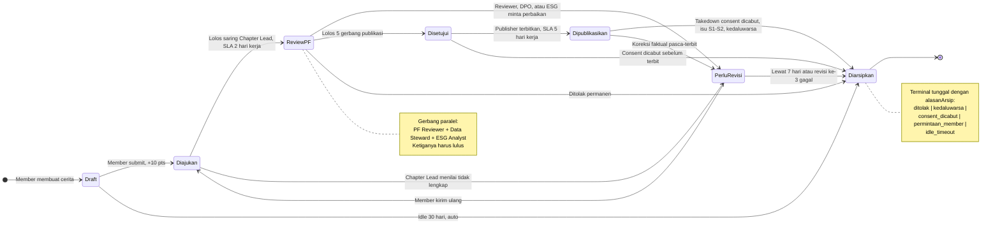
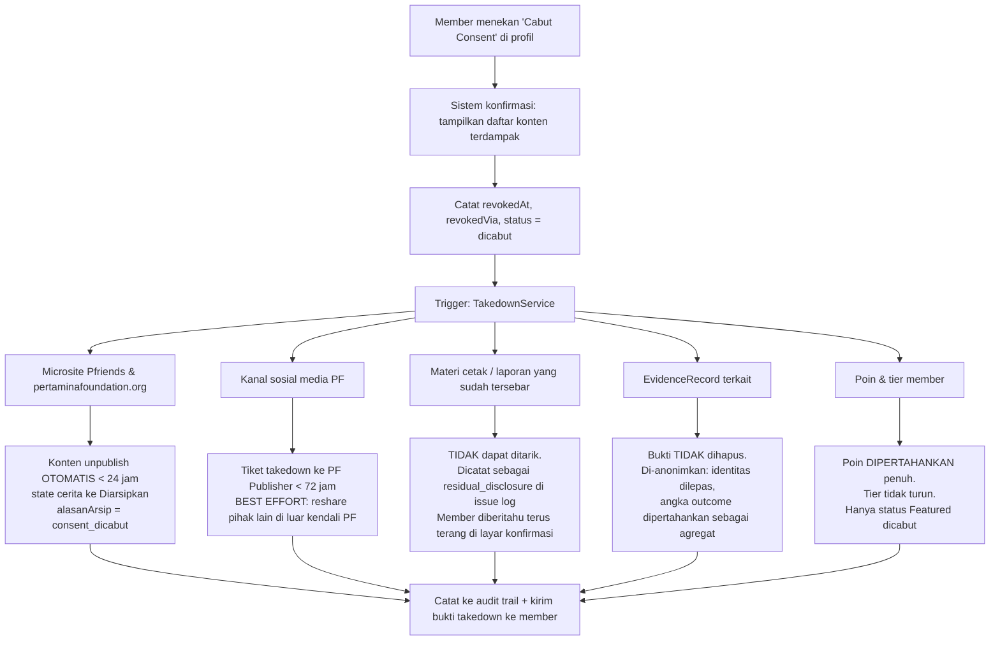
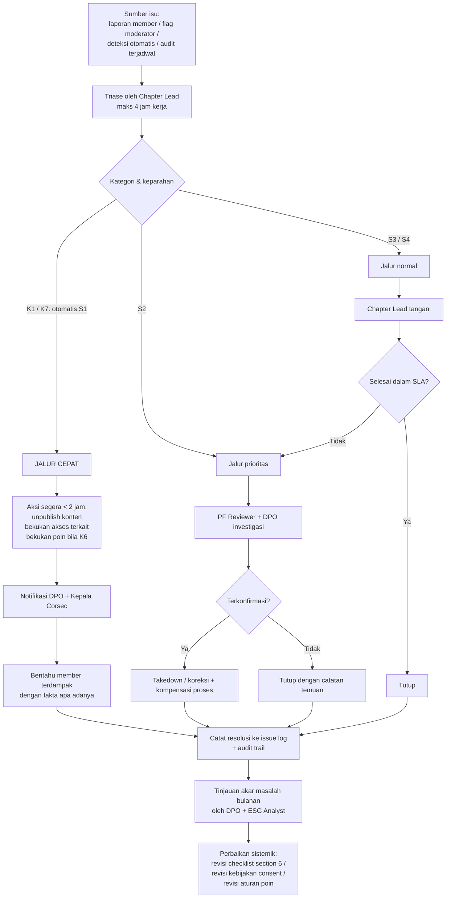
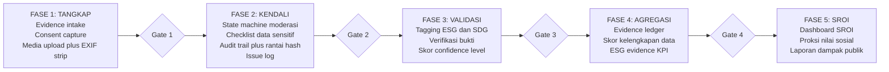

# 04: ESG & Governance Model (Pfriends)

> Turunan langsung dari `00-SOURCE-BRIEF.md` **Hal 9 (Strategic Enhancement)**, **Hal 10 (ESG Measurement Hints)**,
> **Hal 11 (Gamification Scoring Model)**, dan **Hal 12 (Scoring Tiers & Feature Threshold)**.
> Dokumen ini mendefinisikan *apa yang harus dikumpulkan aplikasi sebagai bukti*, *bagaimana konten dimoderasi*,
> dan *bagaimana persetujuan (consent) individu dikelola*: karena member Pfriends adalah **individu nyata**
> (alumni Sobat Bumi Indonesia dan pelaku UMKM Womenpreneur), bukan entitas anonim.

---

## 0. Konvensi Provenance

Karena mockup ini akan dipakai sebagai bahan diskusi dengan tim Corsec, setiap angka dan aturan diberi penanda asal:

| Penanda | Arti |
|---|---|
| **`[DOK]`** | Berasal **persis** dari dokumen sumber (PPT/PDF Corsec). **Tidak boleh diubah.** |
| **`[USUL]`** | Usulan desain analis (SLA, nama field, enum, ambang kualitas). **Wajib divalidasi Corsec** sebelum jadi kebijakan. |

> Semua angka gamifikasi (1/2/5/8/10/15/15/30/50 pts) dan tier (25/50/100/150 pts) di dokumen ini adalah **`[DOK]`**
> dan direplikasi apa adanya. Seluruh SLA jam/hari adalah **`[USUL]`**.

### Prinsip Dasar

Dua kalimat pada **Hal 10** adalah fondasi seluruh model ini:

> **KPI Aktivitas** membuktikan bahwa program **berjalan**.
> **KPI ESG** membuktikan bahwa program **menciptakan nilai**.: `[DOK]`

Konsekuensi arsitektural: aplikasi tidak boleh berhenti pada *counter aktivitas*. Setiap aktivitas yang diklaim
punya nilai ESG **harus** membawa bukti yang dapat ditelusuri. Ini yang membuat Governance bukan sekadar
kebijakan tertulis, melainkan **fitur aplikasi**.

---

## 1. Model Bukti ESG Tiga Pilar

### 1.1 Gerbang Minimum (berlaku untuk SEMUA pilar)

**Hal 12: Minimum for ESG evidence** `[DOK]`:

> Documented activity + outcome note + ESG/SDG tag + evidence source

Empat komponen itu diterjemahkan menjadi **empat field wajib mutlak**. Record bukti yang kehilangan salah satu
dari empat ini **tidak boleh** masuk ke agregasi ESG: statusnya berhenti di `tidak_lengkap`.

| # | Frasa Dokumen `[DOK]` | Field Aplikasi `[USUL]` | Tipe | Validasi |
|---|---|---|---|---|
| 1 | Documented activity | `activityId` | `string` (FK → `activities`) | Wajib; aktivitas harus sudah berstatus `selesai` |
| 2 | Outcome note | `outcomeNote` | `string` (min 120 karakter) | Wajib; bukan template/copy-paste |
| 3 | ESG/SDG tag | `esgTags[]` + `sdgGoals[]` | `string[]`, `number[]` | Wajib; min 1 tag ESG **dan** min 1 nomor SDG |
| 4 | Evidence source | `evidenceSource` + `mediaRefs[]` | `enum`, `MediaRef[]` | Wajib; min 1 lampiran/URL yang dapat diverifikasi |

### 1.2 Field Universal `EvidenceRecord` (base entity)

| Field | Tipe | W/O | Keterangan |
|---|---|:--:|---|
| `id` | `string` (ULID) | **W** | Primary key |
| `pillar` | `enum: 'E' \| 'S' \| 'G'` | **W** | Diskriminator payload pilar |
| `activityId` | `string` | **W** | Gerbang #1: *documented activity* |
| `judul` | `string` (≤120) | **W** | Judul bukti |
| `deskripsi` | `string` (≥200) | **W** | Narasi apa yang dilakukan |
| `outcomeNote` | `string` (≥120) | **W** | Gerbang #2: apa yang **berubah**, bukan apa yang dikerjakan |
| `esgTags` | `string[]` | **W** | Gerbang #3a: lihat §2 |
| `sdgGoals` | `number[]` | **W** | Gerbang #3b: nomor SDG 1–17 |
| `evidenceSource` | `enum` | **W** | Gerbang #4: `foto \| dokumen \| tautan_publik \| data_internal_pf \| pihak_ketiga \| self_report` |
| `mediaRefs` | `MediaRef[]` | **W** | ≥1 item; EXIF wajib di-strip (lihat §6) |
| `periodeMulai` / `periodeSelesai` | `string<ISO8601>` | **W** | Rentang waktu aktivitas |
| `chapterId` | `string` | **W** | Chapter komunitas (Hal 5: *Pembagian chapter komunitas*) |
| `submittedBy` | `string` (memberId) | **W** | Pelapor |
| `submittedAt` | `string<ISO8601>` | **W** | Waktu pengajuan |
| `verificationStatus` | `enum` | **W** | `tidak_lengkap \| menunggu \| terverifikasi \| ditolak \| kedaluwarsa` |
| `confidenceLevel` | `enum` | **W** | `self_reported \| terverifikasi_pf \| terverifikasi_pihak_ketiga` |
| `consentId` | `string` (FK) | **W\*** | **Wajib bila** ada individu teridentifikasi (wajah/nama/usaha) |
| `storyId` | `string` (FK) | O | Bila bukti ini terkait cerita yang dimoderasi (§3) |
| `verifiedBy` / `verifiedAt` | `string`, `ISO8601` | O | Terisi saat status → `terverifikasi` |
| `catatanAsumsi` | `string` | O | **Anti-greenwashing**: asumsi/estimasi di balik angka outcome |
| `integrityHash` / `prevHash` | `string` (SHA-256) | **W** | Rantai integritas bukti (§5.3) |
| `createdAt` / `updatedAt` | `string<ISO8601>` | **W** | Metadata standar |

> `MediaRef = { id, tipe: 'image'|'pdf'|'video'|'url', url, ukuranByte, hash, exifStripped: boolean, altText }`

---

### 1.3 Pilar **Environmental** (E)

**Cakupan aktivitas** `[DOK]`: Hal 10:
`Climate literacy` · `Clean energy campaign` · `Waste reduction` · `Local environmental action`

**Bukti/metrik yang diminta dokumen** `[DOK]`:
`participants` · `locations` · `action reports` · `photos` · `outcomes`

| Field | Tipe | W/O | Turunan dari `[DOK]` | Keterangan |
|---|---|:--:|---|---|
| `kategoriE` | `enum` | **W** | *(cakupan)* | `climate_literacy \| clean_energy_campaign \| waste_reduction \| local_environmental_action` |
| `jumlahPeserta` | `number` (int ≥1) | **W** | participants | Hitungan kepala hadir |
| `pesertaTerdaftar` | `number` | O | participants | Untuk hitung tingkat kehadiran |
| `pesertaBreakdown` | `object` | O | participants | `{ lakiLaki, perempuan, tidakDisebutkan, usia_lt25, usia_25_40, usia_gt40 }`: **agregat saja, tanpa identitas** |
| `daftarHadirRef` | `MediaRef` | O | participants | Scan/foto absensi: **wajib redaksi NIK & no. HP** sebelum unggah |
| `lokasi` | `Lokasi[]` | **W** | locations | `{ namaTempat, kelurahan, kecamatan, kabupatenKota, provinsi, koordinat? }` |
| `koordinatPresisi` | `enum` | **W** | locations | `desa \| kecamatan \| kabupaten`: **koordinat dibulatkan**, dilarang presisi rumah (§6) |
| `laporanAksi` | `string` (≥300) | **W** | action reports | Narasi kronologis: persiapan → pelaksanaan → hasil |
| `laporanAksiRef` | `MediaRef` | O | action reports | Lampiran laporan formal (PDF) |
| `foto` | `MediaRef[]` | **W** | photos | **Min. 2**, maks. 10; `exifStripped = true` wajib |
| `fotoBerisiPihakKetiga` | `boolean` | **W** | photos | Bila `true` → `consentPihakKetiga[]` wajib (§4.4) |
| `outcomes` | `Outcome[]` | **W** | outcomes | **Min. 1**; lihat struktur di bawah |
| `durasiJam` | `number` | O |: | Total jam aksi |
| `mitraKolaborasi` | `string[]` | O |: | Pemda/RT/RW/sekolah/komunitas lain |
| `biayaSwadaya` | `number` (IDR) | O |: | Input untuk perhitungan SROI di fase lanjut (§8) |

**Struktur `Outcome`** (value object: dipakai pilar E dan S):

| Field | Tipe | W/O | Keterangan |
|---|---|:--:|---|
| `metrik` | `string` | **W** | mis. `sampah_terkumpul`, `pohon_ditanam`, `energi_dihemat`, `warga_teredukasi` |
| `nilai` | `number` | **W** | Angka hasil |
| `satuan` | `string` | **W** | `kg` · `batang` · `kWh` · `orang` · `liter` · `m2` |
| `baseline` | `number` | O | Kondisi sebelum aksi |
| `metodePengukuran` | `enum` | **W** | `timbang_langsung \| hitung_manual \| estimasi \| data_mitra \| survei` |
| `estimasi` | `boolean` | **W** | Bila `true`, `catatanAsumsi` di record induk menjadi **wajib** |

> **Aturan anti-greenwashing** `[USUL]`: `estimasi = true` **tanpa** `catatanAsumsi` → record otomatis
> `tidak_lengkap`. Angka estimasi tidak boleh naik ke dashboard publik tanpa label "estimasi".

---

### 1.4 Pilar **Social** (S)

**Cakupan aktivitas** `[DOK]`: Hal 10:
`Scholarship alumni` · `Womenpreneur growth` · `Mentoring` · `Upskilling` · `Social mobility`

**Bukti/metrik yang diminta dokumen** `[DOK]`:
`alumni progress` · `mentoring hours` · `business growth` · `event completion`

| Field | Tipe | W/O | Turunan dari `[DOK]` | Keterangan |
|---|---|:--:|---|---|
| `kategoriS` | `enum` | **W** | *(cakupan)* | `scholarship_alumni \| womenpreneur_growth \| mentoring \| upskilling \| social_mobility` |
| **`alumniProgress`** | `object` | **W\*** | alumni progress | Wajib bila `kategoriS ∈ {scholarship_alumni, social_mobility}` |
| ├ `tahunLulus` | `number` | **W** | alumni progress | Tahun lulus beasiswa Sobat Bumi |
| ├ `statusKarir` | `enum` | **W** | alumni progress | `studi_lanjut \| bekerja \| wirausaha \| asn \| mencari_kerja \| tidak_disebutkan` |
| ├ `sektor` | `string` | O | alumni progress | Sektor industri |
| ├ `jenjangTerakhir` | `enum` | O | alumni progress | `d3 \| s1 \| s2 \| s3` |
| ├ `perusahaanAtauInstansi` | `string` | O | alumni progress | **Sensitif**: hanya tampil publik bila consent `nama_institusi` aktif |
| └ `isMentorAktif` | `boolean` | **W** | alumni progress | Menjembatani ke Hal 4: *alumni sebagai mitra muda/mentor* |
| **`mentoringHours`** | `object` | **W\*** | mentoring hours | Wajib bila `kategoriS = mentoring` |
| ├ `totalJam` | `number` (≥0.5) | **W** | mentoring hours | Akumulasi jam sesi |
| ├ `jumlahSesi` | `number` | **W** | mentoring hours |: |
| ├ `mentorId` | `string` | **W** | mentoring hours | Biasanya alumni SOBI |
| ├ `jumlahMentee` | `number` | **W** | mentoring hours | **Agregat**: daftar identitas mentee tidak disimpan di record bukti |
| ├ `topik` | `string[]` | **W** | mentoring hours | mis. pemasaran digital, riset pasar (Hal 2: kendala Womenpreneur) |
| └ `buktiSesi` | `MediaRef[]` | **W** | mentoring hours | Screenshot sesi/notulen: wajah peserta wajib consent |
| **`businessGrowth`** | `object` | **W\*** | business growth | Wajib bila `kategoriS = womenpreneur_growth` |
| ├ `umkmId` | `string` | **W** | business growth | FK ke profil UMKM binaan |
| ├ `periodeBanding` | `string` | **W** | business growth | mis. `Q1-2026 vs Q1-2025` |
| ├ `omzetBaseline` / `omzetKini` | `number` (IDR) | O | business growth | **RAHASIA by default**: lihat catatan di bawah |
| ├ `pertumbuhanPersen` | `number` | **W** | business growth | Boleh diisi tanpa membuka nominal omzet |
| ├ `tenagaKerjaBaseline` / `tenagaKerjaKini` | `number` | **W** | business growth | Indikator SDG 8 |
| ├ `kanalPasarBaru` | `string[]` | O | business growth | Menjawab kendala "jaringan pemasaran" (Hal 2) |
| ├ `sumberAngka` | `enum` | **W** | business growth | `laporan_mandiri \| pembukuan \| bukti_transaksi \| verifikasi_pf` |
| └ `disclosureLevel` | `enum` | **W** | business growth | `nominal_publik \| persen_publik \| internal_saja`: **default `internal_saja`** |
| **`eventCompletion`** | `object` | **W\*** | event completion | Wajib bila `kategoriS = upskilling` |
| ├ `eventId` | `string` | **W** | event completion | FK ke Kalender Komunitas (Hal 5, pilar 02) |
| ├ `terdaftar` / `hadir` / `menyelesaikan` | `number` | **W** | event completion | Funnel penyelesaian |
| ├ `tingkatPenyelesaian` | `number` (%) | **W** | event completion | `menyelesaikan / terdaftar × 100`, *derived* |
| ├ `sertifikatTerbit` | `number` | O | event completion |: |
| └ `skorPrePost` | `object` | O | event completion | `{ preRataRata, postRataRata }`: bukti kenaikan kompetensi |
| `outcomes` | `Outcome[]` | **W** |: | Sama seperti pilar E |
| `consentId` | `string` | **W** |: | **Selalu wajib di pilar S**: semua bukti S melekat pada individu |

> **Catatan `omzet`** `[USUL]`: nominal omzet UMKM adalah data komersial sensitif. Aplikasi **menyimpan** nominal
> untuk keperluan internal PF, tetapi **default tampilan publik hanya persentase pertumbuhan**. Naik ke
> `nominal_publik` hanya lewat consent eksplisit terpisah.

---

### 1.5 Pilar **Governance** (G)

**Cakupan** `[DOK]`: Hal 10:
`Consent` · `Approval` · `Data quality` · `Evidence integrity` · `Escalation protocol`

**Bukti/metrik yang diminta dokumen** `[DOK]`:
`consent records` · `approved stories` · `metadata` · `audit trail` · `issue log`

Pilar G berbeda sifatnya: buktinya **bukan diunggah member**, melainkan **dihasilkan otomatis oleh sistem**.
Ini poin desain terpenting: Governance harus jadi *by-product* dari cara aplikasi bekerja, bukan laporan manual.

| Field | Tipe | W/O | Turunan dari `[DOK]` | Sumber Data |
|---|---|:--:|---|---|
| `kategoriG` | `enum` | **W** | *(cakupan)* | `consent \| approval \| data_quality \| evidence_integrity \| escalation` |
| `periodeLaporan` | `string` | **W** |: | mis. `2026-07` |
| **Consent** | | | | |
| ├ `totalConsentAktif` | `number` | **W** | consent records | Auto dari tabel `consents` (§4) |
| ├ `totalConsentDicabut` | `number` | **W** | consent records | Auto |
| ├ `cakupanConsentPersen` | `number` (%) | **W** | consent records | `member dengan consent aktif / total member` |
| └ `versiKebijakanTerkini` | `string` | **W** | consent records | mis. `PF-CONSENT-v1.2` |
| **Approval** | | | | |
| ├ `totalCeritaDisetujui` | `number` | **W** | approved stories | Auto dari state machine (§3) |
| ├ `totalCeritaDiajukan` | `number` | **W** | approved stories | Auto |
| ├ `rasioPersetujuan` | `number` (%) | **W** | approved stories | *derived* |
| └ `rataWaktuReviewJam` | `number` | **W** | approved stories | Untuk pemantauan SLA |
| **Data quality** | | | | |
| ├ `skorKelengkapan` | `number` (0–100) | **W** | metadata | % field wajib terisi pada seluruh `EvidenceRecord` periode ini |
| ├ `jumlahRecordTidakLengkap` | `number` | **W** | metadata |: |
| ├ `jumlahRecordTanpaSdgTag` | `number` | **W** | metadata | Pelanggaran Gerbang #3 |
| └ `jumlahRecordEstimasiTanpaAsumsi` | `number` | **W** | metadata | Indikator risiko greenwashing |
| **Evidence integrity** | | | | |
| ├ `rantaiHashValid` | `boolean` | **W** | audit trail | Hasil verifikasi rantai `prevHash` (§5.3) |
| ├ `jumlahMediaExifBersih` | `number` | **W** | evidence integrity |: |
| └ `jumlahBuktiDuplikat` | `number` | **W** | evidence integrity | Deteksi hash media identik |
| **Escalation** | | | | |
| ├ `jumlahIsuTerbuka` | `number` | **W** | issue log | Auto dari `issues` (§7) |
| ├ `jumlahIsuS1S2` | `number` | **W** | issue log | Isu keparahan tinggi |
| └ `rataWaktuPenyelesaianJam` | `number` | **W** | issue log |: |

---

## 2. Pemetaan Aktivitas Komunitas → Tag ESG → SDG

### 2.1 Peta dari Pilar Aktivitas (Hal 5) dan Cakupan ESG (Hal 10)

| Aktivitas Komunitas `[DOK]` | Pilar ESG | `esgTags` `[USUL]` | SDG | Metrik Bukti Utama |
|---|:--:|---|---|---|
| Climate literacy / edukasi iklim | **E** | `climate_literacy` | **SDG 13** · **SDG 4** | `jumlahPeserta`, `warga_teredukasi` |
| Clean energy campaign | **E** | `clean_energy_campaign` | **SDG 7** · **SDG 13** | `jumlahPeserta`, `energi_dihemat (kWh)` |
| Waste reduction / gerakan kurangi sampah | **E** | `waste_reduction` | **SDG 12** · **SDG 11** | `sampah_terkumpul (kg)` |
| Local environmental action (tanam pohon, bersih sungai/pantai) | **E** | `local_environmental_action` | **SDG 13** · **SDG 15** · **SDG 14** | `pohon_ditanam`, `luas_area (m2)`, `lokasi[]` |
| Scholarship alumni progress (Sobat Bumi) | **S** | `scholarship_alumni` | **SDG 4** | `alumniProgress` |
| Womenpreneur growth (PFpreneur / UMKM binaan) | **S** | `womenpreneur_growth` | **SDG 5** · **SDG 8** | `businessGrowth`, `tenagaKerjaKini` |
| Mentoring alumni → Womenpreneur | **S** | `mentoring` | **SDG 4** · **SDG 8** · **SDG 17** | `mentoringHours.totalJam` |
| Upskilling / sharing session | **S** | `upskilling` | **SDG 4** · **SDG 8** | `eventCompletion.tingkatPenyelesaian` |
| Social mobility (kenaikan jenjang karir/ekonomi) | **S** | `social_mobility` | **SDG 1** · **SDG 8** · **SDG 10** | `alumniProgress.statusKarir` |
| Consent & perlindungan data member | **G** | `consent` | **SDG 16** | `consentRecords` |
| Approval / moderasi konten | **G** | `approval` | **SDG 16** | `approvedStories` |
| Data quality & evidence integrity | **G** | `data_quality`, `evidence_integrity` | **SDG 16** | `metadata`, `auditTrail` |
| Escalation protocol | **G** | `escalation_protocol` | **SDG 16** | `issueLog` |
| Kolaborasi lintas pilar (PFprestasi × PFmuda × PFsains × PFlestari) | **S/G** | `cross_pillar_synergy` | **SDG 17** | Jumlah aktivitas multi-pilar |

### 2.2 Peta dari Aksi Gamifikasi (Hal 11) ke Kelayakan Bukti ESG

Tidak semua aksi berpoin layak jadi bukti ESG. Ini penting agar poin tidak "dicuci" menjadi klaim dampak.

| Aksi Gamifikasi `[DOK]` | Poin `[DOK]` | Layak jadi `EvidenceRecord`? `[USUL]` | Pilar | SDG |
|---|:--:|:--:|:--:|---|
| View / read weekly broadcast | **1 pt** | Tidak: hanya KPI Aktivitas |: |: |
| React or reply to light CTA | **2 pts** | Tidak: hanya KPI Aktivitas |: |: |
| Share PF content to WA / private network | **5 pts** | Tidak: KPI Amplifikasi |: |: |
| Share PF content to public social media | **8 pts** | Tidak: KPI Amplifikasi |: |: |
| Submit story / nomination / survey | **10 pts** | **Ya**: masuk state machine §3 | E/S | sesuai isi |
| Attend online session | **15 pts** | **Ya**: via `eventCompletion` | **S** | **4, 8** |
| Ask useful question / share useful answer | **15 pts** | Tidak: KPI Engagement |: |: |
| Become speaker / mentor / facilitator | **30 pts** | **Ya**: via `mentoringHours` | **S** | **4, 8, 17** |
| Lead local action / campaign | **50 pts** | **Ya**: via payload E lengkap | **E** | **7, 12, 13, 15** |

> Selaras dengan catatan Hal 11 `[DOK]`: *"Points should reward meaningful contribution, not spammy activity."*
> Empat aksi berpoin tertinggi (10/15/30/50) adalah tepat aksi yang menghasilkan bukti ESG: desain poin dan
> desain bukti saling menguatkan.

---

## 3. Alur Moderasi & Consent (State Machine Cerita)

### 3.1 Aktor

| Aktor `[USUL]` | Peran | Kewenangan Kunci |
|---|---|---|
| **Member** (SOBI / Womenpreneur) | Penulis cerita & pengunggah bukti | Buat draft, ajukan, revisi, **cabut consent kapan saja** |
| **Chapter Lead** | Moderator lapis-1 di chapter | Saring kelengkapan & relevansi; kembalikan ke revisi; **tidak boleh** menyetujui publikasi |
| **PF Reviewer (Corsec)** | Reviewer substansi | Setujui/tolak; verifikasi klaim; **satu-satunya** pemberi `PF validation` |
| **PF Data Steward / DPO** | Penjaga data pribadi | Jalankan checklist data sensitif (§6); veto mutlak; kelola pencabutan consent |
| **ESG Analyst** | Validator bukti | Tetapkan `esgTags`/`sdgGoals`; ubah `confidenceLevel`; tolak klaim tak berdasar |
| **PF Publisher** | Diseminasi (Hal 5, pilar 04) | Terbitkan ke microsite/sosmed; jalankan takedown |
| **Auditor (read-only)** | Kepatuhan | Baca seluruh audit trail; **tanpa** hak ubah |

> **Pemisahan tugas `[USUL]`**: pengaju ≠ penyetuju ≠ penerbit. Satu orang tidak boleh memegang dua peran
> pada satu cerita. Ini kontrol governance paling dasar dan harus di-*enforce* di layer policy, bukan di UI.

### 3.2 Diagram State Machine



> **Keputusan desain `[USUL]`**: penolakan permanen **tidak** dibuat sebagai state ke-8 (`Ditolak`). Cukup satu
> terminal `Diarsipkan` dengan field `alasanArsip`. Alasannya: konten yang ditolak, yang kedaluwarsa, dan yang
> di-*takedown* karena consent dicabut punya perlakuan teknis **identik** (hilang dari publik, tetap ada di
> audit trail). Membuat state terpisah hanya menduplikasi transisi tanpa menambah informasi.

### 3.3 Definisi State, SLA, dan Yang Diperiksa

| State | Aktor Pemilik | SLA `[USUL]` | Yang Diperiksa | Visibilitas |
|---|---|---|---|---|
| **Draft** | Member |: (auto-arsip 30 hari) | Kelengkapan mandiri; preview checklist §6 | Hanya penulis |
| **Diajukan** | Chapter Lead | Diambil ≤ **2 hari kerja** | Kelengkapan field wajib; relevansi chapter; bukan spam/duplikat | Penulis + Chapter Lead |
| **Review PF** | PF Reviewer + DPO + ESG Analyst | Keputusan ≤ **3 hari kerja** | 5 gerbang publikasi (§3.4); checklist data sensitif (§6); validitas tag ESG/SDG; keselarasan brand | Internal PF |
| **Perlu Revisi** | Member | Member merespons ≤ **7 hari kalender** | Catatan revisi terstruktur (field mana, kenapa) | Penulis + reviewer |
| **Disetujui** | PF Publisher | Terbit ≤ **5 hari kerja** | Re-cek consent masih `aktif` **detik sebelum terbit** | Internal PF |
| **Dipublikasikan** | PF Publisher | Tinjau ulang tiap **12 bulan** | Consent masih berlaku; tidak ada isu baru; fakta masih akurat | Publik |
| **Diarsipkan** | Sistem | Retensi log **5 tahun** `[USUL]` |: | Internal + auditor |

### 3.4 Lima Gerbang Publikasi (`Review PF` → `Disetujui`)

**Hal 12: Minimum for public feature** `[DOK]`:

> **100 points + verified story + consent + PF validation + no sensitive-data concern**

| # | Gerbang `[DOK]` | Cek Otomatis Sistem `[USUL]` | Pemeriksa |
|---|---|---|---|
| 1 | **100 points** | `member.totalPoin >= 100` → tier **Featured Candidate** (merah) | Sistem |
| 2 | **Verified story** | `story.verificationStatus === 'terverifikasi'` **dan** ≥1 `EvidenceRecord` terlampir lulus 4 gerbang §1.1 | ESG Analyst |
| 3 | **Consent** | `consent.status === 'aktif'` **dan** `consent.scope` mencakup kanal tujuan **dan** belum kedaluwarsa | DPO |
| 4 | **PF validation** | Tanda tangan digital `PF Reviewer` tercatat di audit trail | PF Reviewer |
| 5 | **No sensitive-data concern** | Checklist §6 = **21/21 lolos**, `dpoSignOff = true` | Data Steward/DPO |

> Kelima gerbang bersifat **AND**. Sistem **tidak menyediakan tombol override**: jika satu gerbang gagal,
> transisi ke `Disetujui` diblokir di layer policy (`PublicationPolicy`), bukan sekadar disembunyikan di UI.
> Perhatikan gerbang #1 mengikat langsung ke Hal 12: **100 pts = Featured Candidate = eligible for website or
> social media feature** `[DOK]`.

---

## 4. Rancangan Consent Record

Member Pfriends adalah individu nyata. Consent karenanya bukan checkbox tunggal saat pendaftaran, melainkan
**record berversi, bergranular, dan dapat dicabut**.

### 4.1 Prinsip

| Prinsip `[USUL]` | Implikasi Teknis |
|---|---|
| **Granular** | Satu consent per (jenis × kanal), bukan satu consent untuk segalanya |
| **Berversi** | Consent selalu mengikat pada `policyVersion` tertentu; kebijakan berubah → consent lama tidak otomatis berlaku |
| **Kedaluwarsa** | Ada `expiresAt`; tidak ada consent abadi |
| **Dapat dicabut** | Pencabutan harus **semudah** pemberian: satu tombol di profil member |
| **Dapat dibuktikan** | Simpan bukti pemberian (timestamp, teks yang disetujui, hash) |
| **Tidak memaksa** | Menolak consent **tidak** mengurangi poin, tier, atau akses komunitas |

### 4.2 Field `ConsentRecord`

| Field | Tipe | W/O | Keterangan |
|---|---|:--:|---|
| `id` | `string` (ULID) | **W** | Primary key |
| `memberId` | `string` | **W** | Subjek data |
| `subjectType` | `enum` | **W** | `member \| pihak_ketiga \| umkm` |
| `consentType` | `enum` | **W** | Lihat §4.3 |
| `scope` | `string[]` | **W** | Objek yang dicakup: `storyId`, `evidenceId`, atau `'semua_konten'` |
| `channels` | `string[]` | **W** | `microsite_pfriends \| website_pertaminafoundation \| instagram \| linkedin \| youtube \| materi_cetak \| laporan_internal` |
| `purpose` | `string` | **W** | Tujuan spesifik; dilarang generik ("keperluan PF") |
| `policyVersion` | `string` | **W** | mis. `PF-CONSENT-v1.2` |
| `policyUrl` | `string` | **W** | Tautan permanen ke teks kebijakan versi tsb. |
| `statementText` | `string` | **W** | **Teks persis** yang disetujui (disimpan, bukan direferensi) |
| `statementHash` | `string` (SHA-256) | **W** | Hash `statementText`: bukti teks tidak diubah belakangan |
| `status` | `enum` | **W** | `aktif \| kedaluwarsa \| dicabut \| ditangguhkan` |
| `grantedAt` | `string<ISO8601>` | **W** | Waktu pemberian |
| `grantedVia` | `enum` | **W** | `form_microsite \| ttd_digital \| formulir_cetak_discan \| wa_terverifikasi` |
| `grantedProof` | `MediaRef` | O | Scan TTD / screenshot konfirmasi |
| `expiresAt` | `string<ISO8601>` | **W** | Default **`grantedAt + 24 bulan`** `[USUL]` |
| `isMinor` | `boolean` | **W** | Subjek < 18 tahun |
| `guardian` | `object` | **W\*** | Wajib bila `isMinor` → `{ nama, relasi, kontakTerenkripsi, buktiRef }` |
| `revokedAt` | `string<ISO8601>` | O | Terisi saat pencabutan |
| `revokedVia` | `enum` | O | `self_service \| permintaan_email \| permintaan_wa \| permintaan_dpo` |
| `revokedReason` | `string` | O | Opsional: **member tidak wajib memberi alasan** |
| `takedownCompletedAt` | `string<ISO8601>` | O | Bukti eksekusi takedown |
| `supersededBy` | `string` (consentId) | O | Bila diperbarui ke versi kebijakan baru |
| `createdAt` / `updatedAt` | `string<ISO8601>` | **W** | Metadata standar |

### 4.3 Enum `consentType`

| Nilai | Cakupan | Risiko | Default |
|---|---|:--:|:--:|
| `publikasi_nama` | Nama lengkap ditampilkan | Sedang | Tidak aktif |
| `publikasi_foto_wajah` | Wajah member terlihat | **Tinggi** | Tidak aktif |
| `publikasi_cerita` | Narasi/testimoni | Sedang | Tidak aktif |
| `publikasi_video` | Video/rekaman suara | **Tinggi** | Tidak aktif |
| `publikasi_data_usaha` | Nama & profil UMKM | Sedang | Tidak aktif |
| `publikasi_nominal_omzet` | Angka omzet UMKM | **Tinggi** | Tidak aktif |
| `publikasi_institusi` | Nama kampus/perusahaan | Sedang | Tidak aktif |
| `amplifikasi_sosmed` | Konten diunggah ulang di sosmed PF | Sedang | Tidak aktif |
| `kontak_untuk_mentoring` | Kontak dibagikan ke mentee terverifikasi | **Tinggi** | Tidak aktif |
| `pengolahan_data_internal` | Analitik & pelaporan internal PF | Rendah | **Aktif saat daftar** |

> Seluruh `consentType` berisiko **default OFF** (*opt-in*, bukan *opt-out*). Hanya
> `pengolahan_data_internal` aktif otomatis, dan itu pun harus diinformasikan eksplisit saat pendaftaran.

### 4.4 Consent Pihak Ketiga

Foto aksi lingkungan (pilar E) hampir pasti memuat wajah warga yang **bukan** member Pfriends. Mereka tidak punya
akun, jadi tidak bisa memberi consent lewat aplikasi.

| Skenario `[USUL]` | Perlakuan Wajib |
|---|---|
| Wajah pihak ketiga terlihat jelas & dapat dikenali | `consentPihakKetiga[]` wajib: `{ nama, buktiConsentRef, dikumpulkanOleh, tanggal }` |
| Kerumunan, wajah tidak jadi subjek utama | Boleh tanpa consent individual, **tapi** wajib `dokumentasiPublikNotice` (papan/pengumuman di lokasi) |
| **Anak di bawah umur** terlihat | Consent **wali** wajib, tanpa pengecualian. Bila tidak ada → **wajib blur** |
| Tidak ada consent & tidak bisa dikumpulkan | Sistem menawarkan **auto-blur wajah** sebelum submit |

### 4.5 Pencabutan Consent & Dampaknya ke Konten Terbit



**Empat keputusan kebijakan yang perlu persetujuan Corsec** `[USUL]`:

| # | Keputusan | Alasan |
|---|---|---|
| 1 | **Poin tidak dicabut** saat consent ditarik | Hal 11 `[DOK]`: poin memberi penghargaan atas **kontribusi**, bukan atas izin publikasi. Mencabut poin akan menghukum member yang menggunakan haknya: dan itu membuat consent menjadi tidak bebas. |
| 2 | **Bukti ESG dianonimkan, bukan dihapus** | Aksi lingkungan/sosialnya benar-benar terjadi. Menghapus akan memalsukan riwayat dampak. Yang dilepas adalah **kaitan ke identitas**, bukan faktanya. |
| 3 | **Keterbukaan tentang keterbatasan** | Layar konfirmasi wajib menyatakan apa adanya bahwa konten cetak dan *reshare* pihak ketiga tidak dapat ditarik. Menjanjikan penghapusan total adalah janji yang tidak bisa ditepati. |
| 4 | **Tanpa friksi & tanpa negosiasi** | Alur pencabutan dilarang memuat tawaran retensi, langkah tambahan, atau permintaan alasan wajib. |

---

## 5. Audit Trail

### 5.1 Aksi yang Wajib Dicatat

| Domain | Aksi | Pemicu |
|---|---|---|
| **Consent** | `consent.granted`, `consent.revoked`, `consent.expired`, `consent.superseded`, `consent.thirdparty_added` | Setiap perubahan `ConsentRecord` |
| **Moderasi** | `story.created`, `story.submitted`, `story.screened`, `story.review_started`, `story.revision_requested`, `story.approved`, `story.published`, `story.archived`, `story.corrected` | Setiap transisi state §3 |
| **Bukti ESG** | `evidence.created`, `evidence.updated`, `evidence.verified`, `evidence.rejected`, `evidence.tagged`, `evidence.anonymized` | Perubahan `EvidenceRecord` |
| **Data sensitif** | `sensitive.checklist_run`, `sensitive.flag_raised`, `sensitive.dpo_signoff`, `sensitive.redaction_applied`, `sensitive.exif_stripped` | Checklist §6 |
| **Gamifikasi** | `points.awarded`, `points.reversed`, `tier.changed`, `points.gaming_flagged` | Perubahan poin/tier |
| **Publikasi** | `publish.executed`, `takedown.requested`, `takedown.completed`, `takedown.failed` | Aksi Publisher |
| **Akses data** | `data.exported`, `pii.viewed`, `member.data_downloaded` | Akses ke data pribadi |
| **Isu** | `issue.opened`, `issue.escalated`, `issue.resolved`, `issue.closed` | Lihat §7 |
| **Otorisasi** | `role.assigned`, `role.revoked`, `login.failed_repeated`, `policy.overridden_attempt` | Perubahan hak akses |

### 5.2 Field `AuditLog`

| Field | Tipe | W/O | Keterangan |
|---|---|:--:|---|
| `id` | `string` (ULID) | **W** | Monotonic, urut waktu |
| `timestamp` | `string<ISO8601>` | **W** | UTC + offset lokal |
| `actorId` | `string` | **W** | `system` bila otomatis |
| `actorRole` | `enum` | **W** | Peran **saat aksi terjadi** (di-*snapshot*, bukan direferensi) |
| `action` | `string` | **W** | Dari daftar §5.1 |
| `entityType` | `enum` | **W** | `story \| evidence \| consent \| member \| issue \| media` |
| `entityId` | `string` | **W** |: |
| `stateBefore` / `stateAfter` | `string` | O | Untuk transisi state machine |
| `changedFields` | `string[]` | O | **Nama field saja**: nilai PII tidak masuk log |
| `diffHash` | `string` | O | Hash payload perubahan |
| `reason` | `string` | **W\*** | Wajib untuk aksi destruktif: tolak, arsip, takedown, reversal poin |
| `correlationId` | `string` | **W** | Menghubungkan rangkaian aksi satu alur |
| `severity` | `enum` | **W** | `info \| notice \| warning \| critical` |
| `policyVersion` | `string` | O | Versi kebijakan yang berlaku saat aksi |
| `prevHash` | `string` (SHA-256) | **W** | Hash entri sebelumnya: rantai integritas |
| `entryHash` | `string` (SHA-256) | **W** | Hash entri ini (termasuk `prevHash`) |

### 5.3 Integritas: Rantai Hash

`entryHash[n] = SHA256( id + timestamp + actorId + action + entityId + diffHash + prevHash[n-1] )`

Satu entri diubah → seluruh rantai setelahnya tidak cocok. Ini menjawab langsung *evidence integrity* pada
Hal 10 `[DOK]`. Verifikasi rantai dijalankan terjadwal dan hasilnya mengisi `rantaiHashValid` di §1.5.

> **Append-only, tanpa pengecualian** `[USUL]`: tidak ada endpoint `update` atau `delete` pada `AuditLog`.
> Koreksi dilakukan dengan menulis entri baru bertipe `correction` yang merujuk `id` entri keliru.

### 5.4 Matriks Visibilitas

| Peran | Log Miliknya Sendiri | Log Chapter | Log Consent | Log Moderasi | Log Akses PII | Ekspor |
|---|:--:|:--:|:--:|:--:|:--:|:--:|
| **Member** | ✅ | ❌ | ✅ (miliknya) | ✅ (ceritanya) | ✅ (siapa lihat datanya) | ✅ (data sendiri) |
| **Chapter Lead** | ✅ | ✅ | ❌ | ✅ (chapternya) | ❌ | ❌ |
| **PF Reviewer** | ✅ | ✅ | ⚠️ status saja | ✅ | ❌ | ❌ |
| **ESG Analyst** | ✅ | ✅ | ⚠️ status saja | ✅ (bukti) | ❌ | ✅ (agregat anonim) |
| **Data Steward / DPO** | ✅ | ✅ | ✅ **penuh** | ✅ | ✅ | ✅ |
| **PF Publisher** | ✅ | ✅ | ⚠️ status saja | ✅ (terbit) | ❌ | ❌ |
| **Auditor** | ✅ | ✅ | ✅ | ✅ | ✅ | ✅ (read-only) |
| **Admin Sistem** | ✅ | ⚠️ metadata | ❌ | ⚠️ metadata | ❌ | ❌ |

> **Catatan `[USUL]`**: Admin Sistem sengaja **tidak** diberi akses isi consent dan PII. Hak teknis (kelola
> server) dipisahkan dari hak data (lihat data pribadi). Member berhak tahu **siapa** yang melihat datanya :
> ini yang membuat transparansi berlaku dua arah, bukan hanya dari member ke PF.

---

## 6. Checklist "No Sensitive-Data Concern"

Menerjemahkan gerbang kelima Hal 12 `[DOK]` menjadi pemeriksaan konkret. Dijalankan **otomatis oleh sistem**
(deteksi pola) lalu **dikonfirmasi manusia** (Data Steward/DPO) sebelum konten boleh publik.

### 6.1 Checklist 21 Butir

| # | Butir Pemeriksaan | Deteksi Otomatis | Konfirmasi Manusia | Aksi Bila Ditemukan |
|:--:|---|:--:|:--:|---|
| **A. Identitas Langsung** ||||
| 1 | NIK / nomor KTP (16 digit) | ✅ regex | ✅ | **Blokir**: wajib redaksi |
| 2 | Nomor KK, paspor, SIM | ✅ regex | ✅ | **Blokir** |
| 3 | NPWP (15–16 digit berformat) | ✅ regex | ✅ | **Blokir** |
| 4 | Nomor rekening bank / e-wallet | ✅ regex | ✅ | **Blokir** |
| 5 | Nomor HP / WA pribadi | ✅ regex | ✅ | Redaksi, kecuali consent `kontak_untuk_mentoring` aktif |
| 6 | Email pribadi | ✅ regex | ✅ | Redaksi |
| **B. Lokasi** ||||
| 7 | Alamat rumah lengkap (RT/RW + nomor) | ✅ pola | ✅ | Potong sampai tingkat **kelurahan** |
| 8 | Geotag EXIF presisi pada foto | ✅ parser EXIF |: | **Strip otomatis**, `exifStripped = true` |
| 9 | Koordinat lebih presisi dari level desa | ✅ validator | ✅ | Bulatkan sesuai `koordinatPresisi` |
| 10 | Titik rutin yang dapat dilacak (sekolah anak, jadwal tetap) | ❌ | ✅ | Kaburkan/ hapus |
| **C. Data Sensitif Khusus** ||||
| 11 | Data kesehatan / disabilitas / kondisi medis | ⚠️ kata kunci | ✅ | Hapus, kecuali consent eksplisit terpisah |
| 12 | Agama, etnis, orientasi seksual | ⚠️ kata kunci | ✅ | Hapus, kecuali intrinsik pada cerita **dan** ada consent |
| 13 | Afiliasi politik / konten partisan | ⚠️ kata kunci | ✅ | **Blokir** |
| 14 | Data anak di bawah umur (wajah/nama/sekolah) | ⚠️ deteksi wajah | ✅ | Wajib consent wali; bila tidak ada → **blur** |
| 15 | Kondisi ekonomi memalukan / narasi belas kasihan | ❌ | ✅ | Tulis ulang: jaga martabat subjek |
| **D. Komersial & Pihak Ketiga** ||||
| 16 | Nominal omzet UMKM tanpa consent `publikasi_nominal_omzet` | ✅ cek field | ✅ | Turunkan ke persentase |
| 17 | Wajah pihak ketiga tanpa consent (§4.4) | ⚠️ deteksi wajah | ✅ | Blur atau kumpulkan consent |
| 18 | Plat nomor, QR/barcode, dokumen terbaca di foto | ⚠️ OCR | ✅ | Redaksi |
| 19 | Logo/merek pihak ketiga, materi berhak cipta | ❌ | ✅ | Minta izin atau hapus |
| **E. Reputasi & Klaim** ||||
| 20 | Konten SARA, ujaran kebencian, hoaks | ⚠️ kata kunci | ✅ | **Blokir** + buka isu §7 |
| 21 | Klaim dampak berlebihan tanpa `catatanAsumsi` (risiko greenwashing) | ✅ cek field | ✅ | Kembalikan ke `Perlu Revisi` |

### 6.2 Aturan Keputusan

| Kondisi `[USUL]` | Hasil |
|---|---|
| 21/21 lolos **dan** `dpoSignOff = true` | Gerbang #5 **LULUS** → boleh ke `Disetujui` |
| Ada butir "Blokir" (1,2,3,4,13,20) terpicu | **BLOKIR**: tidak dapat dipublikasikan dalam bentuk apa pun |
| Ada butir redaksi/blur belum dieksekusi | → `Perlu Revisi` dengan instruksi field spesifik |
| Deteksi otomatis bersih tapi DPO ragu | **DPO menang**: veto tidak perlu justifikasi teknis |

> **Prinsip `[USUL]`**: deteksi otomatis hanya **menyaring**, tidak pernah **memutuskan**. Sistem yang lulus 21/21
> secara otomatis tetap butuh `dpoSignOff` manusia. Sebaliknya, DPO boleh menolak walau semua cek hijau.

---

## 7. Escalation Protocol & Issue Log

### 7.1 Kategori Isu

| Kode | Kategori | Contoh |
|---|---|---|
| **K1** | Kebocoran data pribadi/sensitif | NIK ter-*publish*; foto anak tanpa consent tersebar |
| **K2** | Sengketa consent | Member menyatakan tidak pernah memberi izin; consent kedaluwarsa tapi konten masih tayang |
| **K3** | Integritas bukti | Foto hasil unduhan internet; angka outcome tidak masuk akal; bukti duplikat lintas member |
| **K4** | Konten bermasalah | SARA, hoaks, konten politik, ujaran kebencian |
| **K5** | Risiko reputasi brand | Konten berpotensi merugikan citra Pertamina / PF / Danantara |
| **K6** | Manipulasi gamifikasi | Spam CTA; akun ganda; klaim `lead local action` **50 pts** `[DOK]` fiktif |
| **K7** | Keamanan akun/akses | Akun diambil alih; akses tak sah ke PII |
| **K8** | Konduct antar-member | Pelecehan, intimidasi dalam sesi mentoring |

### 7.2 Tingkat Keparahan & SLA

| Level | Kriteria | SLA Respons `[USUL]` | SLA Selesai `[USUL]` | Eskalasi Otomatis Ke |
|:--:|---|---|---|---|
| **S1: Kritis** | Data sensitif sudah publik; keselamatan/hukum; krisis reputasi berjalan | **≤ 2 jam** | **≤ 24 jam** | DPO + Kepala Corsec **langsung** |
| **S2: Tinggi** | Consent disengketakan; bukti dipalsukan; konten SARA tayang | **≤ 8 jam** | **≤ 72 jam** | DPO + PF Reviewer Lead |
| **S3: Sedang** | Kualitas data buruk; dugaan gaming poin; keluhan konduct | **≤ 2 hari kerja** | **≤ 10 hari kerja** | Chapter Lead → PF Reviewer |
| **S4: Rendah** | Salah ketik, metadata kurang, pertanyaan klarifikasi | **≤ 5 hari kerja** | **≤ 20 hari kerja** | Chapter Lead |

**Aturan naik-level otomatis** `[USUL]`:
- Kategori **K1** dan **K7** → **selalu** dimulai di **S1**, tidak dapat diturunkan tanpa persetujuan DPO.
- SLA respons terlampaui → naik satu level otomatis.
- Isu S1 belum selesai dalam 24 jam → notifikasi ke Kepala Divisi Corsec.

### 7.3 Alur Eskalasi



### 7.4 Field `IssueLog`

| Field | Tipe | W/O | Keterangan |
|---|---|:--:|---|
| `id` | `string` | **W** | Nomor tiket, mis. `PF-ISU-2026-0142` |
| `kategori` | `enum` | **W** | `K1`–`K8` |
| `severity` | `enum` | **W** | `S1`–`S4` |
| `sumberLaporan` | `enum` | **W** | `member \| moderator \| deteksi_otomatis \| audit \| eksternal` |
| `reportedBy` | `string` | **W** | Boleh `anonim` untuk K8 |
| `entityType` / `entityId` | `enum`, `string` | O | Objek terkait |
| `deskripsi` | `string` | **W** | Kronologi |
| `status` | `enum` | **W** | `terbuka \| triase \| investigasi \| tindakan \| menunggu_pihak_lain \| selesai \| ditutup` |
| `assignedTo` / `escalatedTo` | `string` | **W** | Penanggung jawab & tujuan eskalasi |
| `slaResponsDeadline` / `slaSelesaiDeadline` | `ISO8601` | **W** | Dihitung otomatis dari `severity` |
| `slaBreached` | `boolean` | **W** | *Derived* |
| `tindakanDiambil` | `string[]` | O | `unpublish`, `redaksi`, `blur`, `poin_dibatalkan`, `akun_dibekukan` |
| `dampakKeMember` | `string` | O | Konsekuensi bagi member terdampak |
| `residualDisclosure` | `boolean` | O | Ada bagian yang tidak dapat ditarik (§4.5) |
| `rootCause` | `string` | O | Diisi saat penutupan |
| `perbaikanSistemik` | `string` | O | Perubahan proses/checklist hasil isu ini |
| `openedAt` / `resolvedAt` / `closedAt` | `ISO8601` | **W/O** | Linimasa |

---

## 8. "Bukti Pipeline Sebelum Dashboard" → Urutan Fitur Aplikasi

**Hal 9: Strategic Enhancement** `[DOK]`:

| Internal Direction | Strategic Enhancement |
|---|---|
| Amplification KPI | **Engagement KPI + ESG evidence KPI** |
| SROI dashboard | **Bukti pipeline before dashboard** |

### 8.1 Alasan Urutan Ini Mengikat

SROI adalah rasio: nilai sosial dibagi investasi. Pembilangnya **hanya sekuat bukti yang menopangnya**. Membangun
dashboard lebih dulu menghasilkan angka yang tampak meyakinkan tetapi tidak dapat dipertahankan saat diaudit :
dan justru merusak tujuan Hal 6 `[DOK]`: **peningkatan trust**. Karena itu urutan pada Hal 9 bukan preferensi
teknis, melainkan **prasyarat kredibilitas**.

### 8.2 Peta Fase



### 8.3 Fase, Fitur, dan Gerbang Kelulusan

| Fase | Fitur Aplikasi | Modul `[USUL]` | Gerbang Lulus ke Fase Berikutnya `[USUL]` |
|:--:|---|---|---|
| **1. Tangkap** | Form bukti per pilar (§1.3–1.5); form consent granular (§4); unggah media + strip EXIF | `domain/evidence`, `domain/consent`, `services/MediaService` | ≥100 `EvidenceRecord` masuk **dan** ≥90% punya `consentId` valid |
| **2. Kendali** | State machine 7-state (§3); checklist 21 butir (§6); audit trail rantai hash (§5); issue log (§7) | `domain/moderation`, `policies/PublicationPolicy`, `services/AuditService` | Rantai hash valid 100%; **nol** konten terbit melewati checklist; SLA review terpenuhi ≥80% |
| **3. Validasi** | Tagging ESG/SDG (§2); verifikasi ESG Analyst; penetapan `confidenceLevel` | `domain/esg`, `services/TaggingService` | ≥95% bukti punya `esgTags` **dan** `sdgGoals`; ≥70% ber-`confidenceLevel` ≥ `terverifikasi_pf` |
| **4. Agregasi** | Evidence ledger; skor kelengkapan; **ESG evidence KPI** berdampingan dengan Engagement KPI | `domain/reporting`, `charts/` (ECharts) | `skorKelengkapan` ≥85 selama **3 bulan berturut-turut**; nol record estimasi tanpa asumsi |
| **5. SROI** | Dashboard SROI; proksi nilai sosial; laporan dampak publik | `routes/dashboard/sroi` |: |

### 8.4 Pemisahan Dua Jenis KPI di UI

Menerjemahkan kalimat penutup Hal 10 `[DOK]` menjadi keputusan antarmuka:

| Jenis KPI | Sumber Angka | Membuktikan | Tersedia Sejak |
|---|---|---|---|
| **KPI Aktivitas / Engagement** | Poin gamifikasi (Hal 11), amplifikasi, kehadiran, KPI Hal 6 (75% terdata, 50% amplifikasi, 2 aktivitas) `[DOK]` | Program **berjalan** | Fase 1 |
| **KPI ESG Evidence** | `EvidenceRecord` yang lulus 4 gerbang §1.1 | Program **menciptakan nilai** | Fase 4 |

> **Aturan tampilan `[USUL]`**: kedua jenis KPI ditampilkan **berdampingan namun berlabel jelas dan tidak
> dijumlahkan**. Menggabungkan "jumlah share" dengan "kg sampah terkumpul" ke dalam satu skor komposit akan
> mengaburkan tepat perbedaan yang ditegaskan Hal 10.

### 8.5 Konsekuensi untuk Mockup Ini

| Keputusan | Implikasi pada Mockup |
|---|---|
| Fase 1–3 adalah **inti** | Modul consent, moderasi, audit trail, dan tagging ESG **wajib** ada dan berfungsi di mockup |
| Fase 5 ditampilkan sebagai **placeholder berlabel** | Halaman SROI ada, tetapi diberi label eksplisit: *"Menunggu pipeline bukti: Fase 4 belum terpenuhi"* |
| Data seed harus **realistis, bukan sempurna** | Seed wajib memuat record `tidak_lengkap`, consent `dicabut`, dan isu terbuka: agar alur governance benar-benar terlihat bekerja |

---

## 9. Ringkasan Tabel Dexie (untuk implementasi)

Mengikuti konvensi `src/lib/db/index.js` pada repo referensi (hanya field ter-indeks yang dideklarasikan):

```js
db.version(1).stores({
  evidences: 'id, pillar, activityId, chapterId, submittedBy, verificationStatus, submittedAt',
  stories:   'id, memberId, state, chapterId, submittedAt, publishedAt',
  consents:  'id, memberId, consentType, status, expiresAt, revokedAt',
  auditLogs: 'id, timestamp, actorId, action, entityType, entityId, correlationId, severity',
  issues:    'id, kategori, severity, status, assignedTo, openedAt, slaSelesaiDeadline',
  esgTags:   'id, pillar, kode',
  sdgGoals:  'nomor'
});
```

Domain logic (`PublicationPolicy`, `ConsentPolicy`, `EvidenceCompletenessPolicy`, `EscalationPolicy`,
`SensitiveDataChecklist`) ditempatkan di `src/lib/domain/` dan **tidak boleh** bocor ke komponen Svelte :
komponen hanya memanggil store, store memanggil service, service memanggil policy.

---

## 10. Butir yang Perlu Konfirmasi Corsec

| # | Butir | Mengapa Perlu Diputuskan Corsec |
|:--:|---|---|
| 1 | Seluruh nilai SLA (§3.3, §7.2) | Bergantung kapasitas tim Corsec sebenarnya |
| 2 | Masa berlaku consent 24 bulan (§4.2) | Kebijakan legal PF |
| 3 | Poin **tidak** dicabut saat consent ditarik (§4.5) | Keputusan kebijakan, bukan teknis |
| 4 | Bukti ESG dianonimkan (bukan dihapus) saat consent ditarik (§4.5) | Perlu dasar hukum retensi data |
| 5 | Retensi audit log 5 tahun (§3.3) | Kepatuhan & kapasitas penyimpanan |
| 6 | Peran DPO / Data Steward | Perlu penunjukan personel nyata |
| 7 | Ambang gerbang antar-fase (§8.3) | Menentukan kapan dashboard SROI boleh dibuka |
| 8 | Daftar SDG resmi yang diklaim PF | Agar selaras dengan pelaporan TJSL Pertamina |
