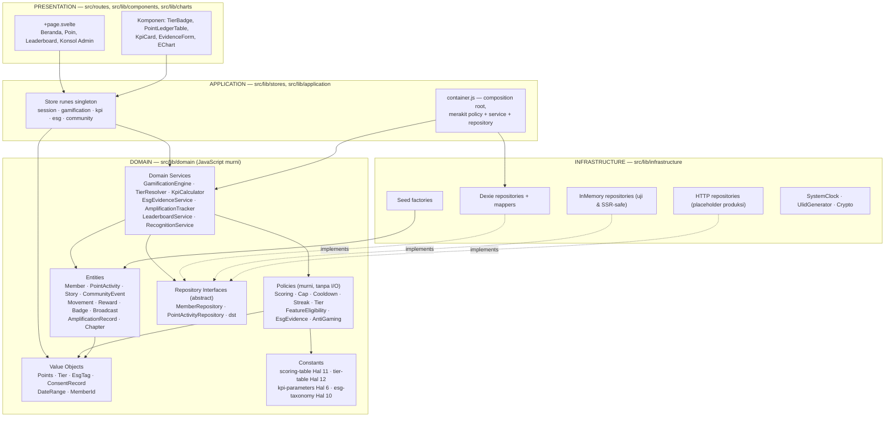
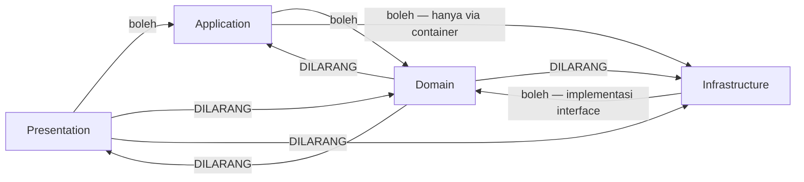
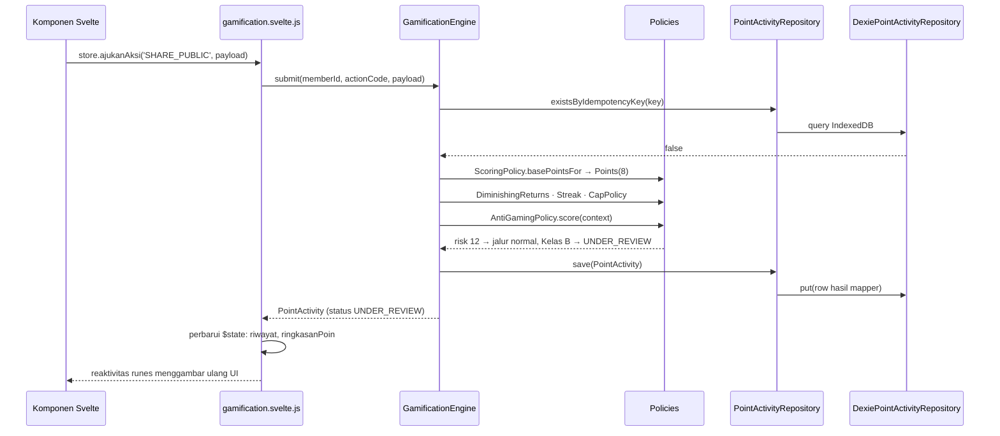
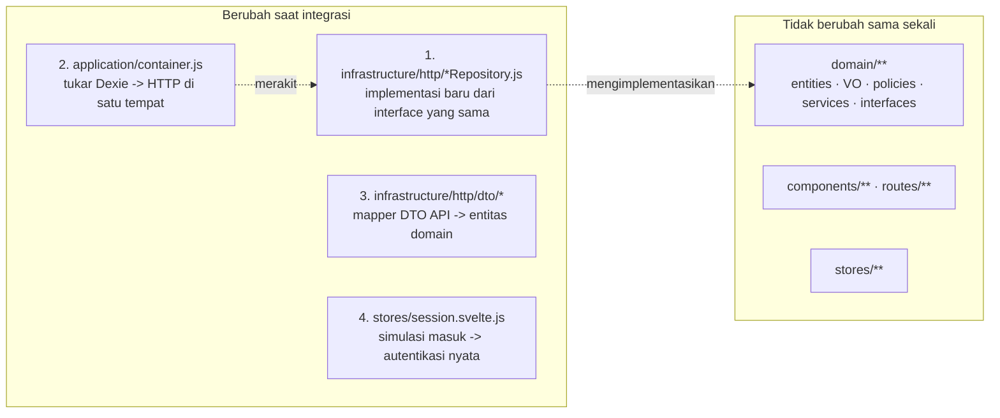

# 05 — Arsitektur Perangkat Lunak Pfriends

> **Peran dokumen.** Rancangan teknis mengikat untuk implementasi microsite **Pfriends** (Community Connect
> Initiative — Divisi Corporate Secretary, Pertamina Foundation).
> **Sumber kebenaran:** `00-SOURCE-BRIEF.md`. Turunan analisis: `01-BRD-SRS.md`, `02-KPI-MODEL.md`,
> `03-GAMIFICATION-SPEC.md`, `04-ESG-GOVERNANCE.md`.
> **Aturan emas yang diwarisi:** seluruh angka poin (1/2/5/8/10/15/15/30/50), ambang tier (25/50/100/150),
> dan target KPI (75% / 1–2 / ≥2 / 50% / 2) **tidak boleh** muncul sebagai literal di mana pun kecuali di
> satu berkas konstanta domain.

| Atribut | Nilai |
|---|---|
| Versi | 1.0 |
| Tanggal | 20 Juli 2026 |
| Sifat rilis | Mockup / prototipe fungsional — tanpa backend, arsitektur siap disambung REST API |
| Stack | SvelteKit 2.49 · Svelte 5 (runes) · JavaScript + JSDoc · Tailwind CSS 4 · Dexie 4 · ECharts 6 |
| Adapter | `@sveltejs/adapter-static`, SPA (`fallback: 'index.html'`), `export const ssr = false` |
| Bahasa | Narasi & UI: **Bahasa Indonesia**. Identifier & istilah domain: **Inggris** |

---

## Daftar Isi

1. [Prinsip & Aturan Ketergantungan](#1-prinsip--aturan-ketergantungan)
2. [Diagram Layer](#2-diagram-layer)
3. [Struktur Folder Lengkap `src/`](#3-struktur-folder-lengkap-src)
4. [Rancangan OOP Detail](#4-rancangan-oop-detail)
5. [Pola Desain yang Dipakai](#5-pola-desain-yang-dipakai)
6. [Aturan Clean Code Proyek Ini](#6-aturan-clean-code-proyek-ini)
7. [Store Svelte 5 Membungkus Domain](#7-store-svelte-5-membungkus-domain)
8. [Jalur Migrasi Mockup → Produksi](#8-jalur-migrasi-mockup--produksi)
9. [Lampiran — Peta Ketertelusuran](#9-lampiran--peta-ketertelusuran)

---

## 1. Prinsip & Aturan Ketergantungan

### 1.1 Empat lapisan

| Lapisan | Isi | Boleh mengimpor | **Dilarang keras** mengimpor |
|---|---|---|---|
| **Presentation** | `src/routes/**`, `src/lib/components/**`, `src/lib/charts/**` | `$lib/stores`, `$lib/utils`, `$lib/data` | `$lib/domain/**`, `$lib/infrastructure/**`, `dexie` |
| **Application** | `src/lib/stores/**`, `src/lib/application/**` | `$lib/domain/**`, `$lib/application/container.js`, `svelte` (runes) | `dexie` langsung, `$lib/infrastructure/dexie/**` (kecuali via container) |
| **Domain** | `src/lib/domain/**` | hanya sesama `$lib/domain/**` | **apa pun** dari `svelte`, `$app/*`, `dexie`, `echarts`, `$lib/stores`, `$lib/components`, DOM/browser API |
| **Infrastructure** | `src/lib/infrastructure/**` | `$lib/domain/**` (untuk mengimplementasikan interface & memetakan entitas), `dexie`, `$app/environment` | `$lib/stores`, `$lib/components`, `$lib/routes` |

**Arah ketergantungan hanya satu:** Presentation → Application → Domain ← Infrastructure.
Domain berada di pusat dan **tidak menunjuk ke luar**. Infrastructure menunjuk *ke dalam* karena ia yang
mengimplementasikan abstraksi milik domain — inilah *Dependency Inversion* yang sebenarnya, bukan sekadar
"pakai interface".

### 1.2 Mengapa domain tidak boleh tahu Svelte maupun Dexie

Tiga alasan konkret, bukan dogma:

1. **Angka Corsec harus dapat diuji tanpa browser.** `ScoringPolicy`, `TierPolicy`, `CapPolicy` adalah
   terjemahan langsung Hal 11 & Hal 12. Kalau kelas-kelas itu mengimpor `dexie` atau `$state`, mereka hanya
   bisa dijalankan di dalam browser — verifikasi angka menjadi mahal dan jarang dilakukan. Sebagai kelas
   JavaScript murni, semuanya dapat dieksekusi `node` langsung.
2. **Mockup ini akan diganti backend-nya.** Dokumen sumber Hal 7 menempatkan integrasi IT pada Februari dan
   microsite pada Mei. Ketika API nyata datang, yang berubah **hanya** isi `src/lib/infrastructure/`.
   Kalau aturan poin tertanam di `+page.svelte`, migrasi berarti menulis ulang aplikasi.
3. **Governance Hal 10 menuntut jejak audit yang deterministik.** Aturan yang tersebar di komponen tidak
   dapat diaudit. Aturan yang terkumpul di `domain/policies/` dapat ditunjuk satu per satu ketika Corsec
   bertanya "dasar keputusan ini apa".

### 1.3 Penegakan otomatis

Aturan ketergantungan bukan imbauan. Ditegakkan oleh skrip statis:

```
scripts/verify/check-layering.mjs   # gagal (exit 1) bila menemukan impor terlarang lintas lapisan
scripts/verify/check-magic-numbers.mjs  # gagal bila 25|50|100|150|0.75|0.5 muncul di luar domain/constants
scripts/verify/compile-all.mjs      # sudah ada — kompilasi seluruh .svelte dengan compiler Svelte 5
```

`check-layering.mjs` bekerja dengan aturan sederhana: baca setiap `import` di `src/lib/domain/**`, tolak
kalau specifier-nya bukan path relatif ke dalam `domain/` sendiri. Lalu baca setiap `import` di
`src/lib/components/**` dan `src/routes/**`, tolak kalau menyebut `domain/` atau `infrastructure/`.

---

## 2. Diagram Layer

### 2.1 Peta lapisan



### 2.2 Aturan ketergantungan sebagai diagram



Baca diagram ini secara harfiah: **tidak ada satu pun panah keluar dari `Domain`.** Kalau sebuah berkas di
`src/lib/domain/` butuh `import { browser } from '$app/environment'`, berarti tanggung jawabnya salah tempat
— pindahkan ke `infrastructure/` dan suntikkan hasilnya sebagai parameter.

### 2.3 Alur satu aksi dari klik sampai IndexedDB

Contoh: anggota menekan "Saya sudah bagikan ke Instagram" (`SHARE_PUBLIC`, 8 pts — Hal 11).



Perhatikan: komponen tidak pernah tahu angka 8, tidak tahu Dexie, dan tidak tahu bahwa Kelas B butuh
verifikasi manusia. Ia hanya memanggil satu method store dan membaca `$state`.

---

## 3. Struktur Folder Lengkap `src/`

Setiap berkas disertai satu kalimat tanggung jawab. Berkas yang bertanda **[Hal N]** adalah terjemahan
langsung dokumen sumber dan tidak boleh diubah tanpa revisi dokumen Corsec.

### 3.1 Akar

| Path | Tanggung jawab |
|---|---|
| `src/app.html` | Kerangka HTML tunggal untuk SPA statis. |
| `src/app.css` | Token warna Pertamina/tier dalam blok `@theme` dan utility kustom dalam `@utility`. |
| `src/routes/+layout.js` | Menonaktifkan SSR (`export const ssr = false`) dan prerender — wajib untuk SPA + Dexie. |
| `src/routes/+layout.svelte` | Kerangka aplikasi: header, navigasi, footer, dan bootstrap seed sekali jalan. |

### 3.2 `src/lib/domain/` — lapisan domain (JavaScript murni, nol dependensi eksternal)

#### `domain/shared/`

| Berkas | Tanggung jawab |
|---|---|
| `DomainError.js` | Kelas galat dasar domain beserta turunannya (`InvariantViolation`, `NotFound`, `Forbidden`). |
| `Result.js` | Pembungkus hasil operasi bisnis yang boleh gagal secara wajar (`Result.ok` / `Result.fail`). |
| `Clock.js` | Interface abstrak penyedia waktu agar seluruh aturan berbasis tanggal dapat diuji deterministik. |
| `IdGenerator.js` | Interface abstrak pembangkit identitas (ULID) agar entitas tidak memanggil `crypto` langsung. |
| `Enum.js` | Basis kelas enum-as-object beku dengan `fromCode`, `equals`, dan daftar `values()`. |
| `guards.js` | Fungsi penjaga invariant ringkas (`assertPositiveInt`, `assertNonEmpty`, `assertOneOf`). |

#### `domain/constants/`

| Berkas | Tanggung jawab |
|---|---|
| `scoring-table.js` | **[Hal 11]** Satu-satunya tempat sembilan nilai poin 1/2/5/8/10/15/15/30/50 dituliskan. |
| `tier-table.js` | **[Hal 12]** Satu-satunya tempat ambang 25/50/100/150, warna, dan kalimat benefit dituliskan. |
| `kpi-parameters.js` | **[Hal 6]** Target 0.75, 1–2, ≥2, 0.50, 2 serta rentang 25–500, 5–20%, 2–3× beserta asumsi. |
| `cap-table.js` | Batas harian/mingguan/bulanan dan cooldown per aksi (03-GAMIFICATION §5.2–5.3). |
| `esg-taxonomy.js` | **[Hal 10]** Daftar pilar E/S/G, kategori cakupan, dan daftar SDG 1–17 yang diklaim PF. |
| `badge-catalog.js` | Katalog 20 badge beserta kriteria deterministik dan rarity. |
| `reward-catalog.js` | Katalog penukaran Koin Tukar beserta harga, tier minimum, dan kuota bulanan. |
| `consent-types.js` | Sepuluh `consentType` beserta tingkat risiko dan status default (seluruhnya opt-in). |
| `roles.js` | Enam peran RBAC (`PUBLIC` … `CORSEC_MANAGER`) beserta kemampuan yang melekat. |

#### `domain/value-objects/`

| Berkas | Tanggung jawab |
|---|---|
| `MemberId.js` | Identitas anggota yang tervalidasi formatnya, membuat tanda tangan method eksplisit. |
| `Points.js` | Bilangan poin non-negatif dengan aritmatika aman (`plus`, `minus`, `scaledBy`, `clampTo`). |
| `Tier.js` | **[Hal 12]** Tier sebagai objek beku berisi kode, label, ambang, warna, dan kalimat benefit. |
| `TierResolution.js` | Hasil resolusi tier: tier aktif, tier terkunci, dan daftar syarat yang belum terpenuhi. |
| `EsgTag.js` | Pasangan pilar E/S/G dengan kategori cakupan yang valid menurut taksonomi Hal 10. |
| `SdgGoal.js` | Nomor SDG 1–17 tervalidasi beserta nama resminya. |
| `ConsentRecord.js` | Rekaman persetujuan **immutable** dan berversi; pencabutan menghasilkan instans baru. |
| `DateRange.js` | Rentang tanggal tertutup dengan operasi `contains`, `overlaps`, `durationDays`, `clampTo`. |
| `ActionCode.js` | Sembilan kode aksi Hal 11 sebagai enum beku, satu-satunya sumber kode yang sah. |
| `ActionClass.js` | Klasifikasi operasional A/B/C/D yang menentukan jalur verifikasi dan cap. |
| `ActivityStatus.js` | Delapan status siklus hidup entri poin beserta transisi yang diizinkan. |
| `MemberStatus.js` | Status keanggotaan `TERDAFTAR`…`KELUAR` beserta kemampuan memperoleh poin. |
| `CommunityType.js` | Dua komunitas utama: `SOBI` dan `WOMENPRENEUR`. |
| `ProgramPillar.js` | Empat pilar program: PFprestasi, PFmuda, PFsains, PFlestari. |
| `SeasonId.js` | Identitas musim kuartalan (`2026-S3`) dengan konversi dari/ke `DateRange`. |
| `Rarity.js` | Empat tingkat kelangkaan badge beserta bonus Koin Tukar. |
| `EligibilityVerdict.js` | Hasil evaluasi policy: `eligible`, daftar `checks`, dan daftar `missing` siap ditampilkan. |
| `MetricResult.js` | Hasil satu metrik KPI: nilai, pembilang, penyebut, status warna, dan periode. |
| `ReachEstimate.js` | Estimasi jangkauan organik: bruto, neto, dan daftar asumsi yang wajib ditampilkan. |
| `AmplificationLevel.js` | Lima tingkat bukti amplifikasi L0–L4 beserta bobot kepercayaannya. |

#### `domain/entities/`

| Berkas | Tanggung jawab |
|---|---|
| `Entity.js` | Basis entitas: identitas, `equals` berbasis id, dan pencatatan `domainEvents`. |
| `Member.js` | Akar agregat anggota: identitas, komunitas, pilar, saldo poin, streak, dan status. |
| `BusinessProfile.js` | Profil usaha PFpreneur beserta hingga lima produk etalase. |
| `PointActivity.js` | Satu entri buku besar kontribusi beserta state machine 8 status (= `PointLedgerEntry`). |
| `Story.js` | Cerita/liputan anggota beserta state machine moderasi dan keterkaitan consent. |
| `CommunityEvent.js` | Kegiatan kalender (upskilling / pertemuan / sharing) beserta kuota dan kehadiran. |
| `Movement.js` | Gerakan bersama beserta kategori, periode, partisipan, dan tag ESG/SDG. |
| `ActionReport.js` | Laporan aksi lapangan dari sebuah gerakan — pemasok utama bukti ESG. |
| `Content.js` | Konten Pertamina/PF yang dapat diterbitkan dan diamplifikasi. |
| `Broadcast.js` | Satu peristiwa diseminasi terjadwal beserta daftar penerima dan penanda baca. |
| `AmplificationRecord.js` | Satu aksi amplifikasi anggota beserta kanal, tingkat bukti, dan status verifikasi. |
| `Chapter.js` | Chapter komunitas (wilayah/batch) beserta penanggung jawab dan keanggotaan. |
| `Badge.js` | Definisi lencana: kode, keluarga, rarity, dan kriteria deterministik. |
| `BadgeAward.js` | Pemberian lencana kepada anggota beserta waktu dan entri sumbernya. |
| `Reward.js` | Item katalog penukaran beserta harga Koin Tukar, tier minimum, dan kuota. |
| `RedemptionOrder.js` | Pesanan penukaran beserta siklus status `DIAJUKAN` → `SELESAI`/`DIBATALKAN`. |
| `EvidenceRecord.js` | Rekaman bukti ESG dengan empat field gerbang Hal 12 dan rantai hash integritas. |
| `Recognition.js` | Penghargaan TOP Contribution / TOP Awardee beserta periode dan status publikasi. |
| `AuditLogEntry.js` | Entri jejak audit *append-only* berantai hash — tidak punya method `update`. |

#### `domain/policies/` — murni, tanpa I/O, menerima snapshot dan mengembalikan keputusan

| Berkas | Tanggung jawab |
|---|---|
| `ScoringPolicy.js` | **[Hal 11]** Memetakan kode aksi → poin dasar, kelas, dan kunci idempotensi. |
| `CapPolicy.js` | Memotong poin yang diminta dengan batas per-aksi, per-kelas, dan global. |
| `CooldownPolicy.js` | Memutuskan apakah jeda minimum antar aksi sejenis sudah terpenuhi. |
| `DiminishingReturnsPolicy.js` | Menghitung pengali penurunan untuk aksi sejenis pada hari yang sama. |
| `StreakPolicy.js` | Menghitung pengali streak mingguan dan pemakaian token Jeda Aman. |
| `TierPolicy.js` | **[Hal 12]** Ambang tier + syarat komposisi + perhitungan Poin Aktif dan Gelar Kehormatan. |
| `FeatureEligibilityPolicy.js` | **[Hal 12]** Gerbang lima syarat konjungtif untuk public feature. |
| `EsgEvidencePolicy.js` | **[Hal 12]** Gerbang empat syarat konjungtif untuk kelayakan bukti ESG. |
| `AntiGamingPolicy.js` | Menghitung skor risiko 0–100 dari delapan sinyal dan memetakan ke konsekuensi. |
| `VerificationPolicy.js` | Menentukan peran verifikator, kebutuhan dual-control, SLA, dan konflik kepentingan. |
| `ConsentPolicy.js` | Menentukan keabsahan consent: aktif, belum kedaluwarsa, mencakup scope & kanal. |
| `SensitiveDataPolicy.js` | Menjalankan checklist data sensitif dan menghasilkan verdict `CLEAR`/`FLAGGED`. |
| `PublicationPolicy.js` | Menggabungkan lima gerbang publikasi story sebelum status `DISETUJUI`. |
| `AmplificationPolicy.js` | Menentukan tingkat bukti L0–L4, kunci deduplikasi, dan aturan anti-manipulasi. |
| `ThresholdPolicy.js` | Memetakan nilai metrik terhadap target → status warna hijau/kuning/merah. |
| `AccessPolicy.js` | Menjawab "peran ini boleh melakukan aksi ini pada objek ini?" untuk enam peran RBAC. |
| `SeasonPolicy.js` | Menentukan batas musim kuartalan, carry-over 50%, dan grace period Champion. |

#### `domain/services/` — orkestrasi; boleh memanggil repository, tidak boleh menyentuh Svelte/Dexie

| Berkas | Tanggung jawab |
|---|---|
| `GamificationEngine.js` | Orkestrator utama pengajuan, perhitungan, verifikasi, dan pembukuan poin. |
| `TierResolver.js` | Merakit statistik anggota dari repository lalu mendelegasikan keputusan ke `TierPolicy`. |
| `EsgEvidenceService.js` | Menyusun, memvalidasi, dan mengagregasi `EvidenceRecord` per pilar ESG. |
| `AmplificationTracker.js` | Mencatat, mendeduplikasi, dan memverifikasi aksi amplifikasi beserta funnel-nya. |
| `KpiCalculator.js` | Menghitung lima metrik inti Hal 6 dan mengembalikan `MetricResult` per metrik. |
| `LeaderboardService.js` | Membangun delapan papan peringkat beserta aturan anonimitas dan anti-demotivasi. |
| `RecognitionService.js` | Menghitung skor komposit TOP Contribution dan mengelola kurasi TOP Awardee. |
| `BadgeEvaluator.js` | Menghitung ulang seluruh badge dari buku besar dan menyelisihkan dengan yang dimiliki. |
| `QuestEvaluator.js` | Mengevaluasi progres quest musiman dari entri berstatus `AWARDED`. |
| `MembershipService.js` | Mengelola pendaftaran, pencocokan master data, verifikasi admin, dan transisi status. |
| `StoryModerationService.js` | Menjalankan alur moderasi cerita dari `DIAJUKAN` sampai `TERBIT` atau `DIARSIPKAN`. |
| `RedemptionService.js` | Memproses penukaran Koin Tukar beserta pemeriksaan tier, kuota, dan pembatalan. |
| `AuditTrailService.js` | Menulis entri audit berantai hash untuk setiap aksi yang wajib dicatat. |
| `ReachEstimator.js` | Mengestimasi jangkauan organik dan nilai earned media beserta daftar asumsinya. |
| `SeedPolicyChecker.js` | Memeriksa konsistensi data seed terhadap seluruh policy sebelum aplikasi dijalankan. |

#### `domain/repositories/` — **abstract base class saja**, nol implementasi

| Berkas | Tanggung jawab |
|---|---|
| `Repository.js` | Kontrak dasar: `findById`, `save`, `saveMany`, `delete`, `count`. Melempar bila tidak dioverride. |
| `MemberRepository.js` | Kontrak akses anggota termasuk pencarian per komunitas, chapter, dan status. |
| `PointActivityRepository.js` | Kontrak buku besar poin termasuk `usageSnapshot`, `existsByIdempotencyKey`, agregasi. |
| `StoryRepository.js` | Kontrak akses cerita termasuk penyaringan berdasarkan state moderasi. |
| `EventRepository.js` | Kontrak akses kegiatan kalender termasuk rentang tanggal dan status penyelesaian. |
| `MovementRepository.js` | Kontrak akses gerakan dan laporan aksi turunannya. |
| `ContentRepository.js` | Kontrak akses konten beserta status terbit dan periode. |
| `BroadcastRepository.js` | Kontrak akses peristiwa diseminasi dan penanda baca per anggota. |
| `AmplificationRepository.js` | Kontrak akses aksi amplifikasi termasuk pencarian berdasarkan kunci deduplikasi. |
| `EvidenceRepository.js` | Kontrak akses bukti ESG termasuk agregasi per pilar dan periode. |
| `ConsentRepository.js` | Kontrak akses rekaman consent termasuk riwayat versi dan pencabutan. |
| `AuditLogRepository.js` | Kontrak jejak audit *append-only* — sengaja tidak memiliki `update` maupun `delete`. |
| `BadgeRepository.js` | Kontrak akses definisi badge dan pemberian badge per anggota. |
| `RewardRepository.js` | Kontrak akses katalog penukaran dan pesanan penukaran. |
| `ChapterRepository.js` | Kontrak akses chapter beserta keanggotaannya. |
| `RecognitionRepository.js` | Kontrak akses penghargaan per periode dan komunitas. |

#### `domain/events/`

| Berkas | Tanggung jawab |
|---|---|
| `DomainEvent.js` | Struktur peristiwa domain: nama, payload, waktu, dan `correlationId`. |
| `EventBus.js` | Interface publikasi/berlangganan peristiwa domain, tanpa implementasi konkret. |
| `event-names.js` | Daftar beku nama peristiwa (`points.awarded`, `tier.changed`, `story.published`, dst). |

### 3.3 `src/lib/infrastructure/` — satu-satunya lapisan yang tahu Dexie, browser, dan HTTP

| Berkas | Tanggung jawab |
|---|---|
| `db/PfriendsDatabase.js` | Membuka koneksi Dexie secara *lazy* dan SSR-safe, mengembalikan `null` di luar browser. |
| `db/schema.js` | Deklarasi `db.version(n).stores({...})` — hanya field ter-indeks. |
| `db/migrations.js` | Riwayat upgrade skema Dexie antarversi. |
| `dexie/DexieRepositoryBase.js` | Perilaku bersama repositori Dexie: akses tabel, `put`, `bulkPut`, penanganan galat. |
| `dexie/DexieMemberRepository.js` | Implementasi `MemberRepository` di atas tabel `members`. |
| `dexie/DexiePointActivityRepository.js` | Implementasi `PointActivityRepository` termasuk agregasi cap harian/mingguan. |
| `dexie/DexieStoryRepository.js` | Implementasi `StoryRepository`. |
| `dexie/DexieEventRepository.js` | Implementasi `EventRepository`. |
| `dexie/DexieMovementRepository.js` | Implementasi `MovementRepository` beserta laporan aksinya. |
| `dexie/DexieContentRepository.js` | Implementasi `ContentRepository`. |
| `dexie/DexieBroadcastRepository.js` | Implementasi `BroadcastRepository` beserta tabel penerima. |
| `dexie/DexieAmplificationRepository.js` | Implementasi `AmplificationRepository` dengan indeks unik `dedupeKey`. |
| `dexie/DexieEvidenceRepository.js` | Implementasi `EvidenceRepository`. |
| `dexie/DexieConsentRepository.js` | Implementasi `ConsentRepository` dengan penyimpanan versi berantai. |
| `dexie/DexieAuditLogRepository.js` | Implementasi `AuditLogRepository`; hanya mengekspos `append` dan pembacaan. |
| `dexie/DexieBadgeRepository.js` | Implementasi `BadgeRepository`. |
| `dexie/DexieRewardRepository.js` | Implementasi `RewardRepository` beserta pesanan. |
| `dexie/DexieChapterRepository.js` | Implementasi `ChapterRepository`. |
| `dexie/DexieRecognitionRepository.js` | Implementasi `RecognitionRepository`. |
| `dexie/mappers/MemberMapper.js` | Konversi dua arah `Member` ↔ baris Dexie datar. |
| `dexie/mappers/PointActivityMapper.js` | Konversi dua arah `PointActivity` ↔ baris Dexie. |
| `dexie/mappers/StoryMapper.js` | Konversi dua arah `Story` ↔ baris Dexie. |
| `dexie/mappers/EvidenceMapper.js` | Konversi dua arah `EvidenceRecord` ↔ baris Dexie. |
| `dexie/mappers/ConsentMapper.js` | Konversi dua arah `ConsentRecord` ↔ baris Dexie. |
| `dexie/mappers/index.js` | Barrel pendaftaran seluruh mapper agar container merakit dalam satu impor. |
| `memory/InMemoryRepositoryBase.js` | Repositori berbasis `Map` untuk uji domain dan render awal sebelum Dexie siap. |
| `memory/InMemoryMemberRepository.js` | Implementasi memori `MemberRepository`. |
| `memory/InMemoryPointActivityRepository.js` | Implementasi memori `PointActivityRepository` termasuk agregasi cap. |
| `memory/index.js` | Perakit cepat seluruh repositori memori untuk skenario uji. |
| `http/HttpClient.js` | Pembungkus `fetch` dengan base URL, header, retry, dan pemetaan galat. |
| `http/HttpRepositoryBase.js` | Perilaku bersama repositori HTTP: serialisasi, penanganan 4xx/5xx, paginasi. |
| `http/HttpMemberRepository.js` | **Placeholder produksi** — implementasi `MemberRepository` di atas REST API. |
| `http/dto/README.md` | Catatan kontrak DTO yang harus disepakati dengan Fungsi IT saat integrasi. |
| `seed/SeedFactory.js` | Fasad pembangkit seluruh data seed deterministik dari satu *seed number*. |
| `seed/MemberFactory.js` | Membangkitkan anggota fiktif lintas komunitas, pilar, chapter, dan tier. |
| `seed/PointActivityFactory.js` | Membangkitkan riwayat kontribusi yang konsisten dengan cap dan tier target. |
| `seed/ContentFactory.js` | Membangkitkan konten dan broadcast sesuai ritme Hal 6 (≥2 diseminasi/bulan). |
| `seed/EventFactory.js` | Membangkitkan kegiatan kalender lintas jenis dan chapter. |
| `seed/MovementFactory.js` | Membangkitkan gerakan dan laporan aksi bertag ESG/SDG. |
| `seed/StoryFactory.js` | Membangkitkan cerita pada beragam state moderasi termasuk yang tertahan gerbang. |
| `seed/EvidenceFactory.js` | Membangkitkan bukti ESG yang sebagian lolos dan sebagian tidak lolos gerbang. |
| `seed/ConsentFactory.js` | Membangkitkan rekaman consent termasuk kasus dicabut dan kedaluwarsa. |
| `seed/seedRunner.js` | Menjalankan seeding sekali per versi skema dan menandainya di tabel `meta`. |
| `system/SystemClock.js` | Implementasi `Clock` berbasis waktu nyata; dapat ditukar `FixedClock` saat uji. |
| `system/UlidGenerator.js` | Implementasi `IdGenerator` menghasilkan ULID monotonik. |
| `system/HashService.js` | SHA-256 via Web Crypto untuk rantai integritas audit dan bukti. |
| `system/InMemoryEventBus.js` | Implementasi `EventBus` sederhana berbasis peta pendengar. |

### 3.4 `src/lib/application/` — composition root

| Berkas | Tanggung jawab |
|---|---|
| `container.js` | Merakit policy, service, dan repository menjadi satu graf dependensi tunggal. |
| `bootstrap.js` | Menyiapkan database, menjalankan seed bila perlu, lalu menandai aplikasi siap. |
| `errorCatalog.js` | Memetakan kode galat domain menjadi kalimat Bahasa Indonesia yang menjelaskan tindakan. |

### 3.5 `src/lib/stores/` — Svelte 5 runes, satu kelas per store, di-export sebagai singleton

| Berkas | Tanggung jawab |
|---|---|
| `session.svelte.js` | Menyimpan anggota yang sedang masuk, perannya, dan kemampuan RBAC turunannya. |
| `gamification.svelte.js` | Menyajikan poin, tier, riwayat, badge, dan streak; mendelegasikan ke `GamificationEngine`. |
| `community.svelte.js` | Menyajikan direktori anggota, chapter, dan profil usaha PFpreneur. |
| `calendar.svelte.js` | Menyajikan kegiatan, pendaftaran, dan konfirmasi kehadiran. |
| `movement.svelte.js` | Menyajikan gerakan, partisipasi, dan laporan aksi. |
| `content.svelte.js` | Menyajikan konten, broadcast, penanda baca, dan share kit. |
| `amplification.svelte.js` | Menyajikan aksi amplifikasi anggota dan antrean verifikasi admin. |
| `story.svelte.js` | Menyajikan story bank, pengiriman cerita, dan antrean moderasi. |
| `esg.svelte.js` | Menyajikan bukti ESG per pilar beserta status kelengkapan gerbang. |
| `kpi.svelte.js` | Menyajikan lima metrik inti dan metrik dampak untuk dashboard. |
| `leaderboard.svelte.js` | Menyajikan papan peringkat aktif beserta posisi anggota sendiri. |
| `reward.svelte.js` | Menyajikan katalog penukaran, saldo Koin Tukar, dan riwayat pesanan. |
| `recognition.svelte.js` | Menyajikan TOP Contribution dan Sorotan Alumni. |
| `notification.svelte.js` | Antrean pesan toast/inline hasil operasi domain, seluruhnya Bahasa Indonesia. |
| `theme.svelte.js` | Preferensi tema terang/gelap yang dipersistensi lokal. |

### 3.6 `src/lib/components/` — presentasi murni, tanpa logika bisnis

| Berkas | Tanggung jawab |
|---|---|
| `Button.svelte`, `Card.svelte`, `Modal.svelte`, `Badge.svelte` | Primitif UI bersama seluruh halaman. |
| `PageHeader.svelte`, `Header.svelte`, `Footer.svelte`, `Sidebar.svelte`, `BottomNav.svelte` | Kerangka navigasi responsif. |
| `EmptyState.svelte`, `ErrorState.svelte`, `LoadingState.svelte` | Tiga keadaan non-ideal yang wajib ada di setiap daftar (NFR-028). |
| `TierBadge.svelte` | Menampilkan tier beserta warna resminya — warna diterima sebagai prop, tidak dihitung sendiri. |
| `TierProgress.svelte` | Bilah progres menuju ambang berikutnya beserta checklist syarat yang belum terpenuhi. |
| `PointLedgerTable.svelte` | Tabel riwayat kontribusi beserta label status Bahasa Indonesia. |
| `ActionCatalogTable.svelte` | Tabel sembilan aksi dan nilai poinnya — data berasal dari store, bukan literal. |
| `KpiCard.svelte` | Kartu satu metrik: nilai, target, dan warna status yang diterima dari `MetricResult`. |
| `EvidenceForm.svelte` | Formulir bukti ESG dengan indikator kelengkapan empat gerbang. |
| `ConsentChecklist.svelte` | Daftar consent granular beserta status dan tombol pencabutan. |
| `AmplifyDialog.svelte` | Alur berbagi konten dan pengiriman bukti dalam maksimum tiga ketukan. |
| `ShareKitPanel.svelte` | Teks siap salin dan gambar siap unduh untuk amplifikasi cepat. |
| `MemberCard.svelte`, `BusinessCard.svelte`, `ChapterCard.svelte` | Kartu ringkas entitas komunitas. |
| `EventCard.svelte`, `MovementCard.svelte`, `StoryCard.svelte`, `RewardCard.svelte` | Kartu ringkas entitas aktivitas. |
| `LeaderboardTable.svelte` | Papan peringkat beserta baris "posisi Anda" yang selalu tampil. |
| `VerificationQueue.svelte` | Antrean verifikasi admin dengan aksi batch. |
| `EChart.svelte` | Pembungkus tipis ECharts 6: menerima `option`, mengelola resize dan pembuangan instans. |

### 3.7 `src/lib/charts/`

| Berkas | Tanggung jawab |
|---|---|
| `_chartTheme.js` | Palet dan tipografi bersama seluruh chart agar konsisten dengan token `app.css`. |
| `KpiGaugeChart.svelte` | Gauge pencapaian satu metrik terhadap targetnya. |
| `AmplificationFunnelChart.svelte` | Funnel dari terkirim → dibaca → dibagikan → terverifikasi. |
| `EsgPillarBarChart.svelte` | Sebaran bukti terverifikasi per pilar E/S/G. |
| `PointsTrendLineChart.svelte` | Tren perolehan poin komunitas per minggu. |
| `TierDistributionPieChart.svelte` | Sebaran anggota per tier dengan warna resmi Hal 12. |
| `ChapterComparisonChart.svelte` | Perbandingan rata-rata poin per anggota antar chapter. |
| `ReachProjectionChart.svelte` | Proyeksi jangkauan organik beserta pita ketidakpastian 25–500. |

### 3.8 `src/lib/data/` & `src/lib/utils/`

| Berkas | Tanggung jawab |
|---|---|
| `data/navigation.js` | Definisi menu per peran RBAC. |
| `data/copy.js` | Teks UI Bahasa Indonesia yang dipakai lebih dari satu tempat. |
| `data/masterBeneficiaries.js` | Master data penerima manfaat fiktif — penyebut KPI-01. |
| `utils/format.js` | Pemformatan angka, tanggal, persentase, dan mata uang lokal Indonesia. |
| `utils/labels.js` | Pemetaan kode domain Inggris → label UI Bahasa Indonesia. |
| `utils/clipboard.js` | Penyalinan teks ke papan klip beserta umpan balik keberhasilan. |
| `utils/ics.js` | Pembangkit berkas kalender `.ics` untuk pengingat kegiatan. |

### 3.9 `src/routes/` — peta halaman

| Path | Tanggung jawab |
|---|---|
| `/+page.svelte` | Landing publik: penjelasan inisiatif, dua komunitas, enam pilar, ajakan mendaftar. |
| `/daftar/+page.svelte` | Formulir pendaftaran anggota dengan persetujuan data pribadi wajib. |
| `/masuk/+page.svelte` | Masuk simulasi berbasis identitas terdaftar. |
| `/aturan/+page.svelte` | Rules keanggotaan dan tabel manfaat per tier. |
| `/beranda/+page.svelte` | Dasbor anggota: poin, tier, broadcast belum dibaca, kegiatan, aksi disarankan. |
| `/profil/+page.svelte` | Profil anggota, visibilitas, dan pengaturan consent. |
| `/profil/usaha/+page.svelte` | Profil usaha dan etalase produk PFpreneur. |
| `/direktori/+page.svelte` | Direktori anggota lintas pilar dengan pencarian keahlian. |
| `/direktori/umkm/+page.svelte` | Direktori UMKM PFpreneur. |
| `/chapter/+page.svelte` | Daftar chapter dan aksi bergabung. |
| `/kalender/+page.svelte` | Kalender kegiatan; bulanan di desktop, daftar vertikal di ponsel. |
| `/kalender/[id]/+page.svelte` | Detail kegiatan, pendaftaran, dan konfirmasi kehadiran berbasis kode sesi. |
| `/gerakan/+page.svelte` | Katalog gerakan bersama beserta filter kategori dan wilayah. |
| `/gerakan/[id]/+page.svelte` | Detail gerakan, ikut serta, dan pelaporan aksi lapangan. |
| `/konten/+page.svelte` | Daftar broadcast dan konten dengan penanda belum dibaca. |
| `/konten/[id]/+page.svelte` | Detail konten, light CTA, share kit, dan alur amplifikasi. |
| `/poin/+page.svelte` | Ringkasan poin, tier, progres, dan riwayat kontribusi. |
| `/poin/cara/+page.svelte` | Katalog sembilan aksi beserta nilai poin dan prinsip anti-spam. |
| `/leaderboard/+page.svelte` | Papan peringkat beserta posisi sendiri dan opsi tampil anonim. |
| `/tukar/+page.svelte` | Katalog penukaran Koin Tukar dan riwayat pesanan. |
| `/cerita/+page.svelte` | Story bank publik. |
| `/cerita/kirim/+page.svelte` | Pengiriman cerita beserta checklist consent. |
| `/tantangan/+page.svelte` | Tantangan komunitas berjalan (Community Journalism). |
| `/penghargaan/+page.svelte` | TOP Contribution dan Sorotan Alumni. |
| `/admin/+layout.svelte` | Kerangka konsol admin beserta penjagaan peran. |
| `/admin/verifikasi/+page.svelte` | Antrean verifikasi keanggotaan. |
| `/admin/amplifikasi/+page.svelte` | Antrean verifikasi bukti amplifikasi dengan aksi batch. |
| `/admin/konten/+page.svelte` | Konsol konten dan penjadwalan diseminasi. |
| `/admin/kegiatan/+page.svelte` | Konsol kegiatan dan penyelesaian aktivitas engagement. |
| `/admin/moderasi/+page.svelte` | Antrean moderasi cerita beserta lima gerbang publikasi. |
| `/admin/kpi/+page.svelte` | Dashboard KPI aktivitas (lima metrik Hal 6). |
| `/admin/esg/+page.svelte` | Dashboard KPI ESG beserta status kelengkapan bukti. |
| `/admin/audit/+page.svelte` | Penelusuran jejak audit beserta verifikasi rantai hash. |

---

## 4. Rancangan OOP Detail

Notasi: `#field` = privat (private class field). Seluruh VO memanggil `Object.freeze(this)` di akhir
konstruktor. Seluruh method domain diberi anotasi JSDoc lengkap — proyek ini JavaScript, bukan TypeScript,
sehingga JSDoc adalah satu-satunya kontrak tipe yang dibaca editor.

### 4.1 Value Objects

Karakteristik wajib setiap VO di proyek ini:
**(a)** tidak punya identitas — dua instans dengan nilai sama dianggap sama;
**(b)** *immutable* — setiap "perubahan" mengembalikan instans baru;
**(c)** tidak pernah ada dalam keadaan tidak valid — validasi di konstruktor, bukan di pemanggil;
**(d)** punya `equals(other)` dan `toString()`.

---

#### `Points` — `domain/value-objects/Points.js`

| Aspek | Detail |
|---|---|
| **Properti** | `#value: number` (bilangan bulat ≥ 0) |
| **Invariant** | Selalu bilangan bulat non-negatif. Poin negatif tidak punya makna bisnis — pencabutan dimodelkan sebagai entri `REVOKED` bertanda, bukan sebagai poin negatif. |
| **Alasan keberadaan** | Mencegah `number` telanjang beredar. Ketika sebuah method menerima `Points`, mustahil salah mengirimkan jumlah hari atau indeks. Aritmatika cap dan diminishing returns terkumpul di satu tempat sehingga aturan pembulatan konsisten. |

```js
/** @param {number} value @returns {Points} */
static of(value)
/** @returns {Points} */
static zero()
/** @returns {number} */
get value()
/** @param {Points} other @returns {Points} */
plus(other)
/** @param {Points} other @returns {Points} — tidak pernah di bawah nol */
minus(other)
/** @param {number} multiplier @returns {Points} — hasil minimal 1 selama multiplier > 0 */
scaledBy(multiplier)
/** @param {number} remaining @returns {Points} — potong dengan sisa kuota cap */
clampTo(remaining)
/** @param {Points} other @returns {boolean} */
isAtLeast(other)
/** @returns {boolean} */ isZero()
/** @param {Points} other @returns {boolean} */ equals(other)
```

Aturan pembulatan `scaledBy` (`base === 0 ? 0 : max(1, floor(base × m))`) ditulis **sekali** di sini.
Kalau tersebar di `DiminishingReturnsPolicy` dan `StreakPolicy` secara terpisah, keduanya pasti akan
menyimpang suatu saat.

---

#### `Tier` — `domain/value-objects/Tier.js` **[Hal 12]**

| Aspek | Detail |
|---|---|
| **Properti** | `code`, `label`, `threshold: number`, `color: string`, `benefit: string` — seluruhnya beku |
| **Invariant** | Hanya lima instans yang boleh ada (`NONE`, `ACTIVE_MEMBER`, `CONTRIBUTOR`, `FEATURED_CANDIDATE`, `CHAMPION`). Konstruktor privat secara konvensi; instansiasi dari luar dilarang. `threshold`, `color`, dan `benefit` diambil dari `tier-table.js` — bukan literal di berkas ini. |
| **Alasan keberadaan** | Tier adalah konsep bisnis, bukan string. Dengan VO, `member.tier.benefit` mengembalikan kalimat resmi Hal 12 tanpa satu pun komponen menyimpan salinan teksnya. Perbandingan tier (`isAtLeast`) menjadi aman dan tidak bergantung pada urutan string. |

```js
/** @param {string} code @returns {Tier} */ static fromCode(code)
/** @param {number} points @returns {Tier} — tier tertinggi yang ambangnya terpenuhi */ static forPoints(points)
/** @returns {readonly Tier[]} — urut menaik, tanpa NONE */ static ordered()
/** @param {Tier} other @returns {boolean} */ isAtLeast(other)
/** @returns {Tier|null} */ next()
/** @param {number} points @returns {number} — sisa poin menuju ambang berikutnya */ pointsToNext(points)
/** @param {Tier} other @returns {boolean} */ equals(other)
```

---

#### `EsgTag` — `domain/value-objects/EsgTag.js` **[Hal 10]**

| Aspek | Detail |
|---|---|
| **Properti** | `#pillar: 'E'\|'S'\|'G'`, `#category: string`, `#label: string` |
| **Invariant** | `category` harus terdaftar di `esg-taxonomy.js` untuk `pillar` yang bersangkutan. Kombinasi `E` + `mentoring` ditolak karena `mentoring` milik pilar `S`. Ini mencegah tag ngawur yang membuat agregasi ESG tidak dapat dipertanggungjawabkan. |
| **Alasan keberadaan** | Hal 10 mendefinisikan cakupan per pilar secara spesifik. Kalau tag hanya `string`, laporan ESG akan berisi kategori karangan yang tidak dapat dipetakan ke tabel Hal 10 — persis masalah *evidence integrity* yang ingin dicegah. |

```js
/** @param {'E'|'S'|'G'} pillar @param {string} category @returns {EsgTag} */ static of(pillar, category)
/** @param {'E'|'S'|'G'} pillar @returns {readonly EsgTag[]} */ static allFor(pillar)
/** @returns {'E'|'S'|'G'} */ get pillar()
/** @returns {string} */ get category()
/** @returns {string} — label Bahasa Indonesia untuk UI */ get label()
/** @param {EsgTag} other @returns {boolean} */ equals(other)
```

---

#### `ConsentRecord` — `domain/value-objects/ConsentRecord.js`

Ditempatkan sebagai **Value Object, bukan Entity**, dengan alasan yang disengaja: dokumen governance
(04-ESG §5) mensyaratkan jejak *append-only*. Consent tidak pernah "diubah"; ia **digantikan**. Pencabutan
menghasilkan instans baru yang menunjuk pendahulunya lewat `supersedes`. Dengan begitu riwayat consent
adalah rantai objek beku yang dapat diaudit, bukan satu baris yang di-`update` berulang kali.

| Aspek | Detail |
|---|---|
| **Properti** | `#id`, `#memberId: MemberId`, `#consentType`, `#scope: readonly string[]`, `#channels: readonly string[]`, `#purpose`, `#policyVersion`, `#statementText`, `#statementHash`, `#status`, `#grantedAt: Date`, `#expiresAt: Date`, `#revokedAt: Date\|null`, `#supersedes: string\|null`, `#isMinor: boolean`, `#guardian: object\|null` |
| **Invariant** | (1) `expiresAt > grantedAt`. (2) `scope` dan `channels` tidak boleh kosong — consent generik dilarang. (3) `purpose` minimal 20 karakter dan tidak boleh sama dengan salah satu frasa generik terlarang. (4) Bila `isMinor === true`, `guardian` wajib terisi. (5) `statementHash` harus cocok dengan hash `statementText`. (6) Objek beku — tidak ada setter. |
| **Alasan keberadaan** | Consent adalah gerbang ketiga public feature (Hal 12) dan seluruh pilar Governance (Hal 10). Menjadikannya VO beku berarti mustahil ada kode yang "diam-diam" mengaktifkan consent seseorang; satu-satunya cara adalah membuat rekaman baru yang tercatat di audit. |

```js
/** @param {ConsentInput} input @returns {ConsentRecord} */ static grant(input)
/** @param {Date} at @param {string} via @param {string} [reason] @returns {ConsentRecord} — instans baru berstatus dicabut */ revoke(at, via, reason)
/** @param {ConsentInput} input @returns {ConsentRecord} — versi kebijakan baru, menunjuk yang lama */ supersedeWith(input)
/** @param {Date} at @returns {boolean} — aktif, belum kedaluwarsa, belum dicabut */ isActiveAt(at)
/** @param {string} scope @returns {boolean} */ covers(scope)
/** @param {string} channel @returns {boolean} */ allowsChannel(channel)
/** @param {ConsentRecord} other @returns {boolean} */ equals(other)
```

---

#### `DateRange` — `domain/value-objects/DateRange.js`

| Aspek | Detail |
|---|---|
| **Properti** | `#start: Date`, `#end: Date` (keduanya inklusif) |
| **Invariant** | `start <= end`. Keduanya `Date` valid. Instans dibekukan beserta salinan `Date` internal sehingga pemanggil tidak dapat memutasi tanggal dari luar. |
| **Alasan keberadaan** | Hampir seluruh perhitungan proyek ini berbasis periode: cap harian/mingguan/bulanan, musim kuartalan, periode KPI bulanan, rentang aktivitas ESG, masa berlaku consent. Tanpa VO, setiap kalkulator akan menulis ulang aritmatika tanggal — dan salah satunya pasti keliru soal batas inklusif/eksklusif. |

```js
/** @param {Date} start @param {Date} end @returns {DateRange} */ static of(start, end)
/** @param {Date} at @param {string} [tz='Asia/Jakarta'] @returns {DateRange} */ static dayOf(at, tz)
/** @param {Date} at @returns {DateRange} — Minggu Pfriends: Selasa 00:00 s.d. Senin 23:59 WIB */ static pfriendsWeekOf(at)
/** @param {Date} at @returns {DateRange} */ static monthOf(at)
/** @param {Date} at @returns {DateRange} — kuartal kalender */ static quarterOf(at)
/** @param {Date} at @returns {boolean} */ contains(at)
/** @param {DateRange} other @returns {boolean} */ overlaps(other)
/** @returns {number} */ get durationDays()
/** @param {DateRange} other @returns {boolean} */ equals(other)
```

---

#### `MemberId` — `domain/value-objects/MemberId.js`

| Aspek | Detail |
|---|---|
| **Properti** | `#value: string` |
| **Invariant** | Non-kosong, cocok pola `^mbr_[0-9A-HJKMNP-TV-Z]{26}$` (prefiks + ULID Crockford). |
| **Alasan keberadaan** | Signature seperti `award(memberId, entryId, verifierId)` yang seluruhnya `string` adalah undangan bug: tiga argumen yang dapat tertukar tanpa peringatan. Dengan `MemberId`, `verify(entryId, verifierId)` yang tertukar akan gagal pada konstruksi VO, bukan diam-diam menulis data ke anggota yang salah. |

```js
/** @param {string} value @returns {MemberId} */ static of(value)
/** @param {IdGenerator} gen @returns {MemberId} */ static generate(gen)
/** @returns {string} */ get value()
/** @param {MemberId} other @returns {boolean} */ equals(other)
/** @returns {string} */ toString()
```

VO identitas lain (`ActivityId`, `StoryId`, `EventId`, `ChapterId`) dibangun dari basis bersama
`domain/value-objects/TypedId.js` agar tidak ada duplikasi kode validasi.

---

#### VO pendukung (ringkas)

| VO | Properti inti | Invariant | Alasan keberadaan |
|---|---|---|---|
| `ActionCode` | `code`, `label`, `class`, `basePoints`, `idempotencyKeys[]` | Hanya sembilan kode Hal 11 yang sah; nilai diambil dari `scoring-table.js` | Mencegah kode aksi karangan masuk ke buku besar dan merusak agregasi KPI |
| `ActionClass` | `code: 'A'\|'B'\|'C'\|'D'` | Empat nilai saja | Menentukan jalur verifikasi, cap, dan kelayakan pengali streak dalam satu tempat |
| `ActivityStatus` | `code`, `awardsPoints: boolean`, `label` | Delapan status; transisi divalidasi oleh `canTransitionTo` | Menjaga state machine §5.6 tidak dapat dilanggar dari luar entitas |
| `MemberStatus` | `code`, `canEarnPoints: boolean`, `visibleOnLeaderboard: boolean` | Sembilan status siklus hidup | Menyatukan aturan "siapa boleh dapat poin dan siapa tampil di papan" |
| `SeasonId` | `year`, `quarter` | `quarter` 1–4 | Membuat perbandingan musim dan carry-over 50% bebas dari aritmatika tanggal ad hoc |
| `SdgGoal` | `number`, `name` | 1 ≤ number ≤ 17 | Menolak nomor SDG di luar rentang resmi |
| `AmplificationLevel` | `level: 'L0'..'L4'`, `confidence: number` | Lima tingkat; `confidence` 0–1 | Membedakan klaim mandiri dari bukti terverifikasi saat menghitung KPI-04 |
| `EligibilityVerdict` | `eligible`, `checks[]`, `missing[]` | `eligible === (missing.length === 0)` | Membuat setiap penolakan gerbang selalu menjelaskan *apa* yang kurang (Core Drive #2) |
| `TierResolution` | `tier`, `locked`, `missing[]`, `honorary` | `locked` hanya terisi bila poin cukup tapi komposisi belum | Membedakan "belum cukup poin" dari "poin cukup tapi komposisi kurang" — dua pesan UI yang berbeda |
| `MetricResult` | `id`, `value`, `numerator`, `denominator`, `target`, `status`, `period` | `status` hanya dari `ThresholdPolicy`, tidak pernah dihitung komponen | Menjamin warna KPI di seluruh dashboard berasal dari satu aturan |
| `ReachEstimate` | `gross`, `net`, `assumptions[]` | `assumptions` tidak boleh kosong | Angka estimasi tanpa asumsi tertulis adalah greenwashing; VO memaksa asumsi ikut dibawa |
| `Rarity` | `code`, `color`, `coinBonus` | Empat tingkat | Menyatukan bonus Koin Tukar per kelangkaan badge |

---

### 4.2 Entities

Karakteristik wajib: **(a)** punya identitas stabil; **(b)** melindungi invariant-nya sendiri — tidak ada
setter publik untuk field yang punya aturan; **(c)** transisi state hanya lewat method bernama sesuai
peristiwa bisnis (`verify()`, bukan `setStatus()`); **(d)** mencatat `domainEvents` untuk efek samping.

---

#### `Member` — `domain/entities/Member.js`

| Aspek | Detail |
|---|---|
| **Properti** | `#id: MemberId`, `#fullName`, `#whatsapp`, `#email`, `#community: CommunityType`, `#pillar: ProgramPillar`, `#batch`, `#region`, `#chapterId`, `#status: MemberStatus`, `#role`, `#lifetimePoints: Points`, `#seasonPoints: Points`, `#previousSeasonPoints: Points`, `#coins: number`, `#streakWeeks: number`, `#freezeTokens: number`, `#profileVisibility`, `#anonymousOnLeaderboard: boolean`, `#businessProfile: BusinessProfile\|null`, `#joinedAt: Date`, `#lastAwardedAt: Date\|null` |
| **Invariant** | (1) `businessProfile` hanya boleh terisi bila `community === WOMENPRENEUR`. (2) Poin hanya bertambah lewat `addPoints()`; tidak ada setter. (3) `seasonPoints <= lifetimePoints` selalu. (4) `freezeTokens` maksimum 2. (5) Anggota berstatus non-`canEarnPoints` menolak `addPoints()` dengan `InvariantViolation`. (6) `coins` boleh negatif sementara akibat clawback pesanan yang telanjur dipenuhi, dan dipulihkan dari perolehan berikutnya. |
| **Alasan keberadaan** | Akar agregat komunitas. Semua aturan "siapa boleh apa" berpusat di sini sehingga tidak ada service yang perlu menebak. Perhatikan: `Member` **tidak** menghitung tier-nya sendiri — tier bergantung pada komposisi kontribusi yang hanya diketahui buku besar, jadi perhitungannya milik `TierResolver`. Entitas yang menghitung sesuatu yang datanya tidak ia miliki adalah kebocoran tanggung jawab. |

```js
/** @param {MemberInput} input @returns {Member} */ static register(input)
/** @returns {boolean} */ canEarnPoints()
/** @param {Points} points @param {Date} at @returns {void} */ addPoints(points, at)
/** @param {Points} points @param {string} reason @returns {void} */ revokePoints(points, reason)
/** @param {number} amount @returns {void} */ addCoins(amount)
/** @param {number} amount @returns {Result<void>} — gagal wajar bila saldo kurang */ spendCoins(amount)
/** @returns {Points} — seasonPoints + floor(0.5 × previousSeasonPoints) */ activePoints()
/** @param {SeasonId} next @returns {void} — rotasi musim, carry-over 50% */ rollSeason(next)
/** @param {Date} at @returns {void} */ registerWeeklyActivity(at)
/** @returns {boolean} */ consumeFreezeToken()
/** @param {string} verifierId @param {Date} at @returns {void} */ verifyMembership(verifierId, at)
/** @param {string} reason @param {Date} at @returns {void} */ suspend(reason, at)
/** @param {Date} at @returns {void} */ markDormant(at)
/** @param {BusinessProfile} profile @returns {void} — menolak bila bukan Womenpreneur */ attachBusinessProfile(profile)
```

---

#### `PointActivity` — `domain/entities/PointActivity.js`

> Entitas ini adalah `PointLedgerEntry` pada `03-GAMIFICATION-SPEC.md` §5.6. Nama `PointActivity` dipakai di
> seluruh kode; dokumen 03 tetap menjadi rujukan aturan status.

| Aspek | Detail |
|---|---|
| **Properti** | `#id`, `#memberId: MemberId`, `#actionCode: ActionCode`, `#actionClass: ActionClass`, `#payload: object`, `#idempotencyKey: string`, `#basePoints: Points`, `#awardedPoints: Points`, `#drMultiplier`, `#streakMultiplier`, `#capped: boolean`, `#capReason`, `#riskScore: number`, `#status: ActivityStatus`, `#requiredVerifier`, `#approvals: Approval[]`, `#rejectionReason`, `#evidenceRefs[]`, `#evidenceDeadline: Date`, `#createdAt: Date`, `#settledAt: Date\|null` |
| **Invariant** | (1) `awardedPoints <= basePoints` **selalu** — pengali dan cap hanya boleh mengurangi, tidak pernah menambah, sehingga tabel Hal 11 tetap menjadi batas atas. (2) Transisi status hanya lewat method; `#status` tidak punya setter. (3) `REJECTED` wajib disertai `rejectionReason` non-kosong. (4) Entri Kelas D wajib dua `approvals` dari peran berbeda sebelum boleh `AWARDED`. (5) Setelah `AWARDED` atau `REVOKED`, entri tidak dapat berubah lagi kecuali ke `REVOKED`. (6) `idempotencyKey` wajib dan tidak boleh berubah. |
| **Alasan keberadaan** | Ini objek paling penting di sistem. KPI-04 (50% anggota beramplifikasi), tier, badge, leaderboard, dan sebagian bukti ESG semuanya diturunkan dari kumpulan `PointActivity`. Karena itu ia harus *append-only secara semantik*: bahkan aksi yang ditolak atau yang poinnya nol karena cap tetap tersimpan (§5.5), sebab KPI dihitung dari **jumlah aksi**, bukan dari poin. Menghapus entri berarti memalsukan laporan. |

```js
/** @param {ActivityInput} input @returns {PointActivity} */ static create(input)
/** @returns {void} */ toAutoCheck()
/** @returns {void} */ toUnderReview()
/** @param {string} reason @returns {void} — AWARDED dengan 0 poin, aksi tetap tercatat */ awardZero(reason)
/** @returns {void} */ awardAuto()
/** @param {string} verifierId @param {string} role @param {string} [note] @returns {void} */ approve(verifierId, role, note)
/** @param {string} verifierId @param {string} reason @returns {void} — alasan WAJIB */ reject(verifierId, reason)
/** @param {Date} at @returns {void} */ expire(at)
/** @param {string} auditorId @param {string} reason @returns {void} */ revoke(auditorId, reason)
/** @returns {void} — banding satu kali dari REJECTED */ appeal()
/** @returns {boolean} */ isAwarded()
/** @returns {boolean} */ countsForKpi()
/** @returns {boolean} */ hasDualApproval()
```

---

#### `Story` — `domain/entities/Story.js`

| Aspek | Detail |
|---|---|
| **Properti** | `#id`, `#memberId`, `#title`, `#body`, `#mediaRefs[]`, `#esgTags: EsgTag[]`, `#sdgGoals: SdgGoal[]`, `#state`, `#consentId`, `#sensitivityScan`, `#pfValidation`, `#reviewNotes[]`, `#submittedAt`, `#publishedAt`, `#archivedAt` |
| **Invariant** | (1) Naskah minimal 300 kata dan minimal satu media sebelum boleh `DIAJUKAN`. (2) Tidak boleh mencapai `TERBIT` tanpa `consentId` yang aktif dan `sensitivityScan === 'CLEAR'`. (3) Setiap perpindahan state mundur (revisi) wajib menyertakan catatan reviewer. (4) `publishedAt` hanya boleh terisi sekali. |
| **Alasan keberadaan** | Story adalah "story bank" pada Hal 9 dan syarat kedua gerbang public feature Hal 12. Ia juga satu-satunya entitas yang membawa risiko reputasi langsung bagi PF — karena itu invariant-nya sengaja ketat dan tidak dapat dilewati oleh jalur apa pun, termasuk konsol admin. |

```js
/** @param {StoryInput} input @returns {Story} */ static draft(input)
/** @param {Date} at @returns {Result<void>} */ submit(at)
/** @param {SensitivityScan} scan @returns {void} */ recordScreening(scan)
/** @param {string} reviewerId @param {string} note @returns {void} */ requestRevision(reviewerId, note)
/** @param {string} validatorId @param {Date} at @returns {void} */ recordPfValidation(validatorId, at)
/** @param {string} approverId @param {Date} at @returns {Result<void>} */ approve(approverId, at)
/** @param {Date} at @returns {Result<void>} */ publish(at)
/** @param {string} reason @param {Date} at @returns {void} */ archive(reason, at)
/** @returns {boolean} */ isVerified()
```

---

#### `CommunityEvent` — `domain/entities/CommunityEvent.js`

| Aspek | Detail |
|---|---|
| **Properti** | `#id`, `#title`, `#type` (`UPSKILLING`/`GATHERING`/`SHARING`), `#range: DateRange`, `#chapterId`, `#speakerIds[]`, `#quota: number`, `#registrations[]`, `#waitlist[]`, `#attendanceCode`, `#claimWindow: DateRange`, `#status`, `#participantCount`, `#outcomeNote`, `#evidenceRefs[]` |
| **Invariant** | (1) `registrations.length <= quota`; kelebihan otomatis masuk `waitlist`. (2) Kehadiran hanya dapat diklaim di dalam `claimWindow` dan hanya sekali per anggota. (3) Status `SELESAI` menolak tersimpan tanpa `participantCount` dan `outcomeNote` — inilah yang membuat sebuah kegiatan sah dihitung untuk KPI-05 dan berpeluang menjadi bukti ESG. |
| **Alasan keberadaan** | Sumber langsung KPI-05 ("2 aktivitas engagement terlaksana") dan pemasok aksi `SESSION_ATTEND` (15 pts). Invariant nomor 3 adalah penerjemahan mandat Hal 9 *"bukti pipeline before dashboard"*: kegiatan tidak dianggap terlaksana sampai buktinya lengkap. |

```js
/** @param {EventInput} input @returns {CommunityEvent} */ static schedule(input)
/** @param {MemberId} memberId @returns {Result<'TERDAFTAR'|'DAFTAR_TUNGGU'>} */ register(memberId)
/** @param {MemberId} memberId @returns {void} — promosi otomatis dari daftar tunggu */ cancelRegistration(memberId)
/** @param {MemberId} memberId @param {string} code @param {Date} at @returns {Result<void>} */ claimAttendance(memberId, code, at)
/** @param {CompletionInput} input @returns {Result<void>} */ complete(input)
/** @returns {boolean} */ countsForEngagementKpi()
```

---

#### `Movement` — `domain/entities/Movement.js`

| Aspek | Detail |
|---|---|
| **Properti** | `#id`, `#title`, `#category` (`ENVIRONMENTAL_ACTION`/`COMMUNITY_EDUCATION`/`ECONOMIC_EMPOWERMENT`), `#objective`, `#range: DateRange`, `#region`, `#leaderId: MemberId`, `#participantIds[]`, `#esgTags[]`, `#sdgGoals[]`, `#status`, `#reportIds[]` |
| **Invariant** | (1) Wajib minimal satu `EsgTag` dan satu `SdgGoal` sebelum boleh `BERJALAN` — tag diwariskan ke seluruh `ActionReport` turunannya. (2) `leaderId` wajib anggota aktif. (3) Usulan dari anggota masuk `MENUNGGU_PERSETUJUAN` dan baru memicu `LEAD_ACTION` (50 pts) ketika disetujui, bukan saat diusulkan. |
| **Alasan keberadaan** | Pilar 03 Hal 5. Pewarisan tag ESG dari gerakan ke laporan (invariant 1) adalah keputusan arsitektural yang menghemat kerja anggota lapangan sekaligus menjamin tidak ada laporan tanpa tag — gerbang ketiga bukti ESG Hal 12 terpenuhi secara struktural, bukan bergantung pada kedisiplinan pengisi formulir. |

```js
/** @param {MovementInput} input @returns {Movement} */ static propose(input)
/** @param {string} approverId @param {Date} at @returns {Result<void>} */ approve(approverId, at)
/** @param {string} reason @returns {void} */ decline(reason)
/** @param {MemberId} memberId @returns {Result<void>} */ join(memberId)
/** @param {ActionReport} report @returns {Result<void>} — mewariskan tag ESG/SDG */ attachReport(report)
/** @param {EsgTag[]} tags @param {SdgGoal[]} goals @returns {void} */ tag(tags, goals)
/** @returns {MovementImpact} */ impactSummary()
```

---

#### `Broadcast` — `domain/entities/Broadcast.js`

| Aspek | Detail |
|---|---|
| **Properti** | `#id`, `#contentIds[]`, `#channel`, `#audience`, `#scheduledAt: Date`, `#sentAt: Date\|null`, `#status`, `#recipients: Map<MemberId, {deliveredAt, openedAt}>`, `#lightCta` |
| **Invariant** | (1) Tidak dapat `sent` dua kali. (2) `openedAt` hanya boleh diisi sekali per anggota — mendukung idempotensi `BROADCAST_VIEW` (1 pt seumur hidup per broadcast). (3) `contentIds` tidak boleh kosong. |
| **Alasan keberadaan** | Sumber langsung KPI-03 ("diseminasi ≥ 2 kali/bulan") dan pemicu aksi 1 pt. Memisahkan `Broadcast` (peristiwa pengiriman) dari `Content` (materi) penting karena satu konten dapat didiseminasi berkali-kali, sementara KPI-02 menghitung konten dan KPI-03 menghitung peristiwa. Menggabungkan keduanya akan membuat dua KPI mustahil dibedakan. |

```js
/** @param {BroadcastInput} input @returns {Broadcast} */ static compose(input)
/** @param {Date} at @param {MemberId[]} audience @returns {Result<void>} */ send(at, audience)
/** @param {MemberId} memberId @param {Date} at @returns {boolean} — false bila sudah pernah dibuka */ markOpened(memberId, at)
/** @returns {number} */ get openRate()
/** @param {DateRange} period @returns {boolean} */ countsForDisseminationKpi(period)
```

---

#### `AmplificationRecord` — `domain/entities/AmplificationRecord.js`

| Aspek | Detail |
|---|---|
| **Properti** | `#id`, `#memberId`, `#contentId`, `#channel`, `#level: AmplificationLevel`, `#proofRefs[]`, `#postUrl`, `#dedupeKey`, `#occurredAt`, `#verificationStatus`, `#verifiedBy`, `#rejectionReason`, `#linkAliveAt: Date\|null`, `#activityId` |
| **Invariant** | (1) `dedupeKey = hash(memberId + contentId + channel + tanggal)` wajib unik — ditegakkan sebagai indeks unik Dexie, bukan hanya oleh kode. (2) Amplifikasi publik wajib punya `postUrl` atau minimal satu `proofRefs`. (3) `level` tidak boleh dinaikkan tanpa bukti yang sesuai tingkatnya. |
| **Alasan keberadaan** | KPI-04 ("50% anggota beramplifikasi") adalah KPI yang paling mudah dimanipulasi dan paling sulit dibuktikan — persis keluhan persona Fajar. `AmplificationRecord` memisahkan *klaim* dari *bukti terverifikasi* lewat `level` L0–L4, sehingga dashboard dapat menampilkan angka konservatif (hanya L3–L4) dan angka optimistis secara transparan alih-alih satu angka yang tidak dapat dipertanggungjawabkan. |

```js
/** @param {AmplificationInput} input @returns {AmplificationRecord} */ static claim(input)
/** @param {MediaRef} proof @returns {void} — dapat menaikkan level */ attachProof(proof)
/** @param {string} verifierId @param {Date} at @returns {void} */ verify(verifierId, at)
/** @param {string} verifierId @param {string} reason @returns {void} */ reject(verifierId, reason)
/** @param {Date} at @param {boolean} alive @returns {void} — hasil link-check jam ke-72 */ recordLinkCheck(at, alive)
/** @returns {boolean} */ countsForAmplificationKpi()
```

---

#### `Chapter` — `domain/entities/Chapter.js`

| Aspek | Detail |
|---|---|
| **Properti** | `#id`, `#name`, `#kind` (`BATCH`/`REGION`/`INTEREST`), `#region`, `#leadMemberId`, `#memberIds: Set<string>`, `#createdAt` |
| **Invariant** | (1) `leadMemberId` wajib anggota chapter tersebut. (2) Keanggotaan unik — `Set`, bukan array. (3) Chapter tidak dapat dihapus bila masih punya kegiatan berstatus `TERBUKA`. |
| **Alasan keberadaan** | Hal 4 menyebut WA Komunitas berisi kumpulan WAG per batch (PF 10, PF 11, PF 12); Hal 5 menyebut "pembagian chapter komunitas"; Hal 9 menyebut "pilot circle". `Chapter` menyatukan ketiganya. Ia juga menjadi unit perbandingan yang adil pada leaderboard kolektif (rata-rata per anggota, bukan total). |

```js
/** @param {ChapterInput} input @returns {Chapter} */ static create(input)
/** @param {MemberId} memberId @returns {void} */ addMember(memberId)
/** @param {MemberId} memberId @returns {void} */ removeMember(memberId)
/** @param {MemberId} memberId @returns {Result<void>} */ assignLead(memberId)
/** @returns {number} */ get size()
```

---

#### `Badge` & `BadgeAward`

| Aspek | Detail |
|---|---|
| **`Badge` properti** | `#code`, `#name`, `#family`, `#rarity: Rarity`, `#criteria: BadgeCriteria`, `#seasonLimited: SeasonId\|null` |
| **`BadgeAward` properti** | `#id`, `#badgeCode`, `#memberId`, `#awardedAt`, `#sourceActivityIds[]` |
| **Invariant** | (1) `Badge` **tidak pernah** memberi Poin Kontribusi — hanya Koin Tukar; ini menjaga tabel Hal 11 sebagai satu-satunya sumber PK. (2) Kriteria wajib deterministik: dapat dihitung ulang dari buku besar kapan saja. (3) `BadgeAward` dicabut hanya bila entri sumbernya `REVOKED`. (4) Badge musiman memeriksa `awardedAt` berada dalam rentang musimnya sehingga tidak dapat diperoleh surut. |
| **Alasan keberadaan** | Badge memberi pengakuan bertingkat tanpa menyentuh angka Corsec. Memisahkan definisi (`Badge`) dari pemberian (`BadgeAward`) memungkinkan `BadgeEvaluator` menghitung ulang dari nol dan menyelisihkan — tidak ada penghitung inkremental yang bisa melenceng. |

---

#### `Reward` & `RedemptionOrder`

| Aspek | Detail |
|---|---|
| **`Reward` properti** | `#id`, `#name`, `#category`, `#priceCoins: number`, `#minTier: Tier`, `#monthlyQuota: number\|null`, `#requiresApproval: boolean` |
| **`RedemptionOrder` properti** | `#id`, `#memberId`, `#rewardId`, `#priceCoins`, `#status`, `#requestedAt`, `#approvedBy`, `#fulfilledAt`, `#cancelledAt` |
| **Invariant** | (1) Penukaran **tidak pernah** mengurangi Poin Kontribusi — hanya Koin Tukar. Ini menutup masalah nyata: seorang Champion yang menukar hadiah tidak boleh turun menjadi Contributor. (2) Tier diperiksa terhadap **tier aktif**, bukan Gelar Kehormatan. (3) Pembatalan hanya sah selama status `DIAJUKAN`, dan mengembalikan Koin Tukar penuh. (4) Kuota bulanan diperiksa pada saat pengajuan, bukan pemenuhan. |
| **Alasan keberadaan** | Mandat langsung Hal 5 pilar 05 (*"peningkatan poin yang dapat ditukar"*). Pemisahan dua mata uang adalah keputusan arsitektural yang menjaga makna "recognition" Hal 12 tetap utuh. |

---

#### `EvidenceRecord`, `Recognition`, `AuditLogEntry` (ringkas)

| Entity | Invariant kunci | Alasan keberadaan |
|---|---|---|
| `EvidenceRecord` | Empat field gerbang Hal 12 (`activityId`, `outcomeNote` ≥ 200 karakter, ≥1 `EsgTag` **dan** ≥1 `SdgGoal`, ≥1 `mediaRefs` terverifikasi) wajib terisi sebelum status boleh melewati `tidak_lengkap`. `integrityHash` dihitung dari isi + `prevHash`. | Menjadikan gerbang ESG Hal 12 mustahil dilewati secara struktural, bukan sekadar divalidasi di formulir |
| `Recognition` | Tidak dapat `TERBIT` tanpa consent aktif berlingkup publikasi. TOP Contribution minimal tier Contributor; feature publik minimal tier Featured Candidate. | Menegakkan konsistensi benefit bertingkat Hal 12 pada jalur penghargaan |
| `AuditLogEntry` | **Append-only** — kelas ini sengaja tidak memiliki method mutasi apa pun. Koreksi ditulis sebagai entri baru bertipe `correction` yang menunjuk entri keliru. `entryHash` mencakup `prevHash`. | Memberi Corsec jawaban yang dapat ditunjuk atas pertanyaan "dasar keputusan ini apa" (Hal 10 Governance) |

---

### 4.3 Domain Services

Perbedaan tegas dengan policy: **service boleh memanggil repository dan mengoordinasi banyak objek;
policy tidak boleh menyentuh I/O sama sekali.** Kalau sebuah kelas butuh `await`, ia service, bukan policy.

---

#### `GamificationEngine` — `domain/services/GamificationEngine.js`

| Aspek | Detail |
|---|---|
| **Dependensi (disuntik)** | `scoringPolicy`, `capPolicy`, `cooldownPolicy`, `diminishingReturnsPolicy`, `streakPolicy`, `antiGamingPolicy`, `verificationPolicy`, `pointActivityRepository`, `memberRepository`, `badgeEvaluator`, `questEvaluator`, `auditTrail`, `clock`, `idGenerator`, `eventBus` |
| **Invariant** | (1) Setiap pemanggilan `submit()` **selalu** menghasilkan tepat satu `PointActivity` tersimpan — bahkan saat ditolak — demi jejak audit. (2) Poin yang dibukukan tidak pernah melebihi `basePoints` dari tabel Hal 11. (3) Pembukuan poin dan penambahan Koin Tukar terjadi bersama-sama atau tidak sama sekali. |
| **Alasan keberadaan** | Aturan poin melibatkan tujuh policy berbeda yang harus dijalankan dalam urutan tertentu (idempotensi → cooldown → poin dasar → diminishing → streak → cap → risiko). Urutan itu sendiri adalah pengetahuan bisnis. Kalau tersebar, urutannya pasti berbeda antar pemanggil dan hasilnya tidak deterministik. |

```js
/** @param {MemberId} memberId @param {string} actionCode @param {object} payload @returns {Promise<PointActivity>} */
async submit(memberId, actionCode, payload)
/** @param {MemberId} memberId @param {string} actionCode @returns {Promise<AwardPreview>} — dry-run untuk UI, tidak menulis */
async previewAward(memberId, actionCode)
/** @param {string} activityId @param {MemberId} verifierId @param {'APPROVE'|'REJECT'} decision @param {string} note @returns {Promise<PointActivity>} */
async verify(activityId, verifierId, decision, note)
/** @param {string[]} activityIds @param {MemberId} verifierId @returns {Promise<BatchResult>} — verifikasi batch untuk admin */
async verifyBatch(activityIds, verifierId)
/** @param {string} activityId @param {MemberId} auditorId @param {string} reason @returns {Promise<void>} */
async revoke(activityId, auditorId, reason)
/** @param {MemberId} memberId @returns {Promise<PointSummary>} */
async summaryFor(memberId)
/** @param {SeasonId} nextSeason @returns {Promise<void>} — rotasi musim seluruh anggota */
async rollSeason(nextSeason)
```

---

#### `TierResolver` — `domain/services/TierResolver.js`

| Aspek | Detail |
|---|---|
| **Dependensi** | `tierPolicy`, `pointActivityRepository`, `storyRepository`, `memberRepository` |
| **Invariant** | Selalu mengembalikan `TierResolution` lengkap — tier aktif, tier terkunci (bila poin cukup tapi komposisi belum), daftar syarat yang kurang, dan Gelar Kehormatan. Tidak pernah mengembalikan `null`. |
| **Alasan keberadaan** | `TierPolicy` murni dan hanya tahu angka; ia butuh statistik (jumlah aksi Kelas C, Kelas D, story terverifikasi, rasio verifikasi) yang hanya bisa diambil dari repository. `TierResolver` adalah lapisan tipis yang merakit statistik itu lalu mendelegasikan keputusan. Pemisahan ini membuat aturan tier dapat diuji tanpa database sama sekali. |

```js
/** @param {MemberId} memberId @returns {Promise<TierResolution>} */ async resolve(memberId)
/** @param {MemberId} memberId @returns {Promise<MemberStats>} */ async statsFor(memberId)
/** @param {MemberId[]} memberIds @returns {Promise<Map<string, TierResolution>>} — batch untuk leaderboard */ async resolveMany(memberIds)
/** @param {MemberId} memberId @returns {Promise<TierChange|null>} — mendeteksi kenaikan/penurunan untuk notifikasi */ async detectChange(memberId)
```

---

#### `EsgEvidenceService` — `domain/services/EsgEvidenceService.js`

| Aspek | Detail |
|---|---|
| **Dependensi** | `esgEvidencePolicy`, `consentPolicy`, `sensitiveDataPolicy`, `evidenceRepository`, `movementRepository`, `eventRepository`, `hashService`, `auditTrail`, `clock` |
| **Invariant** | (1) Record yang tidak lolos empat gerbang Hal 12 **tidak pernah** masuk agregasi — statusnya berhenti di `tidak_lengkap`. (2) Setiap perubahan status menulis entri audit. (3) `integrityHash` dihitung ulang setiap penyimpanan dan dirantai ke record sebelumnya. |
| **Alasan keberadaan** | Hal 10 memisahkan tegas "KPI Aktivitas membuktikan program berjalan" dari "KPI ESG membuktikan program menciptakan nilai". Service ini adalah penjaga pintu kedua. Ia sengaja tidak punya jalur "paksa terbitkan" — kalau Corsec butuh angka lebih cepat, jawabannya melengkapi bukti, bukan melonggarkan gerbang. |

```js
/** @param {EvidenceInput} input @returns {Promise<Result<EvidenceRecord>>} */ async submit(input)
/** @param {EvidenceRecord} record @returns {EligibilityVerdict} — sinkron, delegasi ke policy */ checkGate(record)
/** @param {string} evidenceId @param {MemberId} verifierId @param {Date} at @returns {Promise<Result<void>>} */ async verify(evidenceId, verifierId, at)
/** @param {'E'|'S'|'G'} pillar @param {DateRange} period @returns {Promise<EsgAggregate>} */ async aggregateByPillar(pillar, period)
/** @param {DateRange} period @returns {Promise<EvidencePipelineStatus>} — berapa lengkap, berapa tertahan, di gerbang mana */ async pipelineStatus(period)
/** @param {string} activityId @returns {Promise<EvidenceRecord[]>} */ async findByActivity(activityId)
/** @returns {Promise<ChainVerification>} — memverifikasi rantai hash utuh */ async verifyIntegrityChain()
```

---

#### `AmplificationTracker` — `domain/services/AmplificationTracker.js`

| Aspek | Detail |
|---|---|
| **Dependensi** | `amplificationPolicy`, `amplificationRepository`, `contentRepository`, `memberRepository`, `gamificationEngine`, `clock` |
| **Invariant** | (1) Deduplikasi ditegakkan sebelum pencatatan; klaim kedua dalam jendela yang sama ditolak. (2) Satu `AmplificationRecord` memicu paling banyak satu `PointActivity`. (3) Perhitungan KPI-04 hanya menghitung anggota dengan minimal satu record terverifikasi, bukan sekadar diklaim. |
| **Alasan keberadaan** | Hal 4 menyebut "tracking amplifikasi konten" sebagai salah satu dari tiga bentuk kontrol PF. Tracker ini adalah implementasi kontrol tersebut. Ia juga jembatan antara dua dunia: amplifikasi menghasilkan poin (Hal 11) *dan* menghasilkan angka KPI (Hal 6) — dua konsekuensi berbeda dari satu aksi, yang harus dijaga agar tidak saling merusak. |

```js
/** @param {AmplificationInput} input @returns {Promise<Result<AmplificationRecord>>} */ async track(input)
/** @param {string} recordId @param {MediaRef} proof @returns {Promise<Result<void>>} */ async attachProof(recordId, proof)
/** @param {string} recordId @param {MemberId} verifierId @param {boolean} approved @param {string} [reason] @returns {Promise<void>} */ async review(recordId, verifierId, approved, reason)
/** @param {DateRange} period @returns {Promise<AmplificationFunnel>} — terkirim → dibaca → dibagikan → terverifikasi */ async funnelFor(period)
/** @param {DateRange} period @returns {Promise<Set<string>>} — anggota unik yang beramplifikasi */ async amplifyingMembers(period)
/** @param {string} contentId @returns {Promise<ContentReach>} */ async reachOfContent(contentId)
```

---

#### `KpiCalculator` — `domain/services/KpiCalculator.js`

| Aspek | Detail |
|---|---|
| **Dependensi** | `thresholdPolicy`, `memberRepository`, `contentRepository`, `broadcastRepository`, `amplificationTracker`, `eventRepository`, `movementRepository`, `kpiParameters` |
| **Invariant** | (1) Setiap metrik mengembalikan `MetricResult` lengkap dengan pembilang dan penyebut — angka tanpa asal-usul dilarang. (2) Status warna **selalu** berasal dari `ThresholdPolicy`, tidak pernah dihitung di sini maupun di komponen. (3) Penyebut nol menghasilkan `MetricResult` berstatus "belum dapat dihitung", bukan `NaN` maupun `0%`. |
| **Alasan keberadaan** | Persona Fajar butuh menunjuk angka ke bukti individual. `MetricResult` yang membawa pembilang/penyebut memungkinkan UI menampilkan "150 dari 200 penerima manfaat (75%)" dan menautkannya ke daftar. Ini yang membedakan dashboard yang dapat dipertahankan di rapat dari dashboard yang hanya cantik. |

```js
/** @param {DateRange} period @returns {Promise<MetricResult>} — KPI-01, target 75% */ async coverage(period)
/** @param {DateRange} period @returns {Promise<MetricResult>} — KPI-02, target 1–2 konten/bulan */ async contentVolume(period)
/** @param {DateRange} period @returns {Promise<MetricResult>} — KPI-03, target ≥2 diseminasi/bulan */ async disseminationFrequency(period)
/** @param {DateRange} period @returns {Promise<MetricResult>} — KPI-04, target 50% */ async amplificationRate(period)
/** @param {DateRange} period @returns {Promise<MetricResult>} — KPI-05, target 2 aktivitas */ async engagementActivities(period)
/** @param {DateRange} period @returns {Promise<MetricResult[]>} — kelima metrik sekaligus */ async coreMetrics(period)
```

---

#### `LeaderboardService` — `domain/services/LeaderboardService.js`

| Aspek | Detail |
|---|---|
| **Dependensi** | `pointActivityRepository`, `memberRepository`, `chapterRepository`, `tierResolver`, `seasonPolicy`, `clock` |
| **Invariant** | (1) Hanya menghitung `PointActivity` berstatus `AWARDED` — peringkat tidak boleh berubah-ubah setelah verifikasi. (2) Anggota berstatus `DITANGGUHKAN` atau `DORMAN` tidak muncul di papan mana pun. (3) Anggota yang memilih anonim ditampilkan sebagai inisial + chapter, tetapi peringkatnya tetap dihitung. (4) Papan kolektif chapter memakai **rata-rata per anggota aktif**, bukan total. (5) Papan publik hanya menampilkan 20 teratas + posisi pemanggil sendiri — tidak ada papan peringkat terbawah. |
| **Alasan keberadaan** | Leaderboard naif adalah mesin demotivasi: anggota baru melihat dirinya di peringkat 847 dan tidak pernah kembali. Invariant 4 dan 5 adalah keputusan desain yang menjaga *sense of belonging* (McMillan & Chavis, Hal 5) tetap menjadi tujuan, bukan korban gamifikasi. |

```js
/** @param {LeaderboardQuery} query @returns {Promise<LeaderboardPage>} */ async board(query)
/** @param {MemberId} memberId @param {string} boardId @returns {Promise<SelfPosition>} — posisi relatif, bukan peringkat absolut */ async positionOf(memberId, boardId)
/** @param {SeasonId} season @returns {Promise<ChapterStanding[]>} — rata-rata per anggota */ async chapterStandings(season)
/** @param {DateRange} week @returns {Promise<SurgeEntry[]>} — Sorotan Lonjakan Terbesar */ async biggestGains(week)
/** @param {MemberId} memberId @returns {Promise<LeagueGroup>} — liga 25 peer setara */ async leagueOf(memberId)
```

---

#### `RecognitionService` — `domain/services/RecognitionService.js`

| Aspek | Detail |
|---|---|
| **Dependensi** | `featureEligibilityPolicy`, `tierResolver`, `pointActivityRepository`, `evidenceRepository`, `storyRepository`, `consentRepository`, `recognitionRepository`, `auditTrail`, `clock` |
| **Invariant** | (1) Skor komposit TOP Contribution dinormalisasi **di dalam komunitas masing-masing** (SOBI dan Womenpreneur terpisah) — bauran aksi keduanya berbeda secara struktural. (2) TOP Contribution minimal tier Contributor; publikasi publik minimal lolos gerbang lima syarat Hal 12. (3) Tidak ada penghargaan terbit tanpa consent aktif. (4) Kuota per periode ditegakkan di service, bukan diserahkan pada kedisiplinan admin. |
| **Alasan keberadaan** | Hal 5 pilar 05 menyebut dua bentuk penghargaan yang sifatnya berbeda: TOP Contribution (berbasis skor, di dalam komunitas) dan TOP Awardee dengan karir bagus (berbasis kurasi, di luar komunitas). Menyatukan keduanya dalam satu mekanisme akan salah — alumni dengan karir cemerlang mungkin baru aktif di Pfriends. Service ini menjaga dua jalur itu tetap terpisah dengan aturan masing-masing. |

```js
/** @param {DateRange} period @param {CommunityType} community @returns {Promise<CompositeScore[]>} */ async rankContribution(period, community)
/** @param {DateRange} period @returns {Promise<Recognition[]>} — TOP Contribution bulanan, kuota per komunitas */ async awardMonthlyTop(period)
/** @param {MemberId} memberId @returns {Promise<EligibilityVerdict>} — gerbang lima syarat Hal 12 */ async checkFeatureEligibility(memberId)
/** @param {NominationInput} input @returns {Promise<Result<Recognition>>} — TOP Awardee, jalur kurasi */ async nominateAwardee(input)
/** @param {string} recognitionId @param {MemberId} approverId @returns {Promise<Result<void>>} */ async publish(recognitionId, approverId)
```

---

#### Service pendukung (ringkas)

| Service | Invariant kunci | Alasan keberadaan |
|---|---|---|
| `BadgeEvaluator` | Selalu menghitung ulang dari nol berdasarkan buku besar lalu menyelisihkan — tidak ada penghitung inkremental | Penghitung inkremental pasti melenceng setelah clawback; rekomputasi penuh selalu benar |
| `QuestEvaluator` | Progres hanya dari entri `AWARDED`; hadiah quest **tidak pernah** berupa Poin Kontribusi | Menjaga tabel Hal 11 sebagai satu-satunya sumber PK, tanpa inflasi tersembunyi |
| `MembershipService` | Pendaftar hanya menjadi `AKTIF` setelah dicocokkan dengan master data; nomor WA & email unik | KPI-01 (75%) hanya sah bila penyebut dan pembilangnya tervalidasi |
| `StoryModerationService` | Lima gerbang publikasi dijalankan berurutan; tidak ada jalur pintas untuk admin | Story adalah satu-satunya entitas berisiko reputasi langsung bagi PF |
| `RedemptionService` | Memeriksa saldo Koin Tukar, tier aktif, dan kuota bulanan sebelum pesanan dibuat | Mencegah pesanan yang tidak dapat dipenuhi dan menjaga PK tidak pernah berkurang |
| `AuditTrailService` | Hanya punya `append`; menghitung `entryHash` dari `prevHash` | Rantai hash adalah jawaban teknis atas *evidence integrity* Hal 10 |
| `ReachEstimator` | Selalu mengembalikan daftar asumsi bersama angkanya | Angka jangkauan tanpa asumsi tertulis tidak dapat dipertahankan di forum manapun |

---

### 4.4 Policies

Policy adalah kelas **murni**: tanpa `async`, tanpa repository, tanpa `Date.now()` internal (waktu selalu
disuntik sebagai parameter). Konsekuensinya seluruh policy dapat diuji dengan `node` tanpa browser dan
tanpa data — inilah yang membuat verifikasi angka Corsec menjadi murah.

---

#### `FeatureEligibilityPolicy` — `domain/policies/FeatureEligibilityPolicy.js` **[Hal 12]**

> **Minimum for public feature: 100 points + verified story + consent + PF validation + no sensitive-data concern.**

| Aspek | Detail |
|---|---|
| **Properti** | Tidak ada state. Ambang `100` dibaca dari `tier-table.js` (`Tier.FEATURED_CANDIDATE.threshold`), bukan literal. |
| **Invariant** | (1) Kelima syarat **konjungtif** — satu gagal berarti seluruhnya gagal; tidak ada pembobotan, tidak ada "hampir memenuhi". (2) Selalu mengembalikan `EligibilityVerdict` yang menyebutkan syarat mana yang gagal, bukan sekadar `false`. (3) Tidak melakukan I/O — seluruh fakta diterima sebagai snapshot. |
| **Alasan keberadaan** | Ini gerbang paling sensitif di sistem: ia menentukan wajah dan cerita siapa yang tampil di kanal resmi Pertamina Foundation. Menuliskannya sebagai satu kelas kecil yang dapat dibaca dalam 30 detik dan diuji dalam satu berkas adalah bentuk penghormatan terhadap risiko itu. Menyebarkannya sebagai lima `if` di konsol admin akan berarti suatu saat ada yang lolos. |

```js
/**
 * @param {{ activePoints: Points, verifiedStoryCount: number, consent: ConsentRecord|null,
 *           pfValidation: {approved: boolean, expiresAt: Date}|null,
 *           sensitivityScan: {result: 'CLEAR'|'FLAGGED'}|null, at: Date }} snapshot
 * @returns {EligibilityVerdict}
 */
evaluate(snapshot)

/** @returns {readonly string[]} — lima label syarat, untuk checklist UI */
requirements()
```

Kelima pemeriksaan, apa adanya:

| # | Syarat Hal 12 | Definisi operasional |
|---|---|---|
| 1 | 100 points | `activePoints >= Tier.FEATURED_CANDIDATE.threshold` |
| 2 | verified story | `verifiedStoryCount >= 1` |
| 3 | consent | `consent.isActiveAt(at) && consent.covers('PUBLIC_FEATURE')` |
| 4 | PF validation | `pfValidation.approved && pfValidation.expiresAt > at` |
| 5 | no sensitive-data concern | `sensitivityScan.result === 'CLEAR'` |

---

#### `EsgEvidencePolicy` — `domain/policies/EsgEvidencePolicy.js` **[Hal 12]**

> **Minimum for ESG evidence: documented activity + outcome note + ESG/SDG tag + evidence source.**

| Aspek | Detail |
|---|---|
| **Properti** | Tidak ada state. Panjang minimum `outcomeNote` dan jumlah minimum lampiran dibaca dari `kpi-parameters.js`. |
| **Invariant** | (1) Keempat syarat konjungtif. (2) Syarat ketiga menuntut **dua hal sekaligus**: minimal satu `EsgTag` **dan** minimal satu `SdgGoal` — frasa "ESG/SDG tag" pada dokumen sumber tidak boleh dibaca sebagai "salah satu". (3) `outcomeNote` harus menjelaskan *perubahan yang terjadi*, bukan deskripsi acara; ditegakkan lewat panjang minimum dan pemeriksaan bahwa isinya bukan salinan `deskripsi`. |
| **Alasan keberadaan** | Hal 10 menutup dengan kalimat yang menjadi alasan seluruh dokumen 04 ada: *"KPI Aktivitas membuktikan bahwa program berjalan. KPI ESG membuktikan bahwa program menciptakan nilai."* Policy ini adalah perbedaan antara laporan kegiatan dan bukti dampak. Ia sengaja tidak punya mode longgar. |

```js
/**
 * @param {{ activityId: string|null, title: string, date: Date|null, location: object|null,
 *           participantCount: number, outcomeNote: string, description: string,
 *           esgTags: EsgTag[], sdgGoals: SdgGoal[], mediaRefs: MediaRef[] }} snapshot
 * @returns {EligibilityVerdict}
 */
evaluate(snapshot)

/** @param {object} snapshot @returns {number} — 0..1, untuk bilah kelengkapan di formulir */
completeness(snapshot)
```

---

#### `AntiGamingPolicy` — `domain/policies/AntiGamingPolicy.js`

> **Catatan penempatan.** Ringkasan tugas mendaftar `AntiGamingPolicy` bersama domain service. Kelas ini
> ditempatkan di `policies/` karena ia tidak melakukan I/O dan tidak mengoordinasi objek lain — ia menerima
> `RiskContext` (dirakit oleh `GamificationEngine` dari repository) dan mengembalikan skor. Menempatkannya
> di `services/` akan melanggar batas yang justru ingin ditegakkan dokumen ini. Konsumennya tetap
> `GamificationEngine`, jadi tidak ada perubahan pada alur.

| Aspek | Detail |
|---|---|
| **Properti** | Bobot delapan sinyal, dibaca dari konstanta beku |
| **Invariant** | (1) Skor selalu dalam 0–100. (2) Skor > 80 → penolakan otomatis; 41–80 → wajib tinjauan manusia meski Kelas A; 0–40 → jalur normal. (3) Setiap skor **selalu** disertai daftar sinyal yang memicunya — penolakan tanpa alasan yang dapat dijelaskan tidak boleh terjadi pada komunitas beneficiary. |
| **Alasan keberadaan** | Terjemahan teknis dari satu kalimat Hal 11: *"Points should reward meaningful contribution, not spammy activity."* Tanpa policy ini, kalimat itu hanya slogan; dengan policy ini, ia menjadi kendala yang dapat diuji. |

```js
/** @param {RiskContext} context @returns {{ score: number, signals: RiskSignal[] }} */ score(context)
/** @param {number} score @returns {'NORMAL'|'REVIEW_REQUIRED'|'AUTO_REJECT'} */ consequenceOf(score)
/** @returns {readonly RiskSignalDefinition[]} */ signalCatalog()
```

---

#### Policy lain (ringkas)

| Policy | Method inti | Invariant kunci | Alasan keberadaan |
|---|---|---|---|
| `ScoringPolicy` | `basePointsFor(code)`, `classOf(code)`, `idempotencyKey(memberId, code, payload)` | Tabel Hal 11 dibaca dari `scoring-table.js` yang beku; kode tak dikenal melempar galat | Satu-satunya pintu menuju angka poin — mustahil ada jalur lain |
| `CapPolicy` | `evaluate({actionCode, klass, requested, usage})` | Mengembalikan kuota terketat di antara seluruh batas; Kelas D dikecualikan dari cap harian/mingguan global | Mencegah grinding volume tanpa menghukum kepemimpinan yang justru ingin didorong |
| `CooldownPolicy` | `isSatisfied(code, lastAt, now)` | Waktu selalu parameter, tidak pernah `Date.now()` internal | Membuat aturan jeda dapat diuji deterministik |
| `DiminishingReturnsPolicy` | `multiplierFor(klass, occurrence)` | Kelas C dan D tidak pernah dikenai penurunan | Aksi bernilai tinggi maksimal 1×/hari, jadi penurunan tidak relevan dan hanya akan membingungkan |
| `StreakPolicy` | `multiplierFor(weeks, klass)`, `shouldConsumeFreeze(...)` | Pengali hanya untuk Kelas A & B | Anggota baru yang memimpin kampanye pertamanya harus mendapat poin sama dengan veteran |
| `TierPolicy` | `resolve(stats)`, `activePoints(stats)`, `honoraryTier(lifetime)` | Ambang persis 25/50/100/150; syarat komposisi menambah, tidak pernah mengubah ambang | Menjaga koherensi antara ambang Hal 12 dan benefit yang dijanjikannya |
| `VerificationPolicy` | `verifierRoleFor(code, risk)`, `needsDualControl(entry)`, `assertCanVerify(verifier, entry)` | Verifikator tidak boleh memverifikasi submission miliknya sendiri | Konflik kepentingan adalah risiko governance nyata pada komunitas kecil |
| `ConsentPolicy` | `isValidFor(consent, scope, channel, at)` | Consent kedaluwarsa diperlakukan sama dengan tidak ada | Tidak ada consent abadi (04-ESG §4.1) |
| `SensitiveDataPolicy` | `scan(content)`, `checklist()` | Temuan berisiko tinggi langsung `FLAGGED`, tanpa pembobotan | Gerbang kelima Hal 12 tidak boleh dapat "dinegosiasikan" oleh skor |
| `PublicationPolicy` | `gates(story)` | Lima gerbang berurutan; kegagalan pertama menghentikan sisanya | Memberi reviewer pesan spesifik alih-alih "tidak memenuhi syarat" |
| `AmplificationPolicy` | `levelFor(proof)`, `dedupeKey(...)`, `isSuspicious(...)` | `dedupeKey` deterministik dan menjadi indeks unik penyimpanan | Menegakkan deduplikasi di lapisan data, bukan bergantung pada disiplin kode |
| `ThresholdPolicy` | `statusFor(value, target, mode)` | Tiga status warna saja; komponen dilarang menghitung sendiri | Menjamin arti warna sama di seluruh dashboard |
| `AccessPolicy` | `can(role, action, resource)` | Peran tidak diwariskan secara implisit; setiap kemampuan didaftarkan eksplisit | Enam peran RBAC dengan kewenangan yang dapat diaudit satu per satu |
| `SeasonPolicy` | `currentSeason(at)`, `carryOver(previous)`, `isInGracePeriod(...)` | Decay maksimum 50% per musim, tidak pernah lebih | Anggota tidak boleh merasa kehilangan apa yang sudah diraih |

---

### 4.5 Repository — Interface & Implementasi

#### Kontrak dasar — `domain/repositories/Repository.js`

JavaScript tidak punya `interface`, jadi kontrak diwujudkan sebagai **abstract base class** yang melempar
bila method tidak dioverride. Ini bukan sekadar dokumentasi: implementasi yang lupa satu method akan gagal
keras saat pertama dipanggil, bukan mengembalikan `undefined` diam-diam.

```js
/**
 * Kontrak dasar seluruh repository. Kelas ini TIDAK boleh diinstansiasi langsung.
 * Domain hanya mengenal kelas ini dan turunannya — tidak pernah kelas Dexie/HTTP.
 */
export class Repository {
	constructor() {
		if (new.target === Repository) {
			throw new DomainError('Repository bersifat abstrak dan tidak dapat diinstansiasi');
		}
	}

	/** @param {string} id @returns {Promise<object|null>} */
	async findById(id) { throw new NotImplemented('findById'); }

	/** @param {object} entity @returns {Promise<void>} */
	async save(entity) { throw new NotImplemented('save'); }

	/** @param {object[]} entities @returns {Promise<void>} */
	async saveMany(entities) { throw new NotImplemented('saveMany'); }

	/** @param {object} [criteria] @returns {Promise<number>} */
	async count(criteria) { throw new NotImplemented('count'); }
}
```

#### Kontrak spesifik — contoh `PointActivityRepository`

Kontrak ini menarik karena ia yang paling menentukan performa dan kebenaran. `usageSnapshot()` sengaja
mengembalikan satu objek berisi seluruh angka yang dibutuhkan `CapPolicy` — bukan enam query terpisah.
Alasannya bukan performa semata: `CapPolicy` harus melihat potret konsisten pada satu titik waktu, dan
enam query berurutan tidak menjamin itu.

```js
export class PointActivityRepository extends Repository {
	/** @param {string} key @returns {Promise<boolean>} */
	async existsByIdempotencyKey(key) { throw new NotImplemented('existsByIdempotencyKey'); }

	/** @param {MemberId} memberId @param {string} actionCode @returns {Promise<PointActivity|null>} */
	async lastAccepted(memberId, actionCode) { throw new NotImplemented('lastAccepted'); }

	/** @param {MemberId} memberId @param {string} actionCode @param {DateRange} day @returns {Promise<number>} */
	async countAcceptedIn(memberId, actionCode, day) { throw new NotImplemented('countAcceptedIn'); }

	/**
	 * Potret pemakaian kuota untuk CapPolicy — satu panggilan, satu titik waktu.
	 * @param {MemberId} memberId @param {string} actionCode @param {ActionClass} klass @param {Date} at
	 * @returns {Promise<UsageSnapshot>}
	 */
	async usageSnapshot(memberId, actionCode, klass, at) { throw new NotImplemented('usageSnapshot'); }

	/** @param {MemberId} memberId @param {ActivityStatus} [status] @returns {Promise<PointActivity[]>} */
	async findByMember(memberId, status) { throw new NotImplemented('findByMember'); }

	/** @param {ActionClass} klass @returns {Promise<PointActivity[]>} */
	async findPendingReview(klass) { throw new NotImplemented('findPendingReview'); }

	/** @param {MemberId} memberId @param {DateRange} [period] @returns {Promise<MemberStats>} */
	async statsFor(memberId, period) { throw new NotImplemented('statsFor'); }

	/** @param {DateRange} period @returns {Promise<Map<string, number>>} — memberId → PK, untuk leaderboard */
	async pointsByMember(period) { throw new NotImplemented('pointsByMember'); }
}
```

#### Implementasi InMemory — `infrastructure/memory/`

Bukan sekadar alat uji. Ia dipakai **saat aplikasi berjalan** sebelum Dexie siap (SSR/hidrasi awal) dan
sebagai referensi kebenaran: kalau `DexiePointActivityRepository` dan `InMemoryPointActivityRepository`
memberi hasil berbeda untuk data yang sama, salah satunya bug.

```js
export class InMemoryPointActivityRepository extends PointActivityRepository {
	/** @type {Map<string, PointActivity>} */
	#byId = new Map();
	/** @type {Set<string>} */
	#idempotencyKeys = new Set();

	async existsByIdempotencyKey(key) {
		return this.#idempotencyKeys.has(key);
	}

	async save(entity) {
		this.#byId.set(entity.id, entity);
		this.#idempotencyKeys.add(entity.idempotencyKey);
	}

	async usageSnapshot(memberId, actionCode, klass, at) {
		const rows = [...this.#byId.values()].filter((r) => r.memberId.equals(memberId) && r.isAwarded());
		return buildUsageSnapshot(rows, actionCode, klass, at); // fungsi murni, dibagi dengan versi Dexie
	}
	// ...
}
```

Perhatikan `buildUsageSnapshot` — fungsi murni di `domain/services/usage.js` yang dipakai **kedua**
implementasi. Logika agregasi cap adalah aturan bisnis, jadi ia tinggal di domain; repository hanya
bertugas menyediakan barisnya.

#### Implementasi Dexie — `infrastructure/dexie/`

```js
export class DexiePointActivityRepository extends PointActivityRepository {
	#db; #mapper;

	/** @param {{ db: PfriendsDatabase, mapper: PointActivityMapper }} deps */
	constructor({ db, mapper }) {
		super();
		this.#db = db;
		this.#mapper = mapper;
	}

	async existsByIdempotencyKey(key) {
		const table = await this.#db.table('pointActivities');
		return (await table.where('idempotencyKey').equals(key).count()) > 0;
	}

	async save(entity) {
		const table = await this.#db.table('pointActivities');
		await table.put(this.#mapper.toRow(entity));
	}

	async findByMember(memberId, status) {
		const table = await this.#db.table('pointActivities');
		const query = table.where('memberId').equals(memberId.value);
		const rows = status ? await query.and((r) => r.status === status.code).toArray() : await query.toArray();
		return rows.map((row) => this.#mapper.toEntity(row));
	}
	// ...
}
```

**Mapper wajib, bukan opsional.** Entitas domain punya private fields, VO, dan `Date`; IndexedDB butuh
objek datar yang dapat diserialisasi. Menyimpan entitas langsung akan membuat skema penyimpanan terikat
pada bentuk internal kelas — dan setiap refactor domain menjadi migrasi database. Mapper memutus ikatan itu.

#### Skema Dexie — `infrastructure/db/schema.js`

```js
export const SCHEMA_V1 = {
	members:          'id, community, pillar, chapterId, status, whatsapp, email, seasonPoints',
	pointActivities:  'id, memberId, actionCode, actionClass, status, createdAt, &idempotencyKey',
	amplifications:   'id, memberId, contentId, channel, level, verificationStatus, occurredAt, &dedupeKey',
	contents:         'id, status, publishedAt, category',
	broadcasts:       'id, channel, status, sentAt',
	broadcastReads:   '[broadcastId+memberId], broadcastId, memberId, openedAt',
	events:           'id, type, chapterId, status, startAt',
	eventRegistrations: '[eventId+memberId], eventId, memberId, state',
	movements:        'id, category, region, status, leaderId',
	actionReports:    'id, movementId, memberId, status, reportedAt',
	stories:          'id, memberId, state, chapterId, submittedAt, publishedAt',
	evidences:        'id, pillar, activityId, chapterId, submittedBy, verificationStatus, submittedAt',
	consents:         'id, memberId, consentType, status, expiresAt, revokedAt',
	chapters:         'id, kind, region',
	badges:           'code, family, rarity',
	badgeAwards:      '[memberId+badgeCode], memberId, badgeCode, awardedAt',
	rewards:          'id, category, minTier',
	redemptionOrders: 'id, memberId, rewardId, status, requestedAt',
	recognitions:     'id, memberId, type, period, status',
	auditLogs:        'id, timestamp, actorId, action, entityType, entityId, correlationId, severity',
	meta:             'key'
};
```

Perhatikan dua indeks unik (`&idempotencyKey`, `&dedupeKey`). Keduanya menegakkan aturan bisnis di lapisan
penyimpanan sehingga tetap berlaku bahkan bila ada bug di kode aplikasi — pertahanan berlapis, bukan
kepercayaan pada satu jalur.

#### Dependency Inversion dalam praktik — `application/container.js`

```js
/**
 * Composition root. SATU-SATUNYA tempat implementasi konkret disebutkan.
 * Menukar Dexie dengan REST API = mengubah berkas ini saja.
 */
class Container {
	#singletons = new Map();

	/** @returns {GamificationEngine} */
	get gamificationEngine() {
		return this.#once('gamificationEngine', () => new GamificationEngine({
			scoringPolicy:             this.scoringPolicy,
			capPolicy:                 this.capPolicy,
			cooldownPolicy:            this.cooldownPolicy,
			diminishingReturnsPolicy:  this.diminishingReturnsPolicy,
			streakPolicy:              this.streakPolicy,
			antiGamingPolicy:          this.antiGamingPolicy,
			verificationPolicy:        this.verificationPolicy,
			pointActivityRepository:   this.pointActivityRepository, // ← abstraksi
			memberRepository:          this.memberRepository,
			badgeEvaluator:            this.badgeEvaluator,
			questEvaluator:            this.questEvaluator,
			auditTrail:                this.auditTrailService,
			clock:                     this.clock,
			idGenerator:               this.idGenerator,
			eventBus:                  this.eventBus
		}));
	}

	/** @returns {PointActivityRepository} — tipe deklarasinya ABSTRAK, isinya konkret */
	get pointActivityRepository() {
		return this.#once('pointActivityRepository', () =>
			DATA_SOURCE === 'dexie'
				? new DexiePointActivityRepository({ db: this.db, mapper: new PointActivityMapper() })
				: new InMemoryPointActivityRepository()
		);
	}

	#once(key, factory) {
		if (!this.#singletons.has(key)) this.#singletons.set(key, factory());
		return this.#singletons.get(key);
	}
}

export const container = new Container();
```

`GamificationEngine` tidak pernah menyebut kata "Dexie". Ia menerima sesuatu yang memenuhi kontrak
`PointActivityRepository` dan tidak peduli asalnya IndexedDB, memori, atau HTTP. Itulah *dependency
inversion*: modul tingkat tinggi (engine) dan modul tingkat rendah (Dexie) sama-sama bergantung pada
abstraksi yang dimiliki modul tingkat tinggi.

---

## 5. Pola Desain yang Dipakai

Enam pola berikut dipakai karena menyelesaikan masalah spesifik proyek ini. Pola yang tidak menyelesaikan
masalah nyata sengaja tidak dipakai — proyek ini tidak butuh CQRS, event sourcing penuh, maupun mediator.

### 5.1 Repository

**Masalah:** mockup ini pakai Dexie, produksi akan pakai REST API, dan pengujian butuh data di memori.
Tiga sumber data untuk aturan bisnis yang sama.

**Penerapan:** abstract base class di `domain/repositories/`, implementasi di `infrastructure/{dexie,memory,http}/`.
Domain hanya mengenal abstraksinya.

**Yang didapat:** dokumen sumber Hal 7 menempatkan integrasi IT pada Februari dan microsite pada Mei —
artinya sumber data memang akan berganti dalam masa hidup proyek. Tanpa pola ini, penggantian itu berarti
menyentuh setiap berkas yang membaca data.

**Yang dihindari:** repository generik `save(table, obj)` yang hanya membungkus Dexie tanpa menambah makna.
Setiap repository di sini punya method bernama sesuai kebutuhan domain (`usageSnapshot`, `findPendingReview`),
bukan CRUD telanjang.

---

### 5.2 Strategy — aturan skoring

**Masalah:** perhitungan poin bukan satu rumus, melainkan rantai transformasi: poin dasar → diminishing
returns → pengali streak → pemotongan cap. Setiap tahap punya aturan sendiri yang bisa berubah independen,
dan sebagian di antaranya berbeda per kelas aksi (Kelas C/D tidak kena diminishing returns maupun streak).

**Penerapan:** setiap tahap adalah policy terpisah dengan tanda tangan seragam (menerima snapshot,
mengembalikan pengali atau kuota). `GamificationEngine` menjalankannya berurutan.

**Yang didapat:** ketika Corsec memutuskan mengubah cap harian dari 40 menjadi 50, yang berubah adalah satu
angka di `cap-table.js` — dan `ScoringPolicy` yang memegang angka kanonik Hal 11 sama sekali tidak tersentuh.
Pemisahan ini melindungi angka yang tidak boleh berubah dari angka yang boleh berubah.

**Yang dihindari:** satu method `hitungPoin()` sepanjang 150 baris berisi seluruh cabang. Itu bekerja, tapi
mustahil diuji per aturan dan mustahil dijelaskan kepada Corsec baris per baris.

---

### 5.3 Factory — seed

**Masalah:** mockup butuh data yang **konsisten dengan seluruh aturan**. Anggota bertier Champion harus
benar-benar punya ≥150 poin aktif, ≥1 aksi Kelas D, ≥5 aksi Kelas C, dan rasio verifikasi ≥90% — kalau tidak,
dashboard akan menampilkan angka yang bertentangan dengan halaman tier di sebelahnya.

**Penerapan:** `SeedFactory` sebagai fasad yang memanggil factory per entitas. Setiap factory membangkitkan
entitas lewat method domain yang sama dengan yang dipakai aplikasi (`Member.register()`, `engine.submit()`),
bukan dengan menyuntik objek mentah ke database.

**Yang didapat:** data seed dijamin tidak melanggar invariant apa pun, karena ia melewati jalur yang sama
dengan data nyata. `SeedPolicyChecker` menjalankan pemeriksaan akhir dan gagal keras bila ada kontradiksi.

**Yang dihindari:** berkas `mockData.js` berisi objek literal dengan `tier: 'CHAMPION', points: 87` — tidak
konsisten, dan tidak akan ketahuan sampai ada yang membuka dua halaman bersamaan.

---

### 5.4 Observer / reaktivitas runes

**Masalah:** satu aksi anggota mengubah banyak tampilan sekaligus: poin, tier, progres, badge, streak,
posisi leaderboard, dan angka KPI admin. Memanggil ulang setiap tampilan secara manual dari setiap tempat
yang mengubah data adalah sumber bug yang tidak pernah habis.

**Penerapan dua lapis:**
- **Di dalam domain:** `EventBus` + `DomainEvent`. `GamificationEngine` menerbitkan `points.awarded` dan
  `tier.changed`; `BadgeEvaluator` dan `AuditTrailService` berlangganan. Domain tidak tahu ada UI.
- **Di lapisan store:** `$state` dan `$derived` Svelte 5. Store memperbarui `$state` setelah operasi domain
  selesai; seluruh komponen yang membacanya tergambar ulang otomatis.

**Yang didapat:** komponen tidak pernah perlu tahu bahwa membaca broadcast dapat menaikkan tier. Ia membaca
`gamification.tier` dan Svelte mengurus sisanya.

**Yang dihindari:** menempatkan `$state` di dalam entitas domain. Itu akan mengikat domain pada Svelte dan
membuat seluruh policy mustahil diuji dengan `node`. Reaktivitas berhenti di batas lapisan Application.

---

### 5.5 Specification / Policy — kelayakan

**Masalah:** gerbang Hal 12 bukan validasi formulir. Ia keputusan bisnis dengan konsekuensi reputasi, dan
harus dapat dijawab dalam tiga konteks berbeda: menampilkan checklist ke anggota, menyaring kandidat di
konsol admin, dan menghitung berapa anggota yang *hampir* memenuhi syarat untuk laporan Corsec.

**Penerapan:** setiap gerbang adalah kelas policy yang mengembalikan `EligibilityVerdict` — bukan `boolean`.
Verdict membawa daftar `checks` (setiap syarat beserta status lulus/gagal) dan `missing` (label syarat yang
gagal).

**Yang didapat:** satu policy melayani ketiga konteks. UI anggota merender `checks` sebagai checklist; konsol
admin memfilter berdasarkan `eligible`; laporan menghitung distribusi `missing` untuk tahu gerbang mana yang
paling sering menghambat. Dan yang paling penting: anggota selalu diberi tahu *apa* yang kurang — sesuai
prinsip §1.1 dokumen gamifikasi bahwa checklist harus menampilkan kekurangan, bukan sekadar "belum memenuhi
syarat".

**Yang dihindari:** `if (poin >= 100 && adaStory && adaConsent)` yang tersebar. Selain rapuh, ia tidak dapat
menjawab "kenapa tidak lolos".

---

### 5.6 Value Object

**Masalah:** proyek ini penuh angka yang tampak serupa tetapi bermakna sangat berbeda: poin kontribusi,
koin tukar, ambang tier, skor risiko, jumlah peserta, nomor SDG. Seluruhnya `number`. Tertukar satu saja
dan sistem menghasilkan angka yang salah tanpa peringatan apa pun.

**Penerapan:** `Points`, `Tier`, `EsgTag`, `SdgGoal`, `MemberId`, `DateRange`, dan seterusnya — masing-masing
memvalidasi dirinya di konstruktor dan membekukan diri.

**Yang didapat:** `Points` tidak dapat menerima nilai negatif, `SdgGoal` tidak dapat bernilai 23, `EsgTag`
tidak dapat memasangkan pilar E dengan kategori milik pilar S. Kesalahan muncul di titik pembuatan dengan
pesan jelas, bukan sebagai angka aneh di dashboard tiga layar kemudian.

**Yang dihindari:** VO untuk segala hal. `title`, `description`, dan `region` tetap `string` biasa karena
tidak punya invariant yang berarti. VO dibuat ketika ada aturan untuk dilindungi, bukan sebagai ritual.

---

### 5.7 Pola pendukung

| Pola | Di mana | Alasan singkat |
|---|---|---|
| **Composition Root** | `application/container.js` | Satu-satunya tempat yang tahu implementasi konkret; menjaga sisa aplikasi bebas dari `new DexieX()` |
| **Data Mapper** | `infrastructure/dexie/mappers/` | Memutus ikatan antara bentuk internal entitas dan skema penyimpanan |
| **State Machine** | `PointActivity`, `Story`, `Member`, `CommunityEvent` | Transisi status adalah aturan bisnis; melindungi dari `setStatus()` sembarangan |
| **Result Object** | `domain/shared/Result.js` | Membedakan kegagalan bisnis wajar (cap tercapai, poin kurang) dari galat programmer |
| **Null Object** | `Tier.NONE` | Menghilangkan pemeriksaan `null` di seluruh UI tier |
| **Facade** | `SeedFactory` | Satu pintu untuk merakit belasan factory yang saling bergantung |

---

## 6. Aturan Clean Code Proyek Ini

### 6.1 Ukuran dan bentuk

| Aturan | Batas | Alasan |
|---|---|---|
| Panjang fungsi/method — domain | **≤ 20 baris** isi | Policy dan entitas harus dapat dibaca utuh tanpa menggulir; kalau lebih, ada aturan yang belum dipisah |
| Panjang fungsi/method — service | **≤ 35 baris** isi | Orkestrasi wajar lebih panjang, tetapi di atas 35 baris biasanya ada langkah yang layak jadi method privat |
| Panjang fungsi — komponen Svelte | **≤ 25 baris** per handler | Handler panjang di komponen hampir selalu berarti logika bisnis bocor |
| Jumlah parameter | **≤ 3**; lebih dari itu → satu objek bernama | `submit(memberId, actionCode, payload)` masih terbaca; enam parameter posisional tidak |
| Kedalaman nesting | **≤ 3** | Gunakan *early return*; `if` bersarang empat tingkat menyembunyikan cabang yang tidak diuji |
| Panjang berkas | **≤ 300 baris** (domain), **≤ 250 baris** (komponen) | Ambang praktis, bukan hukum — tetapi berkas yang melewatinya wajib ditinjau apakah punya lebih dari satu tanggung jawab |
| Jumlah method publik per kelas | **≤ 10** | Kelas dengan 20 method publik hampir pasti dua kelas |

### 6.2 Penamaan — Indonesia vs Inggris

Aturan ini tegas karena kalau tidak, kode akan menjadi campuran yang tidak terbaca oleh siapa pun.

| Konteks | Bahasa | Contoh benar | Contoh salah |
|---|---|---|---|
| Nama kelas domain | **Inggris** | `GamificationEngine`, `TierResolver`, `ConsentRecord` | `MesinGamifikasi`, `PencatatConsent` |
| Method & properti domain | **Inggris** | `activePoints()`, `isEligible`, `submittedAt` | `poinAktif()`, `layakTidak` |
| Nilai enum & kode | **Inggris** | `SHARE_PUBLIC`, `UNDER_REVIEW`, `FEATURED_CANDIDATE` | `BAGIKAN_PUBLIK`, `SEDANG_DITINJAU` |
| Nama tabel & field Dexie | **Inggris** | `pointActivities`, `verificationStatus` | `aktivitasPoin`, `statusVerifikasi` |
| Nama store & method store | **Inggris untuk kelas, Indonesia untuk aksi UI** | `class GamificationStore { async ajukanAksi() }` | — |
| Teks UI, label, pesan galat | **Bahasa Indonesia** | `"Aksi tercatat. Batas poin harian sudah tercapai."` | `"Daily cap reached"` |
| Nama route | **Bahasa Indonesia** | `/kalender`, `/gerakan`, `/tukar` | `/calendar`, `/movements` |
| Komentar kode | Bebas — konsisten per berkas | Keduanya diterima | Campuran dalam satu berkas |
| Nama komponen Svelte | **Inggris** | `TierProgress.svelte`, `EvidenceForm.svelte` | `ProgresTier.svelte` |

**Alasan pemisahan ini.** Istilah domain diambil langsung dari dokumen sumber yang memang berbahasa Inggris
(`Featured Candidate`, `Share PF content to public social media`, `outcome note`). Menerjemahkannya ke dalam
kode akan memutus ketertelusuran ke dokumen Corsec — dan ketertelusuran itu justru inti proyek ini.
Sebaliknya, pengguna akhir adalah alumni beasiswa dan pelaku UMKM di seluruh Indonesia; antarmuka wajib
Bahasa Indonesia (NFR-025). Jembatan antara keduanya adalah `utils/labels.js`:

```js
/** Pemetaan kode domain (Inggris) → label UI (Bahasa Indonesia). Satu-satunya tempat penerjemahan. */
export const LABEL_STATUS_AKTIVITAS = Object.freeze({
	PENDING:      'Menunggu',
	AUTO_CHECK:   'Diperiksa',
	UNDER_REVIEW: 'Ditinjau',
	VERIFIED:     'Disetujui',
	AWARDED:      'Diberikan',
	REJECTED:     'Ditolak',
	EXPIRED:      'Kedaluwarsa',
	REVOKED:      'Ditarik'
});
```

Istilah tier (`Active Member`, `Contributor`, `Featured Candidate`, `Champion`) **tetap dalam Bahasa Inggris
di UI** karena itu nama resmi yang ditetapkan Hal 12 — sama seperti nama program tidak diterjemahkan.
Ini pengecualian yang sudah diakui NFR-025.

### 6.3 Larangan magic number

**Aturan:** angka apa pun yang punya makna bisnis **wajib** berasal dari `src/lib/domain/constants/`.

| Angka | Satu-satunya sumber sah |
|---|---|
| 1, 2, 5, 8, 10, 15, 15, 30, 50 (poin aksi) | `constants/scoring-table.js` |
| 25, 50, 100, 150 (ambang tier) | `constants/tier-table.js` |
| `#2E7CD6`, `#7CB342`, `#E53935`, `#F0B429` (warna tier) | `constants/tier-table.js`, dicerminkan ke `app.css` sebagai token `@theme` |
| 0.75, 1–2, 2, 0.50, 2 (target KPI) | `constants/kpi-parameters.js` |
| 25–500, 5–20%, 2–3× (angka dampak) | `constants/kpi-parameters.js` |
| Cap harian/mingguan/bulanan, cooldown | `constants/cap-table.js` |
| Panjang minimum `outcomeNote`, jumlah minimum foto | `constants/kpi-parameters.js` |

**Yang diperbolehkan sebagai literal:** `0`, `1`, dan `-1` ketika maknanya murni teknis (indeks, panjang
array, penambahan counter). Segala hal lain berasal dari konstanta.

**Penegakan:** `scripts/verify/check-magic-numbers.mjs` memindai `src/lib/components/`, `src/routes/`, dan
`src/lib/stores/`; menemukan literal `25|50|100|150|0.75|0.5|0.75` di luar konteks yang diizinkan → exit 1.

**Bentuk konstanta:**

```js
// domain/constants/tier-table.js
/**
 * AMBANG DAN BENEFIT TIER — KANONIK, Hal 12 dokumen sumber.
 * PERINGATAN: nilai di berkas ini tidak boleh diubah tanpa revisi dokumen Corsec.
 * Setiap perubahan wajib disertai referensi halaman dokumen yang merevisinya.
 */
export const TIER_TABLE = Object.freeze({
	ACTIVE_MEMBER:      Object.freeze({ threshold: 25,  color: '#2E7CD6', benefit: 'eligible for monthly digest mention' }),
	CONTRIBUTOR:        Object.freeze({ threshold: 50,  color: '#7CB342', benefit: 'eligible for community recognition' }),
	FEATURED_CANDIDATE: Object.freeze({ threshold: 100, color: '#E53935', benefit: 'eligible for website or social media feature' }),
	CHAMPION:           Object.freeze({ threshold: 150, color: '#F0B429', benefit: 'eligible for mentor / speaker / regional champion invitation' })
});
```

`Object.freeze` bertingkat, bukan hanya di level luar — tanpa itu, `TIER_TABLE.CHAMPION.threshold = 999`
tetap berhasil.

### 6.4 Penanganan error

Proyek ini membedakan **tiga jenis kegagalan** dan memperlakukannya berbeda. Menyamakan ketiganya adalah
sumber pengalaman pengguna yang buruk sekaligus bug yang sulit dilacak.

| Jenis | Contoh | Mekanisme | Sampai ke pengguna? |
|---|---|---|---|
| **Pelanggaran invariant** (bug programmer) | `Points.of(-5)`, `ActionCode` tak dikenal, repository abstrak diinstansiasi | `throw new InvariantViolation(...)` | Tidak — ditangkap store, dicatat, ditampilkan sebagai galat umum |
| **Kegagalan bisnis wajar** | Cap harian tercapai, Koin Tukar kurang, kuota event penuh, gerbang belum terpenuhi | `Result.fail(code, detail)` — **bukan** exception | Ya — dengan kalimat yang menjelaskan dan menyarankan tindakan |
| **Kegagalan infrastruktur** | IndexedDB tidak tersedia, kuota penyimpanan habis, jaringan mati | `throw new InfrastructureError(...)` dari lapisan infra, ditangkap store | Ya — sebagai keadaan galat halaman dengan opsi coba lagi |

**Mengapa `Result` untuk kegagalan bisnis.** Cap harian tercapai bukan kesalahan; itu hasil normal yang
sudah diantisipasi. Melemparkan exception untuk hal normal memaksa setiap pemanggil membungkus `try/catch`
dan membuat alur sukses sulit dibaca. `Result` membuat kedua cabang eksplisit:

```js
const hasil = await container.redemptionService.redeem(memberId, rewardId);
if (hasil.isFailure) {
	notification.tampilkanGalat(errorCatalog.pesanUntuk(hasil.code, hasil.detail));
	return;
}
```

**Katalog pesan.** `application/errorCatalog.js` memetakan kode domain → kalimat Bahasa Indonesia yang
menyebutkan penyebab **dan** langkah perbaikan (NFR-027). Domain tidak pernah menyusun kalimat UI — ia hanya
mengembalikan kode dan detail terstruktur.

```js
export const PESAN_GALAT = Object.freeze({
	DAILY_CAP:       (d) => `Aksi tercatat. Batas poin harian sudah tercapai — poin berikutnya kembali besok.`,
	COOLDOWN:        (d) => `Tunggu ${d.sisaMenit} menit lagi sebelum melakukan aksi serupa.`,
	DUPLICATE:       () => `Aksi ini sudah pernah tercatat. Poin hanya diberikan sekali.`,
	INSUFFICIENT_COINS: (d) => `Koin Tukar Anda kurang ${d.kurang}. Kumpulkan lewat kontribusi berikutnya.`,
	TIER_TOO_LOW:    (d) => `Item ini terbuka mulai tier ${d.minTier}. Tier Anda saat ini ${d.tierSaatIni}.`,
	CONSENT_MISSING: () => `Cerita belum dapat ditayangkan karena persetujuan publikasi belum direkam.`
});
```

**Tiga aturan yang tidak boleh dilanggar:**
1. `catch` kosong dilarang. Minimal catat ke `console.error` beserta konteks; kegagalan yang tidak terlihat
   adalah kegagalan yang tidak pernah diperbaiki.
2. Domain tidak pernah `console.log`. Ia melempar atau mengembalikan `Result`; keputusan mencatat ada di
   lapisan luar.
3. Pesan galat tidak pernah menyalahkan pengguna. Bandingkan *"Input tidak valid"* dengan *"Catatan hasil
   perlu minimal 200 karakter agar dapat menjadi bukti ESG — jelaskan perubahan yang terjadi setelah
   kegiatan."*

### 6.5 Aturan komentar

| Aturan | Ketentuan |
|---|---|
| JSDoc | **Wajib** pada seluruh method publik domain dan seluruh `$props()` komponen |
| Komentar "apa" | Dilarang — `// tambah poin` di atas `addPoints()` adalah kebisingan |
| Komentar "kenapa" | Didorong — terutama pada keputusan yang tampak aneh tapi disengaja |
| Penanda sumber | **Wajib** — setiap konstanta dan policy kanonik menyebut halaman dokumen sumbernya |
| TODO | Wajib menyertakan konteks dan pemilik: `// TODO(integrasi-IT): ganti dengan endpoint master data` |

Contoh komentar yang berharga:

```js
// Kelas D dikecualikan dari cap harian & mingguan global (03-GAMIFICATION §5.3).
// Memimpin kampanye lokal sudah melewati dua lapis validasi manusia dan tidak mungkin di-spam;
// membatasinya justru menghukum perilaku yang paling ingin didorong dokumen sumber.
```

---

## 7. Store Svelte 5 Membungkus Domain

### 7.1 Kontrak store

Store adalah **adaptor**, bukan tempat logika. Empat aturan yang mengikat:

1. Store **tidak pernah** menghitung poin, tier, kelayakan, atau warna status. Ia memanggil service dan
   menyimpan hasilnya ke `$state`.
2. Store **tidak pernah** mengimpor `dexie` maupun repository konkret. Ia mengambil service dari `container`.
3. Store bertanggung jawab atas hal yang memang miliknya: keadaan pemuatan (`memuat`), keadaan galat,
   dan penerjemahan kode domain menjadi pesan Bahasa Indonesia.
4. `$derived` di store hanya boleh berisi transformasi presentasi (memformat, mengurutkan, memfilter) —
   bukan aturan bisnis. Kalau sebuah `$derived` mengandung angka, itu tanda ada aturan yang bocor.

### 7.2 Contoh — `src/lib/stores/gamification.svelte.js`

```js
import { container } from '$lib/application/container.js';
import { PESAN_GALAT } from '$lib/application/errorCatalog.js';
import { notification } from './notification.svelte.js';
import { session } from './session.svelte.js';

/**
 * Store gamifikasi — LAPISAN TIPIS di atas GamificationEngine & TierResolver.
 * Tidak ada satu pun aturan poin, ambang tier, atau angka di berkas ini.
 */
class GamificationStore {
	/** @type {import('$lib/domain/entities/PointActivity.js').PointActivity[]} */
	riwayat = $state([]);

	/** @type {import('$lib/domain/value-objects/TierResolution.js').TierResolution|null} */
	tierResolution = $state(null);

	/** @type {{lifetime: number, season: number, active: number, coins: number}|null} */
	ringkasan = $state(null);

	memuat = $state(false);

	/** @type {string|null} */
	galat = $state(null);

	// ── Turunan presentasi saja — tidak ada aturan bisnis di sini ──────────────
	tier = $derived(this.tierResolution?.tier ?? null);
	tierTerkunci = $derived(this.tierResolution?.locked ?? null);
	syaratKurang = $derived(this.tierResolution?.missing ?? []);
	poinAktif = $derived(this.ringkasan?.active ?? 0);

	/** Riwayat terbaru di atas — urutan tampilan, bukan aturan bisnis. */
	riwayatTerbaru = $derived(
		[...this.riwayat].sort((a, b) => b.createdAt - a.createdAt).slice(0, 20)
	);

	/** Progres menuju ambang berikutnya. Angka ambang berasal dari VO Tier, bukan literal. */
	progresTier = $derived.by(() => {
		const berikutnya = this.tier?.next();
		if (!berikutnya) return null;
		return {
			berikutnya,
			sisa: berikutnya.threshold - this.poinAktif,
			persen: Math.min(100, Math.round((this.poinAktif / berikutnya.threshold) * 100))
		};
	});

	/**
	 * Memuat seluruh keadaan gamifikasi anggota yang sedang masuk.
	 * @returns {Promise<void>}
	 */
	async muat() {
		const memberId = session.memberId;
		if (!memberId) return;

		this.memuat = true;
		this.galat = null;
		try {
			const [riwayat, resolution, ringkasan] = await Promise.all([
				container.pointActivityRepository.findByMember(memberId),
				container.tierResolver.resolve(memberId),
				container.gamificationEngine.summaryFor(memberId)
			]);
			this.riwayat = riwayat;
			this.tierResolution = resolution;
			this.ringkasan = ringkasan;
		} catch (e) {
			this.galat = 'Data kontribusi belum dapat dimuat. Coba muat ulang halaman.';
			console.error('[gamification.muat]', e);
		} finally {
			this.memuat = false;
		}
	}

	/**
	 * Mengajukan satu aksi kontribusi. Seluruh keputusan poin ada di engine.
	 * @param {string} actionCode kode aksi dari tabel Hal 11
	 * @param {object} payload data pendukung aksi
	 * @returns {Promise<void>}
	 */
	async ajukanAksi(actionCode, payload) {
		const memberId = session.memberId;
		if (!memberId) return;

		try {
			const entri = await container.gamificationEngine.submit(memberId, actionCode, payload);
			await this.muat();
			this.#beriUmpanBalik(entri);
		} catch (e) {
			notification.tampilkanGalat('Aksi belum dapat diproses. Coba lagi sebentar lagi.');
			console.error('[gamification.ajukanAksi]', e);
		}
	}

	/**
	 * Menerjemahkan hasil domain menjadi pesan Bahasa Indonesia.
	 * Ini tanggung jawab store yang sah: domain memberi kode, store memberi kalimat.
	 * @param {import('$lib/domain/entities/PointActivity.js').PointActivity} entri
	 */
	#beriUmpanBalik(entri) {
		if (entri.status.code === 'AWARDED' && entri.awardedPoints.isZero()) {
			notification.tampilkanInfo(PESAN_GALAT.DAILY_CAP());
			return;
		}
		if (entri.status.code === 'AWARDED') {
			notification.tampilkanSukses(`+${entri.awardedPoints.value} poin tercatat.`);
			return;
		}
		if (entri.status.code === 'UNDER_REVIEW') {
			notification.tampilkanInfo('Bukti Anda masuk antrean verifikasi admin.');
			return;
		}
		if (entri.status.code === 'REJECTED') {
			notification.tampilkanGalat(PESAN_GALAT[entri.rejectionReason]?.(entri) ?? 'Aksi tidak dapat dicatat.');
		}
	}
}

export const gamification = new GamificationStore();
```

### 7.3 Komponen yang mengonsumsinya

```svelte
<!-- src/lib/components/TierProgress.svelte -->
<script>
	import { gamification } from '$lib/stores/gamification.svelte.js';

	/** @type {{ ringkas?: boolean }} */
	let { ringkas = false } = $props();
</script>

{#if gamification.tier}
	<div class="rounded-2xl border border-outline bg-surface p-5">
		<span class="text-sm text-on-surface-variant">Tier Anda</span>
		<strong style="color: {gamification.tier.color}">{gamification.tier.label}</strong>
		<p class="text-sm">{gamification.tier.benefit}</p>

		{#if gamification.progresTier}
			<progress value={gamification.progresTier.persen} max="100"></progress>
			<p class="text-sm">
				Kurang {gamification.progresTier.sisa} poin menuju
				{gamification.progresTier.berikutnya.label}.
			</p>
		{/if}

		{#if !ringkas && gamification.syaratKurang.length > 0}
			<ul class="mt-3 space-y-1 text-sm">
				{#each gamification.syaratKurang as syarat}
					<li>• {syarat}</li>
				{/each}
			</ul>
		{/if}
	</div>
{/if}
```

**Perhatikan apa yang tidak ada di komponen ini:** tidak ada angka 25/50/100/150, tidak ada kode warna, tidak
ada perhitungan persentase, tidak ada aturan kapan progres disembunyikan. Seluruhnya datang dari VO `Tier`
dan store. Komponen ini hanya menentukan tata letak dan gaya — yang memang tanggung jawabnya.

### 7.4 Bootstrap sekali jalan

```js
// src/routes/+layout.svelte (bagian skrip)
import { onMount } from 'svelte';
import { bootstrap } from '$lib/application/bootstrap.js';
import { session } from '$lib/stores/session.svelte.js';

let siap = $state(false);

onMount(async () => {
	await bootstrap();      // buka Dexie, jalankan seed bila perlu, verifikasi konsistensi seed
	await session.pulihkan();
	siap = true;
});
```

`bootstrap()` ada di lapisan Application dan merupakan satu-satunya tempat Dexie disentuh dari luar
`infrastructure/`. Ia idempoten — dijalankan berkali-kali tidak menduplikasi seed, karena menandai versinya
di tabel `meta`.

---

## 8. Jalur Migrasi Mockup → Produksi

### 8.1 Prinsip

Migrasi ke backend nyata **tidak boleh menyentuh satu baris pun** di `src/lib/domain/`. Kalau ternyata harus,
berarti ada aturan bisnis yang bocor ke infrastruktur dan itu adalah bug arsitektur yang wajib diperbaiki
sebelum migrasi.

### 8.2 Empat titik sambung — dan hanya empat



| # | Titik sambung | Yang dikerjakan | Perkiraan dampak |
|---|---|---|---|
| **1** | `infrastructure/http/*Repository.js` | Tulis implementasi baru dari kontrak yang sudah ada di `domain/repositories/`. Kontraknya tidak berubah — hanya isinya. | Satu berkas baru per repository |
| **2** | `application/container.js` | Ubah pemilihan implementasi dari `dexie` menjadi `http`, atau hibrida (baca dari API, cache di Dexie). | Beberapa baris |
| **3** | `infrastructure/http/dto/` | Mapper dari bentuk JSON API ke entitas domain. Bila API memakai penamaan berbeda, penyesuaian terjadi **di sini**, bukan di domain. | Satu mapper per entitas |
| **4** | `stores/session.svelte.js` | Ganti masuk simulasi dengan alur autentikasi nyata (SSO Pertamina, FUT-12). | Satu store |

### 8.3 Strategi transisi bertahap

Migrasi tidak harus sekaligus. Container mendukung pemilihan per repository, sehingga integrasi dapat
mengikuti kesiapan API dari Fungsi IT:

```js
/** Peta sumber data per repository — memungkinkan migrasi bertahap per modul. */
const SUMBER_DATA = {
	member:          'http',    // sudah tersedia dari master data PF
	pointActivity:   'dexie',   // masih lokal, API belum ada
	content:         'http',
	amplification:   'dexie',
	evidence:        'dexie'
};
```

Urutan migrasi yang disarankan, mengikuti milestone Hal 7 dan prinsip *"bukti pipeline before dashboard"*:

| Fase | Repository yang dimigrasi | Alasan urutan |
|---|---|---|
| 1 | `MemberRepository`, `ChapterRepository` | Master data penerima manfaat adalah milestone Januari; ia juga penyebut KPI-01 |
| 2 | `ContentRepository`, `BroadcastRepository` | Diseminasi butuh konten resmi dari Corsec, bukan seed |
| 3 | `PointActivityRepository`, `AmplificationRepository` | Buku besar dan amplifikasi — inti pipeline bukti |
| 4 | `StoryRepository`, `EvidenceRepository`, `ConsentRepository` | Governance dan bukti ESG, membutuhkan penyimpanan berkas nyata |
| 5 | `AuditLogRepository` | Terakhir karena butuh keputusan retensi 5 tahun dari Corsec |

### 8.4 Pola offline-first sebagai bonus arsitektur

Karena `Repository` adalah abstraksi, implementasi hibrida menjadi mungkin **tanpa mengubah domain**:

```js
/**
 * Membaca dari cache Dexie lebih dulu (cepat, offline-capable),
 * menulis ke API dan mencerminkan ke cache.
 * Domain sama sekali tidak tahu ada dua sumber.
 */
export class CachedMemberRepository extends MemberRepository {
	#remote; #local;

	constructor({ remote, local }) { super(); this.#remote = remote; this.#local = local; }

	async findById(id) {
		const cached = await this.#local.findById(id);
		if (cached) { this.#refreshInBackground(id); return cached; }
		const fresh = await this.#remote.findById(id);
		if (fresh) await this.#local.save(fresh);
		return fresh;
	}

	async save(entity) {
		await this.#remote.save(entity);
		await this.#local.save(entity);
	}
}
```

Persona Ibu Nurhayati (Medan, satu ponsel, kuota terbatas) dan Salsabila (mobile-first, kuota data terbatas
di jam kerja) keduanya diuntungkan langsung oleh kemampuan ini. Yang membuatnya murah adalah keputusan
arsitektur di awal, bukan penulisan ulang di akhir.

### 8.5 Yang perlu disepakati dengan Fungsi IT

| # | Butir | Berdampak pada |
|---|---|---|
| 1 | Bentuk endpoint master data penerima manfaat (pencocokan berdasarkan apa?) | `MembershipService`, KPI-01 |
| 2 | Apakah perhitungan poin dilakukan di server atau tetap di klien | Bila di server, `GamificationEngine` menjadi klien tipis — tetapi kontrak repository tetap sama |
| 3 | Penyimpanan berkas bukti (foto, PDF) dan kebijakan strip EXIF | `EvidenceRecord`, `SensitiveDataPolicy` |
| 4 | Skema autentikasi (SSO korporat vs OTP WhatsApp) | `session.svelte.js`, `AccessPolicy` |
| 5 | Retensi dan lokasi penyimpanan `AuditLog` | `AuditLogRepository` |
| 6 | Apakah `dedupeKey` dan `idempotencyKey` ditegakkan di database server | Bila tidak, `AmplificationTracker` perlu penanganan balapan |

Enam butir ini melengkapi daftar konfirmasi Corsec yang sudah ada di `02-KPI-MODEL.md` (Lampiran) dan
`04-ESG-GOVERNANCE.md` (§10) — daftar tersebut bersifat kebijakan, daftar ini bersifat teknis.

---

## 9. Lampiran — Peta Ketertelusuran

### 9.1 Dokumen sumber → artefak kode

| Halaman sumber | Isi | Artefak kode |
|---|---|---|
| Hal 4 — kontrol PF | Penyebaran informasi | `Broadcast`, `Content`, `content.svelte.js`, `/admin/konten` |
| Hal 4 — kontrol PF | Tracking amplifikasi konten | `AmplificationRecord`, `AmplificationTracker`, `AmplificationPolicy` |
| Hal 4 — kontrol PF | Pengerjaan gamifikasi | `GamificationEngine`, `PointActivity`, `TierResolver` |
| Hal 5 — pilar 01 | Open Community Ecosystem | `Member`, `MembershipService`, `/daftar`, `/aturan`, `/direktori` |
| Hal 5 — pilar 02 | Kalender & chapter | `CommunityEvent`, `Chapter`, `/kalender` |
| Hal 5 — pilar 03 | Movement-Based Program | `Movement`, `ActionReport`, `/gerakan` |
| Hal 5 — pilar 04 | Diseminasi & amplifikasi | `Broadcast`, `AmplificationTracker`, `/konten` |
| Hal 5 — pilar 05 | Recognition & gamifikasi | `RecognitionService`, `Reward`, `RedemptionOrder`, `/penghargaan`, `/tukar` |
| Hal 5 — pilar 06 | Community Journalism | `Story`, `StoryModerationService`, `/cerita`, `/tantangan` |
| Hal 6 | Lima KPI aktivitas | `KpiCalculator`, `kpi-parameters.js`, `/admin/kpi` |
| Hal 6 | Dampak & jangkauan | `ReachEstimator`, `ReachEstimate`, `ReachProjectionChart` |
| Hal 9 | Broadcast-first + pilot circle + story bank | `Broadcast`, `Chapter`, `Story` |
| Hal 9 | Bukti pipeline before dashboard | `EsgEvidenceService.pipelineStatus()`, urutan fase implementasi |
| Hal 10 | Tiga pilar ESG | `EsgTag`, `EvidenceRecord`, `esg-taxonomy.js`, `/admin/esg` |
| Hal 10 | Governance | `ConsentRecord`, `AuditLogEntry`, `AuditTrailService`, `/admin/audit` |
| **Hal 11** | **Sembilan nilai poin** | **`scoring-table.js` — satu-satunya sumber** |
| **Hal 12** | **Empat ambang tier + benefit** | **`tier-table.js` — satu-satunya sumber** |
| **Hal 12** | **Gerbang public feature** | **`FeatureEligibilityPolicy`** |
| **Hal 12** | **Gerbang ESG evidence** | **`EsgEvidencePolicy`** |

### 9.2 NFR arsitektur → penegakan

| NFR | Requirement | Cara ditegakkan |
|---|---|---|
| NFR-029 | Logika domain terpisah dari komponen | `scripts/verify/check-layering.mjs` gagal bila komponen mengimpor `domain/` |
| NFR-030 | Akses data lewat abstraksi repository | Abstract base class di `domain/repositories/`; container satu-satunya yang menyebut kelas konkret |
| NFR-031 | Skor & ambang terpusat satu sumber | `constants/scoring-table.js` + `constants/tier-table.js`; `check-magic-numbers.mjs` |
| NFR-032 | Aplikasi statis tanpa backend | `adapter-static` + `ssr = false`; persistensi Dexie |

### 9.3 Ringkasan jumlah artefak

| Kategori | Jumlah |
|---|---|
| Value Objects | 22 |
| Entities | 19 |
| Policies | 17 |
| Domain Services | 15 |
| Repository interfaces | 16 |
| Implementasi Dexie | 15 + 6 mapper |
| Implementasi InMemory | 3 basis + per kebutuhan uji |
| Store runes | 15 |
| Route halaman | 33 |

---

**Akhir dokumen.** Perubahan pada berkas ini yang menyentuh angka kanonik Hal 11 atau Hal 12 wajib disertai
referensi dokumen revisi dari Divisi Corporate Secretary.
