# 07: UX Sitemap, Route Map & Wireframe Spec: Pfriends

| Atribut | Keterangan |
|---|---|
| Dokumen | Information Architecture · Route Map · Wireframe Spec · User Flow · Navigasi · Mobile Strategy · Microcopy · Aksesibilitas |
| Produk | **Pfriends**: Microsite Community Connect Initiative, Divisi Corporate Secretary Pertamina Foundation |
| Versi | 1.0 |
| Tanggal | 20 Juli 2026 |
| Sumber Kebenaran | `docs/00-SOURCE-BRIEF.md` (12 halaman PDF Corsec) |
| Dokumen Prasyarat | `01-BRD-SRS.md` (46 US · 92 FR · 32 NFR) · `02-KPI-MODEL.md` · `03-GAMIFICATION-SPEC.md` · `04-ESG-GOVERNANCE.md` |
| Tech Stack Target | SvelteKit 2.49 · Svelte 5 runes · Tailwind CSS 4 · adapter-static SPA · Dexie 4 · ECharts 6 |
| Bahasa UI | **Bahasa Indonesia** (NFR-025) |

> **Aturan yang tidak boleh dilanggar dokumen ini.** Seluruh angka poin (1/2/5/8/10/15/15/30/50), ambang tier
> (25/50/100/150), warna tier (biru/hijau/merah/kuning), dan target KPI (75% · 1–2/bulan · ≥2/bulan · 50% · 2)
> adalah **kanonik dari Hal 11, Hal 12, dan Hal 6 dokumen sumber**. Dokumen UX ini hanya menentukan *bagaimana*
> angka-angka itu ditampilkan: tidak pernah *berapa* nilainya.

---

## Daftar Isi

| § | Bagian |
|---|---|
| 1 | Prinsip Information Architecture |
| 2 | Sitemap Lengkap: 3 Zona |
| 3 | Route Map: Publik · Member · Admin |
| 4 | Wireframe Spec per Halaman |
| 5 | Sketsa ASCII: 6 Halaman Terpenting |
| 6 | User Flow: 5 Alur Kritis |
| 7 | Struktur Navigasi |
| 8 | Strategi Mobile-First |
| 9 | Microcopy Bahasa Indonesia |
| 10 | Aksesibilitas |
| 11 | Peta Komponen ke Struktur Folder |

---

## 1. Prinsip Information Architecture

### 1.1 Tiga zona, tiga model mental berbeda

Dokumen sumber Hal 4 menyebut microsite sebagai **"kontrol PF"** atas komunitas, dengan tiga bentuk kontrol:
*penyebaran informasi, tracking amplifikasi konten, dan pengerjaan gamifikasi*. Ketiganya menuntut tiga
permukaan antarmuka yang berbeda sifat, bukan satu aplikasi seragam:

| Zona | Model mental pengguna | Pertanyaan yang dijawab | Karakter UI |
|---|---|---|---|
| **Publik**: microsite | *"Apa ini, dan apa untung saya?"* | Meyakinkan & merekrut | Naratif, bergambar, satu kolom panjang, CTA berulang |
| **Member**: portal | *"Apa yang harus saya kerjakan hari ini?"* | Mengaktivasi & mengapresiasi | Ringkas, berbasis kartu, mobile-first, progres selalu terlihat |
| **Admin PF**: konsol | *"Angkanya dari mana, dan mana buktinya?"* | Membuktikan & mengendalikan | Padat data, tabel + chart, antrean kerja, drill-down |

### 1.2 Tujuh keputusan IA dan alasannya

| # | Keputusan | Alasan |
|---|---|---|
| 1 | **Zona Publik tidak butuh login sama sekali** | Hal 4: microsite adalah "rumah" komunitas yang diakses dari *kotak biru* `pertaminafoundation.org`. Login gate di depan akan mematikan fungsi rekrutmen dan amplifikasi (tautan yang dibagikan anggota harus bisa dibuka siapa pun). |
| 2 | **Zona Member memakai bottom-nav, bukan sidebar** | Persona Salsabila dan Nurhayati sepenuhnya *mobile-first* dan masuk lewat tautan WhatsApp. Sidebar hamburger menyembunyikan navigasi di balik satu ketukan ekstra: fatal untuk KPI-04 amplifikasi. |
| 3 | **Satu halaman = satu pilar, bukan satu fitur** | Enam pilar Hal 5 dijadikan tulang punggung navigasi member agar anggota mengenali struktur komunitas, bukan struktur basis data. |
| 4 | **Amplifikasi tidak punya halaman sendiri** | Amplifikasi adalah *aksi di atas konten*, bukan destinasi. Ia hidup di `/member/kabar/[id]`: maksimal 3 ketukan dari mana pun (NFR-026). Halaman "Amplifikasi" terpisah akan menaikkan friksi pada KPI terpenting. |
| 5 | **Antrean verifikasi admin disatukan di `/admin/moderasi`** | Persona Fajar bekerja dalam *batch*, bukan per-modul. Menyebar antrean ke 5 halaman berbeda memaksa dia berpindah konteks 5 kali sehari. Satu inbox dengan tab = satu sesi kerja. |
| 6 | **Poin dan tier tampil sebagai lapisan persisten, bukan halaman** | `TierChip` hadir di header member di setiap halaman. Progres yang hanya terlihat saat membuka halaman khusus tidak memenuhi *Core Drive #2* (§1.1 dokumen gamifikasi). |
| 7 | **Story bank punya dua wajah** | `/cerita` (publik, hanya `TERPUBLIKASI`, lolos gate 5 syarat Hal 12) dan `/admin/moderasi` + `/admin/laporan` (internal, seluruh `TERVERIFIKASI`). Hal 9 menyebut *story bank* sebagai aset internal; Hal 12 membatasi apa yang boleh tayang publik. |

### 1.3 Pemetaan pilar → zona

| Pilar (Hal 5) | Publik | Member | Admin |
|---|---|---|---|
| 01 Open Community Ecosystem | `/` `/tentang` `/komunitas` `/aturan` `/daftar` `/masuk` | `/member/profil` `/member/direktori` `/member/chapter` | `/admin/anggota` |
| 02 Kalender Komunitas | `/komunitas` (ringkas) | `/member/kalender` | `/admin/kegiatan` |
| 03 Movement-Based Program | `/gerakan` | `/member/gerakan` | `/admin/gerakan` |
| 04 Diseminasi & Amplifikasi | `/` (kabar terbaru) | `/member/kabar` | `/admin/broadcast` |
| 05 Recognition & Gamifikasi | `/sorotan` | `/member/aksi` `/member/papan-peringkat` `/member/penghargaan` | `/admin/gamifikasi` |
| 06 Community Journalism | `/cerita` | `/member/cerita` `/member/tanya-jawab` | `/admin/moderasi` |
| 00 Fondasi (Governance) | `/privasi` | `/member/profil` (tab Privasi) | `/admin` `/admin/esg` `/admin/laporan` `/admin/audit` |

---

## 2. Sitemap Lengkap: 3 Zona

```mermaid
graph TD
    ROOT["pertaminafoundation.org<br/>Kotak biru Pfriends"] --> P0

    subgraph ZP["ZONA PUBLIK: Microsite, tanpa login"]
        P0["/: Beranda Pfriends"]
        P0 --> P1["/tentang: Tentang Inisiatif"]
        P0 --> P2["/komunitas: Dua Komunitas & Chapter"]
        P0 --> P3["/cerita: Cerita Komunitas"]
        P3 --> P3a["/cerita/[slug]: Detail Cerita"]
        P0 --> P4["/gerakan: Gerakan Bersama"]
        P4 --> P4a["/gerakan/[slug]: Detail Gerakan"]
        P0 --> P5["/sorotan: Sorotan Alumni & TOP Contribution"]
        P0 --> P6["/aturan: Aturan Keanggotaan & Manfaat"]
        P0 --> P7["/daftar: Formulir Pendaftaran"]
        P7 --> P7a["/daftar/terkirim: Konfirmasi & Tautan WA"]
        P0 --> P8["/masuk: Masuk"]
        P8 --> P9["/status: Status Pendaftaran Saya"]
        P0 --> P10["/privasi: Kebijakan Privasi & Consent"]
        P11["/t/[kode]: Tautan Jejak Amplifikasi"]
    end

    subgraph ZM["ZONA MEMBER: Portal, wajib sesi aktif"]
        M0["/member: Dasbor Anggota"]
        M0 --> M1["/member/kabar: Kabar Pfriends"]
        M1 --> M1a["/member/kabar/[id]: Baca & Amplifikasi"]
        M0 --> M2["/member/aksi: Pusat Aksi & Poin"]
        M2 --> M2a["/member/aksi/riwayat: Buku Besar Poin Saya"]
        M0 --> M3["/member/kalender: Kalender Komunitas"]
        M3 --> M3a["/member/kalender/[id]: Detail Kegiatan"]
        M3a --> M3b["/member/kalender/[id]/hadir: Konfirmasi Kehadiran"]
        M0 --> M4["/member/gerakan: Gerakan Bersama"]
        M4 --> M4a["/member/gerakan/[id]: Detail Gerakan"]
        M4a --> M4b["/member/gerakan/[id]/lapor: Lapor Aksi Lapangan"]
        M4 --> M4c["/member/gerakan/usul: Usulkan Gerakan"]
        M0 --> M5["/member/cerita: Ruang Cerita & Tantangan"]
        M5 --> M5a["/member/cerita/kirim: Kirim Cerita"]
        M5 --> M5b["/member/cerita/[id]: Detail Cerita Saya"]
        M5 --> M5c["/member/tantangan/[id]: Detail Tantangan"]
        M0 --> M6["/member/tanya-jawab: Tanya Jawab Bermanfaat"]
        M6 --> M6a["/member/tanya-jawab/[id]: Utas"]
        M0 --> M7["/member/papan-peringkat: Papan Peringkat"]
        M0 --> M8["/member/penghargaan: Lencana, Manfaat & Tukar Koin"]
        M0 --> M9["/member/direktori: Direktori Jejaring"]
        M9 --> M9a["/member/direktori/[id]: Profil Anggota atau UMKM"]
        M0 --> M10["/member/chapter: Chapter Saya"]
        M0 --> M11["/member/profil: Profil, Usaha & Privasi"]
    end

    subgraph ZA["ZONA ADMIN PF: Konsol, peran ADMIN atau CORSEC"]
        A0["/admin: Konsol KPI"]
        A0 --> A1["/admin/anggota: Anggota & Verifikasi"]
        A1 --> A1a["/admin/anggota/[id]: Berkas Anggota"]
        A0 --> A2["/admin/broadcast: Konten & Diseminasi"]
        A2 --> A2a["/admin/broadcast/[id]: Editor Konten"]
        A0 --> A3["/admin/moderasi: Pusat Moderasi"]
        A3 --> A3a["/admin/moderasi/[id]: Detail Peninjauan"]
        A0 --> A4["/admin/kegiatan: Kegiatan & Chapter"]
        A0 --> A5["/admin/gerakan: Gerakan & Tantangan"]
        A0 --> A6["/admin/gamifikasi: Gamifikasi & Recognition"]
        A0 --> A7["/admin/esg: ESG Evidence"]
        A0 --> A8["/admin/laporan: Laporan, Story Bank & Ekspor"]
        A0 --> A9["/admin/audit: Jejak Audit"]
        A0 --> A10["/admin/pengaturan: Parameter & Registry"]
    end

    P7a -.->|"admin menyetujui"| M0
    P8 -.->|"sesi dibuat"| M0
    M1a -.->|"bagikan"| P11
    P11 -.->|"pembaca publik"| P0
    A3 -.->|"cerita disetujui"| P3
    A2 -.->|"konten terbit"| M1
```



**Legenda alur putus-putus**: jalur lintas zona yang menjadi mesin utama inisiatif:
`konten terbit → dibaca anggota → dibagikan → tautan berpenanda → pembaca publik → calon anggota baru`.
Inilah loop yang mengubah komunitas menjadi *organic brand amplifier* (Hal 6).

---

## 3. Route Map

### 3.1 Konvensi teknis

| Aspek | Ketentuan |
|---|---|
| Adapter | `@sveltejs/adapter-static` dengan `fallback: 'index.html'`: seluruh rute di-*resolve* di klien |
| Rendering | `export const ssr = false` dan `export const prerender = false` pada `src/routes/+layout.js` |
| Route group | `(publik)` tanpa segmen URL; `member` dan `admin` sebagai segmen nyata agar penjagaan peran eksplisit |
| Penjagaan akses | `+layout.svelte` zona memanggil `authStore.requireRole(...)`; kegagalan → redirect `/masuk?lanjut=<path>` (FR-014, NFR-018) |
| Parameter dinamis | `[id]` untuk entitas internal, `[slug]` untuk konten publik yang ramah SEO/berbagi |
| Bahasa path | Bahasa Indonesia, huruf kecil, tanda hubung (`papan-peringkat`, `tanya-jawab`) |

### 3.2 Zona Publik: microsite tanpa login

| Path SvelteKit | Nama Halaman | Tujuan | Aktor | Komponen Utama | Data yang Ditampilkan |
|---|---|---|---|---|---|
| `/(publik)/+page.svelte` | **Beranda Pfriends** | Menjelaskan inisiatif dalam 30 detik dan mengarahkan ke pendaftaran (FR-001) | `PUBLIC`, calon anggota | `HeroPfriends` · `PilarGrid` · `KomunitasSplitCard` · `AngkaDampakStrip` · `CeritaCarousel` · `GerakanTeaser` · `CtaDaftarBand` · `FooterPublik` | 6 pilar Hal 5 · 2 komunitas · statistik agregat anonim · 3 cerita terbaru · 2 gerakan aktif |
| `/(publik)/tentang/+page.svelte` | **Tentang Inisiatif** | Menjelaskan latar belakang, objective, dan cara kerja komunitas | `PUBLIC` | `PageHeader` · `NarasiSection` · `TimelineMilestone` · `PilarAccordion` · `FaqAccordion` | Problem statement Hal 2 · objective Hal 4 · timeline 2026 Hal 7 · 6 pilar rinci · FAQ |
| `/(publik)/komunitas/+page.svelte` | **Dua Komunitas & Chapter** | Memperkenalkan SOBI dan Womenpreneur serta pembagian chapter | `PUBLIC` | `KomunitasProfilCard` · `ChapterMap` · `ChapterList` · `KegiatanTeaserList` | Profil 2 komunitas · daftar chapter + wilayah + jumlah anggota · 3 kegiatan mendatang |
| `/(publik)/cerita/+page.svelte` | **Cerita Komunitas** | Story bank publik: bukti sosial dan bahan amplifikasi | `PUBLIC` | `PageHeader` · `FilterBar` · `CeritaCard` · `Pagination` · `EmptyState` | Cerita berstatus `TERPUBLIKASI` saja · filter tema/pilar ESG/wilayah · atribusi sesuai consent |
| `/(publik)/cerita/[slug]/+page.svelte` | **Detail Cerita** | Menyajikan satu cerita lengkap dan mendorong pembacanya bergabung | `PUBLIC` | `ArtikelBody` · `PenulisByline` · `EsgTagRow` · `ShareButtonRow` · `CtaDaftarInline` · `CeritaTerkait` | Judul · narasi · foto · lokasi · tanggal · tag ESG/SDG · nama penulis sesuai consent |
| `/(publik)/gerakan/+page.svelte` | **Gerakan Bersama** | Menampilkan gerakan aktif sebagai wajah dampak komunitas | `PUBLIC` | `FilterBar` · `GerakanCard` · `DampakStrip` · `EmptyState` | Gerakan `BERJALAN`/`SELESAI` · kategori · wilayah · jumlah partisipan · tag ESG |
| `/(publik)/gerakan/[slug]/+page.svelte` | **Detail Gerakan Publik** | Menjelaskan satu gerakan dan hasilnya | `PUBLIC` | `GerakanHero` · `TujuanSection` · `LaporanGaleri` · `PartisipanCounter` · `CtaIkutBand` | Tujuan · periode · penanggung jawab · laporan tervalidasi · foto · tag ESG/SDG |
| `/(publik)/sorotan/+page.svelte` | **Sorotan Alumni & TOP Contribution** | Etalase recognition: menjawab *"TOP awardee dengan karir bagus"* Hal 5 | `PUBLIC` | `SorotanAlumniCard` · `TopContributionList` · `TierLegend` · `EmptyState` | Sorotan Alumni bulan berjalan · TOP Contribution bulanan · tier + lencana penerima |
| `/(publik)/aturan/+page.svelte` | **Aturan Keanggotaan & Manfaat** | Menjelaskan hak, kewajiban, dan manfaat per tier (FR-007) | `PUBLIC`, member | `RulesSection` · `TierBenefitTable` · `PoinTable` · `KodeEtikList` | Aturan keanggotaan · kode etik · **tabel tier 25/50/100/150 + benefit persis Hal 12** · tabel 9 aksi + poin Hal 11 |
| `/(publik)/daftar/+page.svelte` | **Formulir Pendaftaran** | Mendata penerima manfaat: mesin KPI-01 (FR-002 … FR-004) | Calon anggota | `FormWizard` · `KomunitasPicker` · `PilarPicker` · `WilayahSelect` · `ConsentCheckbox` · `FieldError` | 3 langkah: Identitas → Program → Persetujuan; ringkasan sebelum kirim |
| `/(publik)/daftar/terkirim/+page.svelte` | **Pendaftaran Terkirim** | Menutup alur dengan langkah berikutnya yang jelas | Calon anggota | `SuccessPanel` · `LangkahBerikutnyaList` · `WaKomunitasButton` · `StatusLinkCard` | Nomor pendaftaran · status `MENUNGGU_VERIFIKASI` · tautan `wa.me` grup komunitas · perkiraan waktu verifikasi |
| `/(publik)/masuk/+page.svelte` | **Masuk** | Membuka sesi anggota tanpa friksi kata sandi (FR-013) | Member, admin | `LoginCard` · `IdentitasInput` · `PeranSwitcherDemo` | Input nomor WhatsApp/email · pemulihan sesi · tautan daftar |
| `/(publik)/status/+page.svelte` | **Status Pendaftaran Saya** | Menjawab *"pendaftaran saya sampai mana?"* (UC-02 A3) | Pendaftar | `StatusStepper` · `AlasanPanel` · `UnggahDokumenBox` | Status `MENUNGGU_VERIFIKASI`/`PERLU_KLARIFIKASI`/`DITOLAK` · alasan · aksi yang diminta admin |
| `/(publik)/privasi/+page.svelte` | **Kebijakan Privasi & Consent** | Dasar hukum pengumpulan data (NFR-014, KPI-ESG-03) | `PUBLIC`, member | `KebijakanBody` · `VersiBadge` · `HakAnggotaList` | Isi kebijakan · versi + tanggal berlaku · cara mencabut consent |
| `/(publik)/t/[kode]/+page.svelte` | **Tautan Jejak Amplifikasi** | Mencatat klik pada tautan berpenanda lalu meneruskan (FR-046) | `PUBLIC` | `RedirectNotice` | Layar antara 800 ms: "Membuka kabar dari Pfriends…" lalu redirect ke `/cerita/[slug]` atau kabar terkait |

### 3.3 Zona Member: portal anggota

| Path SvelteKit | Nama Halaman | Tujuan | Aktor | Komponen Utama | Data yang Ditampilkan |
|---|---|---|---|---|---|
| `/member/+page.svelte` | **Dasbor Anggota** | Menjawab *"apa yang perlu saya lakukan hari ini?"* (FR-015) | Member | `SapaanHeader` · `TierProgressCard` · `AksiHariIniList` · `KabarBelumDibacaCard` · `KegiatanMendatangCard` · `QuestAktifCard` · `StreakChip` · `PengingatBanner` | Poin aktif · tier + sisa poin ke ambang berikutnya · 3 aksi disarankan · kabar belum dibaca · kegiatan H-1 · quest berjalan · streak minggu |
| `/member/kabar/+page.svelte` | **Kabar Pfriends** | Daftar konten diseminasi: pintu KPI-02/03/04 (FR-043) | Member | `FilterChipRow` · `KabarCard` · `BelumDibacaDot` · `Pagination` · `EmptyState` | Konten `TERBIT` · penanda belum dibaca · kategori · tanggal terbit · potensi poin |
| `/member/kabar/[id]/+page.svelte` | **Baca & Amplifikasi Kabar** | Mesin utama KPI-04 (FR-044 … FR-048, FR-051) | Member | `KabarBody` · `DwellTracker` · `LightCtaBox` · `ShareKitPanel` · `ShareSheet` · `BuktiUploader` · `PoinToast` · `StatusKontribusiChip` | Isi konten · light CTA (**2 pts**) · share kit teks+gambar · tombol WA (**5 pts**) & sosmed publik (**8 pts**) · status bukti |
| `/member/aksi/+page.svelte` | **Pusat Aksi & Poin** | Katalog transparan 9 aksi dan nilainya (FR-062, US-029) | Member | `TabNav` · `AksiKatalogTable` · `AksiCard` · `CapMeter` · `KomposisiChecklist` · `PrinsipPoinNote` | **Tabel 9 aksi Hal 11 persis** · sisa kuota harian/mingguan · checklist syarat komposisi tier · tautan langsung ke tempat mengerjakan aksi |
| `/member/aksi/riwayat/+page.svelte` | **Buku Besar Poin Saya** | Transparansi perhitungan poin (FR-054, US-030) | Member | `LedgerTable` · `StatusBadge` · `FilterBar` · `AlasanPanel` · `BandingButton` · `EmptyState` | Tanggal · jenis aksi · objek · poin · status (`Menunggu`/`Ditinjau`/`Diberikan`/`Ditolak`/`Ditarik`) · alasan · tombol banding |
| `/member/kalender/+page.svelte` | **Kalender Komunitas** | Agenda upskilling, pertemuan, sharing session (FR-016 … FR-018) | Member | `KalenderBulan` (desktop) · `AgendaList` (mobile) · `JenisFilterChip` · `ChapterFilter` · `EmptyState` | Kegiatan mendatang · jenis · chapter · kuota terisi · penanda kegiatan chapter saya |
| `/member/kalender/[id]/+page.svelte` | **Detail Kegiatan** | Mendaftar dan menyiapkan kehadiran (FR-019 … FR-021, FR-027) | Member | `EventHero` · `NarasumberCard` · `KuotaMeter` · `DaftarButton` · `IcsDownloadButton` · `DaftarTungguPanel` | Deskripsi · waktu · tempat/tautan · kuota · narasumber · status pendaftaran saya |
| `/member/kalender/[id]/hadir/+page.svelte` | **Konfirmasi Kehadiran** | Klaim **15 pts** dengan kode sesi (FR-022) | Member | `KodeSesiInput` · `CountdownKlaim` · `PoinToast` · `GagalKlaimPanel` | Kolom kode sesi · sisa waktu klaim · hasil klaim |
| `/member/gerakan/+page.svelte` | **Gerakan Bersama** | Katalog gerakan lintas kategori (FR-028 … FR-029) | Member | `FilterBar` · `GerakanCard` · `UsulGerakanCta` · `DampakStrip` · `EmptyState` | Gerakan aktif · kategori (lingkungan/edukasi/ekonomi) · wilayah · partisipan · tag ESG |
| `/member/gerakan/[id]/+page.svelte` | **Detail Gerakan** | Bergabung dan melihat kemajuan (FR-030 … FR-031) | Member | `GerakanHero` · `IkutSertaButton` · `PartisipanAvatarRow` · `LaporanTimeline` · `EsgTagRow` | Tujuan · periode · penanggung jawab · partisipan · laporan tervalidasi |
| `/member/gerakan/[id]/lapor/+page.svelte` | **Lapor Aksi Lapangan** | Memproduksi ESG evidence (FR-034 … FR-035) | Member | `LaporForm` · `FotoUploader` · `OutcomeNoteTextarea` · `EsgTagPicker` · `EvidenceChecklist` | Tanggal · lokasi · jumlah partisipan · foto · **outcome note wajib** · indikator kelengkapan 4 syarat ESG |
| `/member/gerakan/usul/+page.svelte` | **Usulkan Gerakan** | Menumbuhkan inisiatif dari bawah: **50 pts** bila disetujui (FR-032 … FR-033) | Member | `UsulForm` · `KategoriPicker` · `RencanaTimeline` · `PoinPreviewNote` | Judul · kategori · tujuan · lokasi · rencana pelaksanaan · catatan potensi poin |
| `/member/cerita/+page.svelte` | **Ruang Cerita & Tantangan** | Rumah Community Journalism (FR-069 … FR-070) | Member | `TabNav` · `TantanganCard` · `CeritaSayaCard` · `StatusBadge` · `KirimCeritaFab` · `EmptyState` | Tab **Tantangan Berjalan** (tema, periode, ketentuan) · tab **Cerita Saya** (status kurasi) |
| `/member/cerita/kirim/+page.svelte` | **Kirim Cerita** | Submit story: **10 pts** (FR-071 … FR-072) | Member | `CeritaForm` · `FotoUploader` · `RujukanPicker` · `ConsentCheckbox` · `PihakKetigaPernyataan` · `DrafButton` | Judul · narasi · foto · lokasi · tanggal · rujukan tantangan/gerakan · **2 consent wajib** |
| `/member/cerita/[id]/+page.svelte` | **Detail Cerita Saya** | Memantau status kurasi dan menanggapi catatan admin | Member | `CeritaPreview` · `KurasiTimeline` · `CatatanAdminPanel` · `PerbaikiButton` | Status `DRAF`/`MENUNGGU_KURASI`/`TERVERIFIKASI`/`TERPUBLIKASI`/`DITOLAK` · catatan kurator |
| `/member/tantangan/[id]/+page.svelte` | **Detail Tantangan** | Menjelaskan satu tantangan dan cara ikut | Member | `TantanganHero` · `KetentuanList` · `IkutiButton` · `KontribusiTerbaruList` | Tema · periode · ketentuan · peserta · cerita masuk |
| `/member/tanya-jawab/+page.svelte` | **Tanya Jawab Bermanfaat** | Aliran pengetahuan antar anggota: **15 pts** (FR-079) | Member | `TanyaJawabList` · `TanyaButton` · `TopikFilter` · `UsefulBadge` · `EmptyState` | Utas pertanyaan · jumlah jawaban · penanda *bermanfaat* · penanya + tier |
| `/member/tanya-jawab/[id]/+page.svelte` | **Utas Tanya Jawab** | Membaca dan menjawab | Member | `UtasHeader` · `JawabanCard` · `JawabEditor` · `TandaiUsefulInfo` | Pertanyaan · jawaban berurut · status verifikasi poin |
| `/member/papan-peringkat/+page.svelte` | **Papan Peringkat** | TOP Contribution: apresiasi tanpa mempermalukan (FR-063 … FR-064) | Member | `TabNav` · `LeaderboardTable` · `PosisiSayaCard` · `PeriodeFilter` · `KomunitasFilter` · `LonjakanCard` · `AnonimNote` | Papan Musim/Chapter/Komunitas/Bulanan/Bintang Baru · 20 besar · **posisi saya selalu tampil** · Sorotan Lonjakan Terbesar |
| `/member/penghargaan/+page.svelte` | **Lencana, Manfaat & Tukar Koin** | Menutup loop gamifikasi (FR-060 … FR-061, FR-066 … FR-068) | Member | `TabNav` · `TierBenefitLadder` · `BadgeGrid` · `BadgeDetailModal` · `KoinSaldoCard` · `RewardCard` · `TukarModal` · `PesananList` | Tab **Manfaat Tier** (4 tier + benefit persis Hal 12, terkunci/terbuka) · tab **Lencana** · tab **Tukar Koin** (katalog + saldo KT) · tab **Pesanan Saya** |
| `/member/direktori/+page.svelte` | **Direktori Jejaring** | Memecah silo SOBI × Womenpreneur (FR-011 … FR-012) | Member | `TabNav` · `SearchInput` · `FilterBar` · `AnggotaCard` · `UmkmCard` · `Pagination` · `EmptyState` | Tab **Alumni SOBI** (pilar, keahlian, wilayah, tier) · tab **UMKM Womenpreneur** (kategori, lokasi, produk): profil privat tersembunyi |
| `/member/direktori/[id]/+page.svelte` | **Profil Anggota / UMKM** | Menghubungkan orang dengan kebutuhan | Member | `ProfilHeader` · `TierBadge` · `KeahlianChipRow` · `BadgeStrip` · `EtalaseProdukGrid` · `HubungiButton` | Identitas · komunitas · pilar · angkatan · tier + gelar kehormatan · lencana · hingga 5 produk (PFpreneur) |
| `/member/chapter/+page.svelte` | **Chapter Saya** | Pembagian chapter komunitas (FR-023 … FR-024) | Member | `ChapterCard` · `GabungButton` · `ChapterAnggotaList` · `ChapterAgendaList` · `PapanChapterMini` | Chapter tersedia + wilayah + PJ + jumlah anggota · agenda chapter · peringkat kolektif chapter |
| `/member/profil/+page.svelte` | **Profil, Usaha & Privasi** | Identitas, etalase usaha, dan kendali data (FR-008 … FR-010, FR-080 … FR-081) | Member, `MEMBER_PRENEUR` | `TabNav` · `ProfilForm` · `FotoAvatarUploader` · `UsahaForm` · `ProdukRepeater` · `VisibilitasToggle` · `ConsentManagerPanel` · `CabutConsentDialog` | Tab **Identitas** · tab **Profil Usaha** (khusus PFpreneur, maks 5 produk) · tab **Chapter & Minat** · tab **Privasi & Consent** (riwayat + versi kebijakan) |

### 3.4 Zona Admin PF: konsol

| Path SvelteKit | Nama Halaman | Tujuan | Aktor | Komponen Utama | Data yang Ditampilkan |
|---|---|---|---|---|---|
| `/admin/+page.svelte` | **Konsol KPI** | Menjawab *"apakah program berjalan?"* (FR-083 … FR-086) | `ADMIN_KOMUNITAS`, `CORSEC_MANAGER` | `PeriodePicker` · `KpiCard` ×5 · `CoverageGaugeChart` · `DisseminationComboChart` · `AmplificationTrendLine` · `KpiRadarChart` · `TabNav` · `AmplificationFunnelChart` · `ChannelSplitPie` · `TierDistributionBar` · `MemberGrowthArea` · `DrillDownDrawer` | Tab **Ringkasan**: 5 KPI (75% · 1–2/bln · ≥2/bln · 50% · 2) + status tercapai/belum · Tab **Amplifikasi**: funnel, kanal, performa konten · Tab **Komunitas**: sebaran tier, pertumbuhan anggota |
| `/admin/anggota/+page.svelte` | **Anggota & Verifikasi** | Menjaga kualitas KPI-01 (FR-005 … FR-006) | `ADMIN_KOMUNITAS` | `TabNav` · `AntreanVerifikasiTable` · `MatchScoreBadge` · `BulkActionBar` · `TolakAlasanModal` · `AnggotaTable` · `FilterBar` · `ImportMasterDataPanel` | Tab **Antrean Verifikasi** (pendaftar + skor kecocokan master data) · tab **Daftar Anggota** (status, tier, chapter) · tab **Chapter** · tab **Master Data** |
| `/admin/anggota/[id]/+page.svelte` | **Berkas Anggota** | Satu layar untuk seluruh jejak seorang anggota | `ADMIN_KOMUNITAS` | `AnggotaHeader` · `TierBadge` · `LedgerTable` · `KontribusiRingkasan` · `ConsentRecordList` · `SanksiPanel` · `AuditMiniTimeline` | Identitas · status · poin & tier · riwayat kontribusi · rekaman consent · riwayat sanksi |
| `/admin/broadcast/+page.svelte` | **Konten & Diseminasi** | Memenuhi KPI-02 dan KPI-03 (FR-039 … FR-042, FR-052) | `ADMIN_KOMUNITAS`, `CORSEC_MANAGER` | `TabNav` · `KontenTable` · `StatusBadge` · `BuatKontenButton` · `KampanyeTable` · `SegmentPicker` · `KpiBulanMiniCard` | Tab **Konten** (`DRAF`/`MENUNGGU_PERSETUJUAN`/`TERBIT`/`ARSIP`) · tab **Kampanye** (peristiwa diseminasi) · counter bulan berjalan vs target |
| `/admin/broadcast/[id]/+page.svelte` | **Editor Konten** | Menyusun konten + share kit (FR-040, FR-051) | `ADMIN_KOMUNITAS` | `KontenForm` · `RichTextEditor` · `GambarUploader` · `LightCtaBuilder` · `ShareKitBuilder` · `EsgTagPicker` · `PratinjauPanel` · `AjukanPersetujuanButton` | Judul · isi · gambar · kategori · tag ESG/SDG · light CTA · teks siap salin · pratinjau kartu WA |
| `/admin/moderasi/+page.svelte` | **Pusat Moderasi** | Satu inbox untuk seluruh antrean verifikasi (FR-049, FR-074, FR-036, FR-079) | `ADMIN_KOMUNITAS` | `TabNav` · `AntreanCounterRow` · `ModerasiTable` · `BuktiPreviewPane` · `KelayakanChecklist` · `BulkActionBar` · `AlasanModal` · `SlaBadge` | Tab **Bukti Amplifikasi** · **Kurasi Cerita** · **Laporan Aksi** · **Tanya Jawab** · **Usulan Gerakan** · **Banding**: masing-masing dengan jumlah antrean dan SLA |
| `/admin/moderasi/[id]/+page.svelte` | **Detail Peninjauan** | Keputusan satu objek dengan konteks penuh (FR-050, FR-075) | `ADMIN_KOMUNITAS`, `CORSEC_MANAGER` | `ObjekPreview` · `PengirimCard` · `KelayakanChecklist` · `SensitiveDataFlagPanel` · `GatePublikasiPanel` · `KeputusanBar` | Objek + bukti · profil pengirim + riwayat verifikasi · checklist consent · **5 syarat gate Hal 12 dengan status per syarat** |
| `/admin/kegiatan/+page.svelte` | **Kegiatan & Chapter** | Menyelenggarakan aktivitas engagement: KPI-05 (FR-025 … FR-026, FR-023) | `ADMIN_KOMUNITAS` | `TabNav` · `KegiatanTable` · `BuatKegiatanModal` · `KodeSesiPanel` · `KehadiranTable` · `SelesaikanKegiatanForm` · `ChapterTable` | Tab **Kegiatan** (status, kuota, terdaftar, hadir) · tab **Chapter** (PJ, anggota) · form penyelesaian + lampiran bukti |
| `/admin/gerakan/+page.svelte` | **Gerakan & Tantangan** | Mengelola movement dan penandaan ESG (FR-032, FR-036 … FR-037, FR-069) | `ADMIN_KOMUNITAS` | `TabNav` · `GerakanTable` · `EsgTagPicker` · `SdgPicker` · `UsulanAntrean` · `TantanganForm` · `LaporanValidasiTable` | Tab **Gerakan** · tab **Tantangan** · tab **Usulan Anggota** · penandaan pilar ESG + SDG yang diwariskan ke laporan |
| `/admin/gamifikasi/+page.svelte` | **Gamifikasi & Recognition** | Mengoperasikan mesin poin dan penghargaan (FR-053 … FR-068) | `ADMIN_KOMUNITAS`, `CORSEC_MANAGER` | `TabNav` · `LedgerTable` · `ScoringTableReadonly` · `CapUsagePanel` · `RiskScoreTable` · `BadgeAdminGrid` · `QuestTable` · `RewardKatalogTable` · `PenukaranAntrean` · `RecognitionPanel` · `RevokeModal` | Tab **Buku Besar** (seluruh entri + status) · tab **Katalog Aksi** (tabel Hal 11 *read-only* + cap) · tab **Anti-Gaming** (skor risiko) · tab **Lencana & Quest** · tab **Katalog Tukar** · tab **Penukaran** · tab **Recognition** (TOP Contribution & TOP Awardee) |
| `/admin/esg/+page.svelte` | **ESG Evidence** | Membuktikan *program menciptakan nilai* (FR-087 … FR-088) | `CORSEC_MANAGER` | `TabNav` · `EsgPillarRadar` · `EsgEvidenceGateBar` · `EvidenceTable` · `BuktiBelumLengkapList` · `ReachEstimateBand` · `EmvBarChart` · `EksporButton` | 3 pilar E/S/G + metrik Hal 10 · corong 4 gerbang bukti · daftar bukti belum lengkap · estimasi reach & EMV berlabel *Estimasi* |
| `/admin/laporan/+page.svelte` | **Laporan, Story Bank & Ekspor** | Menutup laporan bulanan dalam 30 menit (FR-078, FR-089) | `CORSEC_MANAGER` | `TabNav` · `StoryBankTable` · `FilterBar` · `SeleksiCheckbox` · `LaporanBuilder` · `PratinjauLaporan` · `EksporButton` · `RiwayatEksporList` | Tab **Story Bank** (seluruh `TERVERIFIKASI`, filter tema/ESG/wilayah/periode) · tab **Laporan Bulanan** (KPI + bukti) · tab **Riwayat Ekspor** |
| `/admin/audit/+page.svelte` | **Jejak Audit** | Integritas tata kelola (FR-082, KPI-ESG-03) | `CORSEC_MANAGER` | `AuditTable` · `FilterBar` · `AktorFilter` · `ObjekFilter` · `AppendOnlyNotice` · `EmptyState` | Aktor · waktu · objek · aksi · alasan: **append-only, tanpa tombol sunting/hapus** |
| `/admin/pengaturan/+page.svelte` | **Parameter & Registry** | Satu tempat parameter KPI dan gamifikasi (NFR-031) | `CORSEC_MANAGER` | `RegistryTable` · `ParameterForm` · `KanonikLockBadge` · `ResetSeedPanel` | Parameter KPI (target, periode, denominator) · parameter turunan · **nilai kanonik Hal 11/12 terkunci dengan lencana "Nilai Dokumen Sumber"** |

### 3.5 Rekapitulasi

| Zona | Jumlah rute | Rute dinamis | Peran minimum |
|---|---:|---:|---|
| Publik | 15 | 3 | `PUBLIC` |
| Member | 23 | 8 | `MEMBER_SOBI` / `MEMBER_PRENEUR` / `MENTOR` |
| Admin | 14 | 3 | `ADMIN_KOMUNITAS` / `CORSEC_MANAGER` |
| **Total** | **52** | **14** |: |

---

## 4. Wireframe Spec per Halaman

**Konvensi pembacaan.** Setiap halaman diuraikan sebagai urutan *section* dari atas ke bawah pada viewport
mobile 360 px. Perilaku desktop dinyatakan dengan awalan **≥lg**. Setiap halaman wajib mendefinisikan
*empty state*: daftar kosong tanpa penjelasan melanggar NFR-028.

### 4.1 Zona Publik

#### `/`: Beranda Pfriends

| # | Section | Isi | Perilaku |
|---|---|---|---|
| S1 | **Header publik** | Logo Pfriends · logo PF + Pertamina + Danantara (kecil) · menu · tombol **Masuk** + **Gabung Sekarang** | Sticky. Mobile: logo + hamburger + tombol Gabung. ≥lg: menu horizontal penuh |
| S2 | **Hero** | Judul *"Sekali jadi Sobat Bumi, selamanya jadi keluarga."* · subjudul 2 baris menjelaskan Pfriends sebagai rumah komunitas alumni & UMKM binaan · 2 CTA: **Gabung Sekarang** (primer) + **Lihat Cerita Komunitas** (sekunder) · ilustrasi/foto komunitas | Teks di atas gambar dengan overlay navy 60% agar kontras ≥ 4,5:1. ≥lg: dua kolom 55/45 |
| S3 | **Strip angka** | 4 angka agregat anonim: jumlah anggota terdata · chapter aktif · gerakan berjalan · cerita terpublikasi | Angka besar + label kecil. Mobile: grid 2×2. ≥md: 1×4. **Tidak menampilkan data pribadi** (NFR-017) |
| S4 | **Dua komunitas** | Dua kartu besar berdampingan: **Sobat Bumi Indonesia** (alumni beasiswa) dan **Womenpreneur / PFpreneur** (UMKM binaan). Tiap kartu: ikon, 1 paragraf, 3 butir manfaat, tautan "Pelajari" | Mobile: tumpuk vertikal. ≥md: dua kolom setara |
| S5 | **Enam pilar** | Grid 6 kartu pilar Hal 5, tiap kartu: nomor (01–06), nama pilar, satu kalimat penjelas, ikon | Mobile: 1 kolom. ≥sm: 2 kolom. ≥lg: 3 kolom. Kartu bukan tautan pada MVP: hanya penjelas |
| S6 | **Cara kerjanya** | 4 langkah horizontal: Daftar → Terverifikasi → Berkontribusi → Naik tier & dapat penghargaan | Mobile: stepper vertikal bergaris. ≥lg: horizontal dengan konektor |
| S7 | **Cerita pilihan** | 3 `CeritaCard` terbaru berstatus `TERPUBLIKASI` + tautan "Lihat semua cerita" | Mobile: carousel geser horizontal dengan *snap*. ≥lg: grid 3 kolom |
| S8 | **Gerakan berjalan** | 2 `GerakanCard` + jumlah partisipan + tag ESG | Mobile: tumpuk. ≥md: 2 kolom |
| S9 | **Pita CTA penutup** | Latar navy penuh · judul *"Sudah pernah jadi bagian dari Pertamina Foundation?"* · tombol **Gabung Sekarang** + tautan **Sudah punya akun? Masuk** | Selalu terlihat sebelum footer |
| S10 | **Footer** | Logo co-brand · tautan Tentang/Aturan/Privasi · kanal kontak · pernyataan hak cipta | ≥lg: 4 kolom; mobile: akordeon |
|: | **Empty state** | Bila belum ada cerita/gerakan terpublikasi: kartu netral *"Cerita pertama komunitas sedang disiapkan. Jadilah yang pertama menulisnya."* + CTA Gabung | Jangan tampilkan section kosong |

#### `/tentang`: Tentang Inisiatif

`PageHeader` (judul + breadcrumb) → **Latar belakang** (dua blok: Fragmentasi Alumni, Isolasi Womenpreneur :
kutipan Hal 2 dengan gaya *blockquote*) → **Objective** (kartu kutipan Hal 4 dengan aksen navy) →
**Enam pilar** (`PilarAccordion`, tiap pilar dapat dibuka berisi isi persis Hal 5) → **Timeline 2026**
(`TimelineMilestone` Januari–Juli, milestone Hal 7; bulan berjalan ditandai) → **FAQ** (akordeon 6 pertanyaan)
→ CTA penutup. ≥lg: konten maksimal `max-w-3xl` terpusat agar baris teks ≤ 75 karakter.

#### `/komunitas`: Dua Komunitas & Chapter

`PageHeader` → **Profil SOBI** (`KomunitasProfilCard` besar: siapa, berapa, apa perannya) → **Profil
Womenpreneur** (idem + penekanan kebutuhan jaringan pemasaran/riset/tenaga digital) → **Jembatan antar
komunitas** (blok naratif menjelaskan mengapa keduanya dipertemukan: jawaban PS-02) → **Chapter komunitas**
(`ChapterMap` peta Indonesia sederhana + `ChapterList` kartu: nama chapter, wilayah, jumlah anggota, PJ) →
**Kegiatan terdekat** (3 kartu, tanpa tombol daftar: tombol mengarah ke `/masuk`) → CTA.
*Empty state chapter:* "Chapter di wilayahmu belum terbentuk. Daftar dulu: chapter baru dibuka setiap ada 10 anggota sewilayah."

#### `/cerita`: Cerita Komunitas

`PageHeader` → `FilterBar` (chip: Semua · Lingkungan · Sosial · Tata Kelola; dropdown wilayah; dropdown
periode) → **Cerita unggulan** (1 kartu besar *featured*, tinggi 2×) → **Grid cerita** (`CeritaCard`: gambar
16:9, judul 2 baris, ringkasan 2 baris, tag ESG, nama penulis sesuai consent, tanggal) → `Pagination` 12 per
halaman. Mobile 1 kolom, ≥sm 2 kolom, ≥lg 3 kolom.
*Empty state:* "Belum ada cerita untuk filter ini. Coba hapus sebagian filter atau lihat semua cerita."

#### `/cerita/[slug]`: Detail Cerita

Gambar sampul lebar penuh (rasio 16:9, `max-h-[420px]`, `object-cover`) → judul H1 → `PenulisByline` (avatar,
nama sesuai consent, komunitas, chapter, `TierBadge`) → meta (tanggal, lokasi) → `EsgTagRow` →
**badan artikel** (`prose`, lebar ≤ 68ch) → galeri foto → **kotak dampak** (jika cerita terkait gerakan:
partisipan, lokasi, outcome) → `ShareButtonRow` (WA, IG, LinkedIn, salin tautan) → **CTA inline**
*"Punya cerita seperti ini? Anggota Pfriends bisa mengirimkannya."* → 3 cerita terkait.
Bila penulis mencabut consent, rute mengembalikan halaman "Cerita ini tidak lagi ditampilkan" (FR-077).

#### `/gerakan` dan `/gerakan/[slug]`

Struktur paralel dengan `/cerita`. Detail gerakan menambahkan: `PartisipanCounter` (angka besar + label),
`LaporanGaleri` (grid foto laporan tervalidasi, klik → lightbox), dan pita CTA "Ikut gerakan ini" yang
mengarah ke `/masuk?lanjut=/member/gerakan/[id]`.

#### `/sorotan`: Sorotan Alumni & TOP Contribution

`PageHeader` → **Sorotan Alumni bulan ini** (2 kartu besar: 1 SOBI + 1 Womenpreneur, foto potret, nama,
capaian karir/usaha dalam 2 kalimat, kutipan, tautan ke cerita lengkap) → **TOP Contribution bulan ini**
(daftar 3+3 dengan avatar, nama, komunitas, `TierBadge`) → **Legenda tier** (`TierLegend`: 4 tier dengan
warna + ikon + ambang + benefit persis Hal 12) → **Arsip** (grid bulan sebelumnya).
*Empty state:* "Sorotan bulan ini sedang dikurasi Corsec. Kembali lagi tanggal 15."

#### `/aturan`: Aturan Keanggotaan & Manfaat

`PageHeader` → **Siapa yang boleh bergabung** → **Hak anggota** (daftar centang) → **Kewajiban & kode etik**
(daftar) → **Tabel manfaat per tier** (`TierBenefitTable`: 4 baris: 25 Active Member / 50 Contributor /
100 Featured Candidate / 150 Champion, kolom: ambang, nama tier, warna+ikon, benefit persis Hal 12) →
**Tabel cara mendapat poin** (`PoinTable`: 9 baris persis Hal 11) → **Prinsip poin** (kutipan
*"Points should reward meaningful contribution, not spammy activity"* dalam kotak aksen) → **Sanksi &
banding** → CTA Gabung. Kedua tabel wajib berada dalam `overflow-x-auto` (NFR-022).

#### `/daftar`: Formulir Pendaftaran

Wizard 3 langkah dengan `StepIndicator` di atas (mobile: "Langkah 1 dari 3" + bar; ≥md: stepper bernama).

| Langkah | Kolom | Validasi |
|---|---|---|
| 1: Identitas | Nama lengkap · Nomor WhatsApp · Email · Wilayah (provinsi/kota) | Nomor WA & email unik (FR-003); galat inline di bawah kolom, bukan alert |
| 2: Program | Jenis komunitas (2 kartu pilihan besar: SOBI / PFpreneur) · Pilar program (PFprestasi/PFmuda/PFsains/PFlestari) · Angkatan/batch · *(khusus PFpreneur)* nama usaha & kategori | Kartu pilihan berukuran ≥ 88 px tinggi agar mudah disentuh |
| 3: Persetujuan | Ringkasan isian (dapat disunting) · `ConsentCheckbox` persetujuan pengolahan data pribadi + tautan `/privasi` · checkbox opsional izin publikasi nama & foto | **Tombol Kirim nonaktif** sampai consent wajib dicentang, disertai teks alasan di bawah tombol (FR-004) |

Tombol utama menempel di bawah layar (`sticky bottom-0`) pada mobile agar selalu terjangkau ibu jari.
Semua kolom memakai `<label>` eksplisit, `inputmode="tel"` untuk nomor WA, dan `autocomplete` yang benar.

#### `/daftar/terkirim` · `/masuk` · `/status` · `/privasi` · `/t/[kode]`

- **`/daftar/terkirim`**: ikon sukses → judul *"Pendaftaranmu sudah kami terima."* → nomor pendaftaran (dapat
  disalin) → `LangkahBerikutnyaList` 3 langkah bernomor → tombol besar **Gabung ke WA Komunitas** (`wa.me`) →
  kartu *"Cek status pendaftaran"* menuju `/status` → catatan perkiraan waktu verifikasi.
- **`/masuk`**: kartu terpusat `max-w-sm`: judul, satu kolom identitas (nomor WA atau email), tombol
  **Masuk**, tautan **Belum terdaftar? Daftar di sini**. Panel *demo mockup* (hanya tampil bila
  `import.meta.env.DEV`) berisi tombol cepat masuk sebagai 4 persona.
- **`/status`**: `StatusStepper` 3 simpul (Terkirim → Diverifikasi → Aktif) dengan simpul berjalan ditandai;
  bila `PERLU_KLARIFIKASI`: panel kuning berisi permintaan admin + `UnggahDokumenBox`; bila `DITOLAK`: panel
  netral berisi alasan + kanal bantuan.
- **`/privasi`**: badan kebijakan `prose` + `VersiBadge` (versi & tanggal berlaku) + daftar hak anggota +
  petunjuk mencabut consent.
- **`/t/[kode]`**: layar antara minimal: logo, spinner, teks *"Membuka kabar dari Pfriends…"*, lalu redirect.
  Bila kode tidak dikenal: *"Tautan ini sudah tidak berlaku."* + tombol ke beranda.

### 4.2 Zona Member

#### `/member`: Dasbor Anggota

| # | Section | Isi | Perilaku |
|---|---|---|---|
| S1 | **Sapaan** | *"Halo, Salsabila 👋"* · chapter & komunitas · avatar | Mobile: satu baris ringkas |
| S2 | **Kartu Tier** | `TierProgressCard`: nama tier + ikon + warna · poin aktif angka besar · bar progres ke ambang berikutnya · teks *"Kurang N poin lagi menuju Contributor"* · bila `TIER_LOCKED`: checklist syarat komposisi yang kurang | Kartu paling menonjol. Bar progres memiliki `role="progressbar"` + `aria-valuenow/min/max` |
| S3 | **Pengingat** | `PengingatBanner` bila ada kegiatan < 24 jam atau bukti `PERLU_KLARIFIKASI` | Maksimal 1 banner; dapat ditutup |
| S4 | **Aksi hari ini** | 3 `AksiCard` yang dipilih mesin rekomendasi: mis. "Baca kabar minggu ini (+1)", "Bagikan ke WhatsApp (+5)", "Konfirmasi kehadiran (+15)". Tiap kartu: ikon, judul, nilai poin, tombol | Kartu adalah tautan langsung ke tempat aksi dikerjakan: **maksimal 1 ketukan** |
| S5 | **Kabar belum dibaca** | 2 `KabarCard` ringkas + penanda titik + tautan "Lihat semua" | Bila 0: "Kamu sudah membaca semua kabar minggu ini. Mantap." |
| S6 | **Kegiatan mendatang** | 2 kartu kegiatan terdaftar/terbuka + tombol Daftar/Detail |: |
| S7 | **Quest & streak** | `QuestAktifCard` (maks 2 quest, bar progres) + `StreakChip` ("Nyala 6 minggu") | Streak memakai ikon + angka, tidak hanya warna |
| S8 | **Ringkas komunitas** | Mini leaderboard posisi saya + tautan papan peringkat |: |
|: | **Empty state anggota baru** | Bila poin 0: ganti S4–S8 dengan *panel onboarding* berisi 3 langkah pertama ("Lengkapi profil", "Baca kabar pertamamu", "Gabung chapter") | Menghindari dasbor kosong yang mematikan motivasi |

≥lg: dua kolom: kiri (S2, S4, S5, S6) lebar 2fr; kanan (S3, S7, S8) lebar 1fr *sticky*.

#### `/member/kabar` dan `/member/kabar/[id]`

**Daftar**: `PageHeader` → `FilterChipRow` (Semua · Belum dibaca · Pertamina · Pertamina Foundation ·
Program) → daftar `KabarCard` (thumbnail kiri 88×88, judul 2 baris, tanggal, chip kategori, titik biru bila
belum dibaca, chip *"+1 poin"* bila belum diklaim) → `Pagination`.
*Empty state:* "Belum ada kabar baru. Kabar mingguan terbit setiap Selasa pagi."

**Detail**: struktur berurut:
1. Breadcrumb + judul H1 + meta (tanggal, kategori, perkiraan waktu baca).
2. Gambar sampul.
3. Badan konten (`prose`, ≤ 68ch). `DwellTracker` mencatat dwell ≥ 15 detik lalu memberi **1 pt** sekali
   seumur hidup per `broadcastId`; saat poin masuk, `PoinToast` muncul dari bawah.
4. `LightCtaBox`: pertanyaan ringan dari admin + kolom balasan (min. 20 karakter) + tombol reaksi.
   Memberi **2 pts**. Setelah dijawab, kotak berubah menjadi tampilan jawaban tersimpan + chip "+2 poin".
5. `ShareKitPanel`: tab **Teks** (2–3 varian siap salin, tombol **Salin Teks**) dan **Gambar** (1–3 gambar,
   tombol **Unduh**).
6. `ShareSheet`: **dua tombol besar bersebelahan**:
  : **Bagikan ke WhatsApp (+5)** → membuka `wa.me` dengan teks + tautan berpenanda `/t/[kode]` → kembali ke
     microsite muncul dialog konfirmasi *"Sudah kamu bagikan?"* → **Ya, sudah** mencatat aksi.
  : **Bagikan ke Media Sosial (+8)** → panduan 3 langkah → `BuktiUploader` (tempel URL unggahan **atau**
     unggah tangkapan layar) → kirim → status `MENUNGGU_VERIFIKASI`.
7. `StatusKontribusiChip`: menampilkan status aksi saya atas konten ini beserta SLA verifikasi.
8. Konten terkait.

Bila cap harian tercapai, tombol tetap aktif; setelah aksi muncul pesan jujur §9.3.

#### `/member/aksi` dan `/member/aksi/riwayat`

**Pusat Aksi**: `PageHeader` → `TabNav` (Aksi Tersedia · Kuota Saya · Syarat Tier) →
tab **Aksi Tersedia**: 9 `AksiCard` dikelompokkan menjadi *Ringan* (1–2 pt), *Amplifikasi* (5–8 pt),
*Kontribusi* (10–15 pt), *Kepemimpinan* (30–50 pt); tiap kartu memuat nama aksi Bahasa Indonesia, nilai poin
persis Hal 11, satu kalimat cara melakukan, dan tombol menuju halaman terkait →
tab **Kuota Saya**: `CapMeter` per kelas aksi (terpakai/batas harian & mingguan) →
tab **Syarat Tier**: `KomposisiChecklist` menampilkan apa yang kurang untuk tier berikutnya.
Di bawah: kotak kutipan prinsip poin Hal 11.

**Riwayat**: `FilterBar` (status, jenis aksi, periode) → `LedgerTable` (mobile: kartu bertumpuk; ≥md: tabel
5 kolom) → tiap baris: tanggal, aksi, objek (tautan), poin, `StatusBadge`. Baris `Ditolak`/`Ditarik` dapat
diperluas menampilkan alasan + tombol **Ajukan Banding** (1×). Footer tabel: ringkasan poin musim, poin
seumur hidup, dan saldo Koin Tukar. *Empty state:* "Riwayat poinmu masih kosong. Mulai dari membaca kabar minggu ini."

#### `/member/kalender`, `/member/kalender/[id]`, `/member/kalender/[id]/hadir`

**Kalender**: `PageHeader` → `JenisFilterChip` (Semua · Upskilling · Pertemuan Komunitas · Sharing Session)
→ `ChapterFilter` → **mobile: `AgendaList`** (dikelompokkan per bulan, kartu berisi tanggal besar kiri +
detail kanan, kegiatan chapter saya bertanda bendera): **≥lg: `KalenderBulan`** (grid 7 kolom, titik warna
per jenis, klik tanggal membuka panel samping). Toggle Daftar/Bulan tersedia di ≥lg.
*Empty state:* "Belum ada kegiatan terjadwal. Kegiatan baru biasanya diumumkan awal bulan."

**Detail Kegiatan**: hero (judul, jenis chip, tanggal & jam WIB, mode daring/luring) → `KuotaMeter`
(terisi/kuota, bar) → deskripsi → `NarasumberCard` → **tombol utama** (Daftar / Batalkan / Sudah terdaftar) →
`IcsDownloadButton` → daftar peserta (avatar, disamarkan bila privat) → panel *"Cara dapat 15 poin"*
menjelaskan mekanisme kode sesi. Bila kuota penuh: `DaftarTungguPanel`.

**Konfirmasi Kehadiran**: layar fokus tunggal: judul kegiatan, `KodeSesiInput` (6 karakter, `inputmode`
teks besar, spasi otomatis), `CountdownKlaim` ("Masa klaim tersisa 42 menit"), tombol **Konfirmasi
Kehadiran**. Berhasil → animasi + `PoinToast` **+15**. Gagal → pesan spesifik (kode salah / sudah diklaim /
masa klaim lewat), bukan galat generik.

#### `/member/gerakan/*`

**Katalog**: `FilterBar` (kategori: Aksi Lingkungan / Edukasi Masyarakat / Pemberdayaan Ekonomi; wilayah) →
`DampakStrip` (total gerakan, partisipan, lokasi) → grid `GerakanCard` (gambar, judul, kategori chip, bar
periode, jumlah partisipan, tag ESG) → kartu ajakan **Usulkan Gerakan** di akhir grid.

**Detail**: hero → status chip (`BERJALAN`/`SELESAI`) → tujuan → periode + penanggung jawab →
`PartisipanAvatarRow` → tombol **Ikut Serta** (berubah menjadi **Lapor Aksi** setelah bergabung) →
`LaporanTimeline` (laporan tervalidasi: foto, tanggal, lokasi, outcome note, pelapor) → `EsgTagRow`.

**Lapor Aksi**: form dengan `EvidenceChecklist` **hidup di sisi kanan (≥lg) / di atas tombol kirim
(mobile)** yang mencentang 4 syarat ESG secara real-time: Aktivitas terdokumentasi ✓ · Catatan hasil ✓ ·
Tag ESG/SDG ✓ · Sumber bukti ✓. Kolom: tanggal, lokasi (teks + opsi ambil lokasi), jumlah partisipan,
`FotoUploader` (maks 5, kompresi otomatis, batas 5 MB), `OutcomeNoteTextarea` (**wajib**, penghitung
karakter, target ≥ 200), `EsgTagPicker` + `SdgPicker`. Tombol kirim nonaktif bila outcome note kosong,
disertai alasan tertulis (FR-035).

**Usulkan Gerakan**: form judul, kategori, tujuan, lokasi, rencana pelaksanaan, kebutuhan dukungan; panel
informasi *"Bila disetujui, kamu ditetapkan sebagai penggerak dan memperoleh 50 poin."*

#### `/member/cerita/*` dan `/member/tanya-jawab/*`

**Ruang Cerita**: `TabNav` (Tantangan Berjalan · Cerita Saya) → tab 1: `TantanganCard` (tema, periode, bar
sisa waktu, jumlah peserta, tombol Ikuti) → tab 2: daftar cerita saya dengan `StatusBadge` per status kurasi.
FAB **Kirim Cerita** melayang kanan-bawah di mobile (di atas bottom-nav, `bottom-20`).

**Kirim Cerita**: form: judul, narasi (editor sederhana, penghitung kata, target ≥ 300 kata),
`FotoUploader`, lokasi, tanggal, `RujukanPicker` (tantangan/gerakan terkait, opsional),
`EsgTagPicker`. **Dua consent wajib**: (a) izin publikasi cerita & nama; (b) pernyataan persetujuan pihak
ketiga atas wajah dalam foto. Tombol **Simpan Draf** dan **Kirim**: kirim nonaktif sampai kedua consent
tercentang (FR-072). Setelah kirim: layar sukses + `PoinToast` **+10** + penjelasan tahap kurasi.

**Detail Cerita Saya**: pratinjau + `KurasiTimeline` 4 simpul (Terkirim → Dikurasi → Terverifikasi →
Terpublikasi) + `CatatanAdminPanel` bila ada permintaan perbaikan + tombol **Perbaiki & Kirim Ulang**.

**Tanya Jawab**: daftar utas (judul pertanyaan, penanya + tier, jumlah jawaban, chip *Bermanfaat*) +
`TopikFilter` + tombol **Ajukan Pertanyaan**. Utas: pertanyaan di atas, jawaban berurut, editor jawaban di
bawah, catatan *"Jawaban yang ditandai bermanfaat oleh moderator memperoleh 15 poin."*

#### `/member/papan-peringkat`

`PageHeader` → `TabNav` horizontal *scrollable* (Musim · Chapter · Komunitas · Bulanan · Bintang Baru ·
Sepanjang Masa) → `PeriodeFilter` + `KomunitasFilter` → **`PosisiSayaCard` (sticky di atas daftar)**
menampilkan peringkat saya, poin, dan **posisi relatif** ("Kamu di 35% teratas chapter PF11") →
`LeaderboardTable` 20 besar (peringkat, avatar, nama/anonim, chapter, `TierBadge`, poin) → `LonjakanCard`
(Sorotan Lonjakan Terbesar minggu ini) → catatan *"Terakhir diperbarui pukul HH.MM"* + tautan pengaturan
tampil anonim. Tidak pernah menampilkan peringkat terbawah.

#### `/member/penghargaan`

`TabNav` (Manfaat Tier · Lencana · Tukar Koin · Pesanan Saya).
- **Manfaat Tier**: `TierBenefitLadder` vertikal 4 anak tangga; tier tercapai berlatar penuh + ikon centang;
  tier terkunci berlatar abu + ikon gembok + teks syarat pembuka. Setiap anak tangga menampilkan ambang
  (25/50/100/150), nama tier, dan benefit persis Hal 12.
- **Lencana**: `BadgeGrid` (diperoleh berwarna, belum diperoleh siluet abu dengan kriteria terlihat),
  dikelompokkan per keluarga; klik → `BadgeDetailModal` (kriteria, tanggal perolehan, rarity, bonus KT).
- **Tukar Koin**: `KoinSaldoCard` (saldo KT + peringatan kedaluwarsa terdekat) → filter kategori →
  `RewardCard` (gambar, nama, harga KT, tier minimum, sisa kuota bulan ini); kartu yang belum memenuhi syarat
  tampil redup + label alasan. Klik → `TukarModal` (konfirmasi: harga, saldo sesudah, waktu pemenuhan,
  tombol batal/tukar). **Kategori Dampak ditempatkan paling menonjol** sesuai §10.1 dokumen gamifikasi.
- **Pesanan Saya**: daftar penukaran dengan status `DIAJUKAN`/`DIPROSES`/`SELESAI`/`DIBATALKAN` + tombol
  batal selama masih `DIAJUKAN`.

#### `/member/direktori`, `/member/direktori/[id]`, `/member/chapter`, `/member/profil`

**Direktori**: `TabNav` (Alumni SOBI · UMKM Womenpreneur) → `SearchInput` (nama/keahlian/produk) →
`FilterBar` (pilar, angkatan, wilayah, tier) → grid kartu. `AnggotaCard`: avatar, nama, komunitas, pilar,
angkatan, chip keahlian, `TierBadge`. `UmkmCard`: foto produk, nama usaha, kategori, lokasi, 1 baris
deskripsi. Anggota berprofil privat tidak muncul (FR-012 AC-3).
*Empty state:* "Belum ada anggota yang cocok. Coba kurangi filter: atau ajak temanmu bergabung."

**Profil Anggota/UMKM**: header (avatar, nama, komunitas, chapter, `TierBadge` + gelar kehormatan) →
`BadgeStrip` → tentang → `KeahlianChipRow` → *(PFpreneur)* `EtalaseProdukGrid` maks 5 produk + kontak usaha
→ `HubungiButton` (membuka WA usaha untuk PFpreneur; untuk alumni hanya bila mengizinkan) → kontribusi
publik (cerita terpublikasi, gerakan diikuti). **Nomor WA & email pribadi tidak pernah tampil** (NFR-017).

**Chapter Saya**: kartu chapter saya (nama, wilayah, PJ, jumlah anggota, tombol Keluar) → agenda chapter →
`PapanChapterMini` (peringkat kolektif rata-rata) → daftar chapter lain yang dapat diikuti.

**Profil**: `TabNav` (Identitas · Profil Usaha · Chapter & Minat · Privasi & Consent).
Tab **Privasi & Consent** adalah yang paling penting secara tata kelola: `VisibilitasToggle` (profil
publik/privat), tiga sakelar izin (tampilkan nama, tampilkan foto, izinkan publikasi cerita),
`ConsentManagerPanel` (riwayat consent: jenis, tanggal, versi kebijakan), dan `CabutConsentDialog` dengan
peringatan eksplisit *"Cerita yang sudah tayang akan ditarik dari halaman publik."* (FR-077, NFR-016).

### 4.3 Zona Admin PF

#### `/admin`: Konsol KPI

| # | Section | Isi |
|---|---|---|
| S1 | **Bar konteks** | `PeriodePicker` (bulan berjalan / kuartal / kustom) · pemilih komunitas · tombol **Ekspor** · stempel *"Data per DD MMM YYYY HH.MM"* |
| S2 | **Lima kartu KPI** | `KpiCard` ×5 sesuai §6.1 dokumen KPI: Coverage Registrasi (75%) · Konten Terdiseminasi (1–2/bln) · Frekuensi Diseminasi (≥2/bln) · Amplification Rate (50%) · Aktivitas Engagement (2). Tiap kartu: nilai besar, target, *delta* vs periode lalu, visual mini, dan **status tekstual** ("Tercapai" / "Belum tercapai" / "Perlu perhatian"): bukan hanya warna |
| S3 | **Tab analitik** | `TabNav`: Ringkasan · Amplifikasi · Komunitas |
| S3a | Tab Ringkasan | `CoverageGaugeChart` · `DisseminationComboChart` · `AmplificationTrendLine` · `KpiRadarChart` |
| S3b | Tab Amplifikasi | `AmplificationFunnelChart` · `ChannelSplitPie` · `ContentPerformanceScatter` · `EvidenceLevelStackedBar` |
| S3c | Tab Komunitas | `TierDistributionBar` (warna tier wajib Hal 12) · `TierFunnelChart` · `PointSourceStackedBar` · `MemberGrowthArea` · `MemberProvinceMap` |
| S4 | **Antrean menunggu saya** | Ringkasan lintas antrean: bukti amplifikasi (n) · cerita (n) · laporan aksi (n) · pendaftar (n): masing-masing tautan langsung dengan lencana SLA terlampaui |
| S5 | **Drill-down** | Klik titik data mana pun membuka `DrillDownDrawer` dari kanan berisi daftar bukti individual + tautan ke berkas anggota (FR-085) |
|: | **Empty state** | Chart tanpa data menampilkan pesan eksplisit, **bukan grafik nol** (§6.3 dokumen KPI) |

#### `/admin/anggota` dan `/admin/anggota/[id]`

`TabNav` (Antrean Verifikasi · Daftar Anggota · Chapter · Master Data).
**Antrean Verifikasi**: `BulkActionBar` (pilih semua, Setujui Terpilih, Tolak Terpilih) → tabel: checkbox,
nama, nomor WA (disamarkan sebagian), komunitas, pilar, angkatan, `MatchScoreBadge` (skor kecocokan master
data + kolom yang tidak cocok disorot), tanggal daftar, aksi. Klik baris → panel samping berisi
perbandingan berdampingan *data pendaftar* vs *master data*. Tolak wajib mengisi alasan (`TolakAlasanModal`).
**Berkas Anggota**: header identitas + status + tier; kartu ringkas (poin musim, seumur hidup, KT, streak,
rasio verifikasi); `LedgerTable` seluruh entri; `ConsentRecordList`; `SanksiPanel`; `AuditMiniTimeline`.

#### `/admin/broadcast` dan `/admin/broadcast/[id]`

**Daftar**: `KpiBulanMiniCard` di atas ("Bulan ini: 1 dari 1–2 konten · 2 dari ≥2 diseminasi") → `TabNav`
(Konten · Kampanye) → tabel konten (judul, kategori, status, penulis, tanggal terbit, jumlah pembaca, jumlah
amplifikasi) dengan aksi baris (Sunting, Ajukan, Terbitkan, Arsipkan).
**Editor**: dua kolom ≥lg: kiri form (`RichTextEditor`, gambar, kategori, `EsgTagPicker`, `LightCtaBuilder`,
`ShareKitBuilder`), kanan `PratinjauPanel` *sticky* dengan tiga mode pratinjau: **Kartu WhatsApp**,
**Halaman Member**, **Kartu Sosmed**. Bar bawah *sticky*: Simpan Draf · Ajukan Persetujuan · Terbitkan
(sesuai peran) · Jadwalkan.

#### `/admin/moderasi` dan `/admin/moderasi/[id]`

**Inbox**: `AntreanCounterRow` (6 chip dengan angka + penanda SLA) → `TabNav` (Bukti Amplifikasi · Kurasi
Cerita · Laporan Aksi · Tanya Jawab · Usulan Gerakan · Banding) → `FilterBar` (chapter, komunitas, rentang
tanggal, urutkan: terlama dulu) → **tata letak dua panel ≥lg**: kiri daftar antrean ringkas, kanan
`BuktiPreviewPane` + `KelayakanChecklist` + `KeputusanBar`. Mobile: daftar penuh, ketuk → halaman detail.
`BulkActionBar` untuk persetujuan massal (FR-049 AC-2). Setiap penolakan **wajib** alasan tertulis.
**Detail Peninjauan**: objek + bukti (gambar dapat diperbesar, URL dapat dibuka di tab baru) · profil
pengirim + riwayat verifikasi + skor risiko · `KelayakanChecklist` · `SensitiveDataFlagPanel` ·
untuk cerita: `GatePublikasiPanel` menampilkan **5 syarat Hal 12** masing-masing dengan status
✓/✗ dan alasan: tombol Terbitkan nonaktif sampai kelimanya ✓ (FR-075).

#### `/admin/kegiatan`, `/admin/gerakan`, `/admin/gamifikasi`

- **Kegiatan**: tabel kegiatan (judul, jenis, tanggal, chapter, kuota/terdaftar/hadir, status) ·
  `BuatKegiatanModal` · panel `KodeSesiPanel` (kode + tombol salin + masa berlaku) · `KehadiranTable` ·
  `SelesaikanKegiatanForm` (jumlah peserta, catatan hasil, lampiran bukti) yang menaikkan hitungan KPI-05.
- **Gerakan & Tantangan**: tabel gerakan dengan kolom tag ESG/SDG yang dapat disunting inline ·
  `UsulanAntrean` (setujui → pengusul memperoleh 50 pts) · `LaporanValidasiTable` (validasi laporan aksi
  dengan checklist 4 syarat ESG) · `TantanganForm`.
- **Gamifikasi & Recognition**: `TabNav` 7 tab. Tab **Katalog Aksi** menampilkan tabel Hal 11 dalam keadaan
  **read-only** dengan lencana *"Nilai dokumen sumber: tidak dapat diubah"*; yang dapat disunting hanyalah
  cap dan cooldown. Tab **Anti-Gaming** menampilkan `RiskScoreTable` (anggota, skor, sinyal terdeteksi,
  tindakan). Tab **Recognition** berisi kalender recognition, kandidat TOP Contribution terurut skor
  komposit, dan alur nominasi TOP Awardee dengan pemeriksaan consent (FR-065).

#### `/admin/esg`, `/admin/laporan`, `/admin/audit`, `/admin/pengaturan`

- **ESG Evidence**: `TabNav` (Ringkasan · Environmental · Social · Governance · Bukti Belum Lengkap) →
  `EsgPillarRadar` + `EsgEvidenceGateBar` (corong 4 gerbang) + `EvidenceTable` (objek, pilar, SDG, outcome
  note, sumber bukti, status kelayakan) + `ReachEstimateBand` & `EmvBarChart` **berlabel "Estimasi"** dengan
  garis putus-putus. Tab **Bukti Belum Lengkap** adalah daftar kerja: apa yang kurang per bukti + tombol
  "Minta pelengkapan" ke anggota.
- **Laporan**: `TabNav` (Story Bank · Laporan Bulanan · Riwayat Ekspor). Story Bank: filter tema/pilar
  ESG/wilayah/periode + pilih ganda + **Ekspor Terpilih**. Laporan Bulanan: `LaporanBuilder` memilih section
  (KPI aktivitas, KPI ESG, daftar bukti, lampiran cerita) → `PratinjauLaporan` → Ekspor.
- **Jejak Audit**: tabel append-only (waktu, aktor, peran, objek, aksi, alasan) + filter + `AppendOnlyNotice`
  berisi pernyataan *"Catatan audit tidak dapat disunting atau dihapus."* Tidak ada tombol destruktif di
  halaman ini sama sekali (FR-082 AC-3).
- **Parameter & Registry**: tabel parameter (kode, nama, nilai, satuan, sumber, dapat diubah?). Baris
  bersumber Hal 11/Hal 12 memakai `KanonikLockBadge` dan kolom nilai bersifat *read-only*.
  `ResetSeedPanel` (khusus mockup) untuk memuat ulang data seed.

---

## 5. Sketsa ASCII: 6 Halaman Terpenting

Enam halaman dipilih karena masing-masing memikul satu KPI atau satu keputusan tata kelola yang tidak boleh
gagal: rekrutmen (KPI-01), aktivasi harian, amplifikasi (KPI-04), penutupan loop gamifikasi, pembuktian
(KPI-01…05), dan penjagaan gerbang publikasi (Hal 12).

### 5.1 `/`: Beranda Pfriends (mobile 360 px)

```
┌──────────────────────────────────────┐
│ [≡]  Pfriends              [Gabung]  │ ← header sticky, tinggi 56px
├──────────────────────────────────────┤
│                                      │
│   ░░░ foto komunitas + overlay ░░░   │
│                                      │
│   Sekali jadi Sobat Bumi,            │ ← H1, 28/34px, bold
│   selamanya jadi keluarga.           │
│                                      │
│   Rumah digital alumni Beasiswa      │ ← 15/24px
│   Sobat Bumi & UMKM binaan PF.       │
│                                      │
│   ┌────────────────────────────────┐ │
│   │      Gabung Sekarang           │ │ ← primer, h=48px
│   └────────────────────────────────┘ │
│   ┌────────────────────────────────┐ │
│   │    Lihat Cerita Komunitas      │ │ ← sekunder
│   └────────────────────────────────┘ │
├──────────────────────────────────────┤
│  ┌──────────┐  ┌──────────┐          │
│  │  1.248   │  │    12    │          │ ← strip angka 2x2
│  │ anggota  │  │ chapter  │          │
│  └──────────┘  └──────────┘          │
│  ┌──────────┐  ┌──────────┐          │
│  │    6     │  │    34    │          │
│  │ gerakan  │  │  cerita  │          │
│  └──────────┘  └──────────┘          │
├──────────────────────────────────────┤
│  Dua komunitas, satu keluarga        │ ← H2
│  ┌────────────────────────────────┐  │
│  │ ◉  Sobat Bumi Indonesia        │  │
│  │    Alumni Beasiswa Sobat Bumi  │  │
│  │    • Jejaring alumni lintas... │  │
│  │    • Jadi mentor adik tingkat  │  │
│  │    • Pengakuan & sertifikat    │  │
│  │    Pelajari →                  │  │
│  └────────────────────────────────┘  │
│  ┌────────────────────────────────┐  │
│  │ ◈  Womenpreneur / PFpreneur    │  │
│  │    UMKM binaan Pertamina       │  │
│  │    • Akses jaringan pemasaran  │  │
│  │    • Bantuan riset & digital   │  │
│  │    • Etalase di kanal resmi PF │  │
│  │    Pelajari →                  │  │
│  └────────────────────────────────┘  │
├──────────────────────────────────────┤
│  Enam pilar aktivitas komunitas      │
│  ┌────────────────────────────────┐  │
│  │ 01  Open Community Ecosystem   │  │
│  │     Kanal, pendaftaran, aturan │  │
│  └────────────────────────────────┘  │
│  ┌────────────────────────────────┐  │
│  │ 02  Kalender Komunitas         │  │
│  └────────────────────────────────┘  │
│         … 03 · 04 · 05 · 06 …        │
├──────────────────────────────────────┤
│  Cara kerjanya                       │
│   ①─── Daftar                        │
│   │                                  │
│   ②─── Diverifikasi tim PF           │
│   │                                  │
│   ③─── Berkontribusi, kumpulkan poin │
│   │                                  │
│   ④─── Naik tier & dapat penghargaan │
├──────────────────────────────────────┤
│  Cerita dari komunitas    Semua →    │
│  ┌───────┐┌───────┐┌───────┐         │ ← carousel snap-x
│  │ ▤ img ││ ▤ img ││ ▤ img │  →      │
│  │ Judul ││ Judul ││ Judul │         │
│  └───────┘└───────┘└───────┘         │
├──────────────────────────────────────┤
│ ██████ pita navy ██████████████████  │
│  Sudah pernah jadi bagian dari       │
│  Pertamina Foundation?               │
│  ┌────────────────────────────────┐  │
│  │      Gabung Sekarang           │  │
│  └────────────────────────────────┘  │
│  Sudah punya akun? Masuk             │
├──────────────────────────────────────┤
│  Logo PF · Pertamina · Danantara     │
│  Tentang · Aturan · Privasi · Kontak │
└──────────────────────────────────────┘
```

**≥lg (1024 px):** hero menjadi dua kolom 55/45 (teks kiri, gambar kanan); strip angka satu baris 4 kolom;
kartu komunitas berdampingan; pilar grid 3×2; cerita grid 3 kolom tanpa carousel.

### 5.2 `/member`: Dasbor Anggota (mobile 360 px)

```
┌──────────────────────────────────────┐
│ Pfriends      ⓘ 3   [◐ 78 pt]   (S)  │ ← topbar member: notif, poin, avatar
├──────────────────────────────────────┤
│  Halo, Salsabila 👋                  │
│  SOBI · PF-12 · Chapter Yogyakarta   │
├──────────────────────────────────────┤
│ ┌──────────────────────────────────┐ │
│ │ ◆ CONTRIBUTOR          hijau     │ │ ← kartu tier: ikon+nama+warna
│ │                                  │ │
│ │        78          poin aktif    │ │ ← angka 40px
│ │                                  │ │
│ │ ████████████░░░░░░░░░░░  78/100  │ │ ← role="progressbar"
│ │ Kurang 22 poin menuju             │ │
│ │ Featured Candidate               │ │
│ │                                  │ │
│ │ Syarat lain: 2 dari 3 aksi       │ │ ← checklist komposisi
│ │ kontribusi  ·  1 cerita ✓        │ │
│ │                    Lihat cara →  │ │
│ └──────────────────────────────────┘ │
├──────────────────────────────────────┤
│ ⚑ Sesi "Cerita Energi" besok 19.00   │ ← banner pengingat (dismissible)
│    Lihat detail →              [×]   │
├──────────────────────────────────────┤
│  Aksi hari ini                       │
│ ┌──────────────────────────────────┐ │
│ │ 📖 Baca kabar minggu ini    +1   │ │ ← tinggi 64px, target ≥44px
│ │    Terbit Selasa 09.00        →  │ │
│ ├──────────────────────────────────┤ │
│ │ 📣 Bagikan ke WhatsApp      +5   │ │
│ │    Materi sudah disiapkan     →  │ │
│ ├──────────────────────────────────┤ │
│ │ ✍ Kirim cerita aksimu      +10   │ │
│ │    Tantangan Nol Sampah       →  │ │
│ └──────────────────────────────────┘ │
├──────────────────────────────────────┤
│  Kabar belum dibaca (2)   Semua →    │
│ ┌──────────────────────────────────┐ │
│ │ ▤ │ Pertamina resmikan PLTS...  ●│ │ ← titik = belum dibaca
│ │   │ 18 Jul · Energi Bersih   +1  │ │
│ └──────────────────────────────────┘ │
├──────────────────────────────────────┤
│  Kegiatan mendatang                  │
│ ┌──────────────────────────────────┐ │
│ │ 21 │ Sharing Session: Karir      │ │
│ │ JUL│ 19.00 WIB · Daring          │ │
│ │    │ [ Terdaftar ✓ ]             │ │
│ └──────────────────────────────────┘ │
├──────────────────────────────────────┤
│  Quest & konsistensi                 │
│ ┌──────────────────────────────────┐ │
│ │ 🔥 Nyala 6 minggu                │ │
│ │ Jejak Hijau  ███████░░░  2/4     │ │
│ └──────────────────────────────────┘ │
├──────────────────────────────────────┤
│  Posisi kamu                         │
│  #14 dari 132 di Chapter Yogyakarta  │
│  Kamu di 11% teratas    Papan →      │
├══════════════════════════════════════┤
│  🏠      📣      ✍       🏅      👤   │ ← bottom-nav, tinggi 64px
│ Beranda  Kabar  Cerita  Papan  Saya  │
└──────────────────────────────────────┘
```

**≥lg:** dua kolom: kiri 2fr (tier, aksi hari ini, kabar, kegiatan), kanan 1fr *sticky* (pengingat, quest &
streak, posisi). Bottom-nav diganti sidebar kiri permanen.

### 5.3 `/member/kabar/[id]`: Baca & Amplifikasi (mobile 360 px)

```
┌──────────────────────────────────────┐
│ ←  Kabar Pfriends            [◐ 78]  │
├──────────────────────────────────────┤
│  Energi Bersih · 18 Juli 2026        │
│  Pertamina Resmikan PLTS Atap        │ ← H1
│  di 12 Sekolah Binaan                │
│  ⏱ 3 menit baca                      │
├──────────────────────────────────────┤
│   ░░░░░░ gambar sampul ░░░░░░        │
├──────────────────────────────────────┤
│  Lorem ipsum badan konten yang       │
│  dibaca anggota. Dwell time dihitung │
│  diam-diam; setelah 15 detik poin    │
│  +1 diberikan sekali seumur hidup.   │
│  …                                   │
├──────────────────────────────────────┤
│ ┌──────────────────────────────────┐ │
│ │ 💬 Ajakan ringan            +2   │ │ ← LightCtaBox
│ │ Menurutmu, apa dampak PLTS ini   │ │
│ │ untuk sekolah di daerahmu?       │ │
│ │ ┌──────────────────────────────┐ │ │
│ │ │ Tulis jawaban singkat…       │ │ │ ← min 20 karakter
│ │ └──────────────────────────────┘ │ │
│ │ 12/20 karakter    [ Kirim ]      │ │
│ └──────────────────────────────────┘ │
├──────────────────────────────────────┤
│  Materi siap bagikan                 │
│ ┌─ Teks ─┬─ Gambar ─────────────────┐│ ← tab share kit
│ │ "Bangga! 12 sekolah binaan PF     ││
│ │  kini pakai listrik tenaga surya. ││
│ │  #SobatBumi #EnergiBersih"        ││
│ │                    [ Salin Teks ] ││
│ └───────────────────────────────────┘│
├──────────────────────────────────────┤
│  Bagikan & dapatkan poin             │
│ ┌────────────────┐┌─────────────────┐│ ← dua tombol sejajar
│ │  📲 WhatsApp   ││  🌐 Media Sosial││
│ │      +5        ││       +8        ││
│ └────────────────┘└─────────────────┘│
│  Poin masuk setelah kamu konfirmasi  │
│  Bukti media sosial ditinjau ≤2 hari │
├──────────────────────────────────────┤
│ ┌──────────────────────────────────┐ │
│ │ Status kontribusimu di kabar ini │ │
│ │ • Baca               Diberikan +1│ │
│ │ • Balas ajakan       Diberikan +2│ │
│ │ • Bagikan WhatsApp   Belum       │ │
│ │ • Bagikan sosmed     Ditinjau ⏱  │ │
│ └──────────────────────────────────┘ │
├══════════════════════════════════════┤
│  🏠      📣      ✍       🏅      👤   │
└──────────────────────────────────────┘

  ╭────────────────────────────────╮
  │ ✓  +5 poin masuk!              │  ← PoinToast, muncul 3 detik
  │    Total kamu 83 poin           │     dari bawah, di atas nav
  ╰────────────────────────────────╯
```

**Dialog konfirmasi setelah kembali dari WhatsApp:**

```
  ╭──────────────────────────────────╮
  │  Sudah kamu bagikan?             │
  │                                  │
  │  Kami tidak bisa melihat isi     │
  │  WhatsApp-mu, jadi konfirmasi    │
  │  ini yang kami pakai.            │
  │                                  │
  │  [ Belum ]      [ Ya, sudah ]    │
  ╰──────────────────────────────────╯
```

### 5.4 `/member/penghargaan`: Manfaat Tier & Tukar Koin (mobile 360 px)

```
┌──────────────────────────────────────┐
│ ←  Penghargaan               [◐ 78]  │
├──────────────────────────────────────┤
│ ┌Manfaat Tier┬Lencana┬Tukar┬Pesanan┐ │ ← TabNav scrollable
├──────────────────────────────────────┤
│  Tangga tier Pfriends                │
│                                      │
│ ┌──────────────────────────────────┐ │
│ │ ♛  CHAMPION            150 pt 🔒 │ │ ← terkunci: abu + gembok
│ │    Eligible for mentor / speaker │ │
│ │    / regional champion invitation│ │
│ │    Butuh 72 poin lagi + 1 aksi   │ │
│ │    kepemimpinan + 5 kontribusi   │ │
│ ├──────────────────────────────────┤ │
│ │ ★  FEATURED CANDIDATE  100 pt 🔒 │ │
│ │    Eligible for website or       │ │
│ │    social media feature          │ │
│ │    Butuh 22 poin + 1 kontribusi  │ │
│ ├──────────────────────────────────┤ │
│ │ ◆  CONTRIBUTOR      50 pt ✓ HIJAU│ │ ← tercapai: warna penuh
│ │    Eligible for community        │ │
│ │    recognition                   │ │
│ │    ✓ Tier kamu sekarang          │ │
│ ├──────────────────────────────────┤ │
│ │ ●  ACTIVE MEMBER    25 pt ✓ BIRU │ │
│ │    Eligible for monthly digest   │ │
│ │    mention                       │ │
│ └──────────────────────────────────┘ │
│  Pernah dicapai: Contributor         │ ← gelar kehormatan
├──────────────────────────────────────┤
│ ── tab Tukar Koin ──────────────────  │
│ ┌──────────────────────────────────┐ │
│ │ 🪙  Koin Tukar        142 KT     │ │
│ │ 30 KT kedaluwarsa 12 Sep 2026    │ │
│ └──────────────────────────────────┘ │
│ [Semua][Dampak][Upskilling][Mentor…] │ ← filter chip scrollable
│                                      │
│ ┌──────────────────────────────────┐ │
│ │ 🌳 DAMPAK: paling bermakna      │ │ ← kategori disorot
│ │ ┌──────────────────────────────┐ │ │
│ │ │ ▤ Tanam 1 pohon atas namamu  │ │ │
│ │ │   via PFlestari + e-sertifikat│ │
│ │ │   1.000 KT · Active Member    │ │ │
│ │ │   Sisa kuota 30      [ Tukar ]│ │ │
│ │ └──────────────────────────────┘ │ │
│ └──────────────────────────────────┘ │
│ ┌──────────────────────────────────┐ │
│ │ ▤ Voucher kelas daring mitra     │ │
│ │   400 KT · Active Member         │ │
│ │   Sisa kuota 100     [ Tukar ]   │ │
│ ├──────────────────────────────────┤ │
│ │ ▤ Jaket Champion (bernomor)   🔒 │ │ ← redup + alasan
│ │   1.500 KT · butuh tier Champion │ │
│ │   Terkunci: naik tier dulu ya   │ │
│ └──────────────────────────────────┘ │
├══════════════════════════════════════┤
│  🏠      📣      ✍       🏅      👤   │
└──────────────────────────────────────┘
```

### 5.5 `/admin`: Konsol KPI (desktop 1280 px)

```
┌──────────┬───────────────────────────────────────────────────────────────────────┐
│ Pfriends │  Konsol KPI                         [Jul 2026 ▾] [SOBI+WP ▾] [Ekspor] │
│  ADMIN   │  Data per 20 Jul 2026 08.15 WIB                                       │
├──────────┼───────────────────────────────────────────────────────────────────────┤
│ ▸ Konsol │ ┌───────────┬───────────┬───────────┬───────────┬───────────┐         │
│   KPI    │ │Coverage   │Konten     │Frekuensi  │Amplifikasi│Aktivitas  │         │
│          │ │Registrasi │Diseminasi │Diseminasi │Anggota    │Engagement │         │
│ ▸ Anggota│ │           │           │           │           │           │         │
│   [12]   │ │   68%     │    1      │    3      │   41%     │    2      │         │
│          │ │ ▁▃▅▆▇     │  ▁▂▁▂▃    │  ● ● ● ○  │ ▁▂▄▅▆     │   ✓ ✓     │         │
│ ▸Broadcast│ │target 75% │target 1–2 │target ≥2  │target 50% │target 2   │         │
│          │ │▲ Belum    │✓ Tercapai │✓ Tercapai │▲ Belum    │✓ Tercapai │         │
│ ▸Moderasi│ │  tercapai │           │           │  tercapai │           │         │
│   [27]   │ │849/1.248  │ 1 konten  │ jarak 9hr │ 512/1.248 │ 2 selesai │         │
│          │ └───────────┴───────────┴───────────┴───────────┴───────────┘         │
│ ▸Kegiatan│                                                                       │
│          │ ┌ Ringkasan ┬ Amplifikasi ┬ Komunitas ─────────────────────────────┐  │
│ ▸ Gerakan│ │                                                                  │  │
│          │ │ ┌──────────────────────┐ ┌────────────────────────────────────┐ │  │
│ ▸Gamifi-  │ │ │ Coverage Registrasi  │ │ Diseminasi vs Target (Jan–Jul)     │ │  │
│   kasi   │ │ │      ╭───────╮       │ │  ▇                              ▇  │ │  │
│          │ │ │     ╱   68%   ╲      │ │  ▇   ▇       ▇      ▇     ▇     ▇  │ │  │
│ ▸ ESG    │ │ │    │  ┊75%    │      │ │ ─────────────────────────── target │ │  │
│          │ │ │     ╲        ╱       │ │  ── konten  ── hari diseminasi     │ │  │
│ ▸ Laporan│ │ │      ╰───────╯       │ │                                    │ │  │
│          │ │ └──────────────────────┘ └────────────────────────────────────┘ │  │
│ ▸ Audit  │ │ ┌──────────────────────┐ ┌────────────────────────────────────┐ │  │
│          │ │ │ Tren Amplifikasi     │ │ Radar 5 KPI                        │ │  │
│ ▸Pengatu- │ │ │      ╱───            │ │        M-01                        │ │  │
│   ran    │ │ │  ╱──╱   ┈┈┈50%       │ │    M-05 ╱─╲ M-02                   │ │  │
│          │ │ │ ╱                    │ │     M-04 ╲╱ M-03                   │ │  │
│ ──────── │ │ └──────────────────────┘ └────────────────────────────────────┘ │  │
│ Fajar H. │ └──────────────────────────────────────────────────────────────────┘  │
│ Admin PF │                                                                       │
│ [Keluar] │ Menunggu keputusan kamu                                               │
│          │ ┌──────────────┬──────────────┬──────────────┬──────────────┐         │
│          │ │Bukti amplif. │Kurasi cerita │Laporan aksi  │Pendaftar baru│         │
│          │ │     18  ⚠SLA │      6       │      3       │     12       │         │
│          │ │  Tinjau →    │  Tinjau →    │  Tinjau →    │  Tinjau →    │         │
│          │ └──────────────┴──────────────┴──────────────┴──────────────┘         │
└──────────┴───────────────────────────────────────────────────────────────────────┘
```

**Klik angka `849/1.248` →** `DrillDownDrawer` terbuka dari kanan berisi daftar anggota terverifikasi dengan
tautan ke berkas masing-masing (FR-085).

### 5.6 `/admin/moderasi`: Pusat Moderasi (desktop 1280 px)

```
┌──────────┬───────────────────────────────────────────────────────────────────────┐
│ Pfriends │  Pusat Moderasi                                                       │
│  ADMIN   │  [Bukti 18⚠] [Cerita 6] [Laporan 3] [Tanya 4] [Usulan 2] [Banding 1]  │
├──────────┼───────────────────────────────────────────────────────────────────────┤
│ ▸ Konsol │  Tab: Kurasi Cerita        [Chapter ▾][Terlama dulu ▾]  ☑ Pilih semua │
│          │ ┌──────────────────────────┬────────────────────────────────────────┐ │
│ ▸ Anggota│ │ ANTREAN (6)              │  PENINJAUAN                            │ │
│          │ │                          │                                        │ │
│ ▸Broadcast│ │ ☑ ▸ Bersih Pantai        │  Bersih Pantai Parangtritis            │ │
│          │ │     Parangtritis         │  Salsabila P.R. · SOBI · PF-12         │ │
│ ▪Moderasi│ │     Salsabila · 2 hr ⚠   │  Dikirim 18 Jul 2026 · Yogyakarta      │ │
│   [27]   │ │                          │  ┌────────────────────────────────────┐│ │
│          │ │ ☐ ▸ Dapur Nurhayati      │  │  ░░ foto 1 ░░  ░░ foto 2 ░░       ││ │
│ ▸Kegiatan│ │     naik kelas           │  └────────────────────────────────────┘│ │
│          │ │     Nurhayati · 1 hr     │  "Pagi itu 42 orang berkumpul di…"     │ │
│ ▸ Gerakan│ │                          │  312 kata · tag: E · SDG 14            │ │
│          │ │ ☐ ▸ Kelas Coding untuk   │  ────────────────────────────────────  │ │
│ ▸Gamifi-  │ │     Adik Binaan          │  CHECKLIST KELAYAKAN                   │ │
│   kasi   │ │     Raka D.N. · 3 jam    │  ✓ Narasi ≥ 300 kata                   │ │
│          │ │                          │  ✓ Foto asli, metadata konsisten       │ │
│ ▸ ESG    │ │ ☐ ▸ …                    │  ✓ Consent publikasi terekam           │ │
│          │ │                          │  ✓ Consent pihak ketiga atas wajah     │ │
│ ▸ Laporan│ │                          │  ✓ Tidak ada data sensitif             │ │
│          │ │                          │  ────────────────────────────────────  │ │
│ ▸ Audit  │ │                          │  GATE PUBLIKASI PUBLIK (Hal 12)        │ │
│          │ │                          │  ✓ 100 poin           aktif 112        │ │
│ ▸Pengatu- │ │                          │  ✓ Verified story                      │ │
│   ran    │ │                          │  ✓ Consent aktif      v1.2, 12 Jul     │ │
│          │ │                          │  ✗ Validasi PF        belum diminta    │ │
│ ──────── │ │                          │  ✓ Tidak ada data sensitif             │ │
│ Fajar H. │ │                          │  → Terbitkan nonaktif: 1 syarat kurang │ │
│ Admin PF │ ├──────────────────────────┴────────────────────────────────────────┤ │
│ [Keluar] │ │ [Setujui Terpilih (1)]  [Minta Klarifikasi]  [Tolak…]             │ │
│          │ │ Verifikasi → cerita masuk story bank. Terbit publik butuh          │ │
│          │ │ validasi Corsec.                                                   │ │
│          │ └───────────────────────────────────────────────────────────────────┘ │
└──────────┴───────────────────────────────────────────────────────────────────────┘
```

**Mobile:** panel peninjauan menjadi halaman terpisah `/admin/moderasi/[id]`; `KeputusanBar` menempel di
bawah layar. Admin diasumsikan bekerja di laptop (persona Fajar), namun moderasi cepat di ponsel tetap harus
mungkin.

